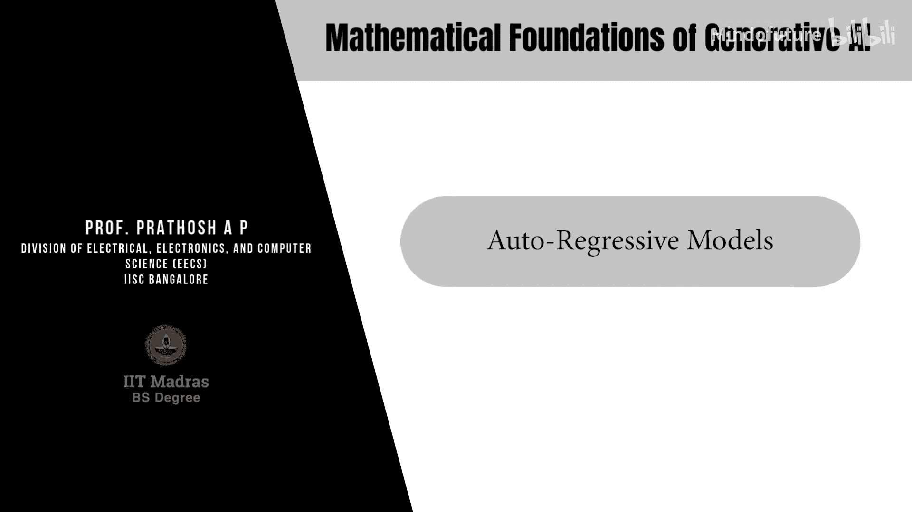
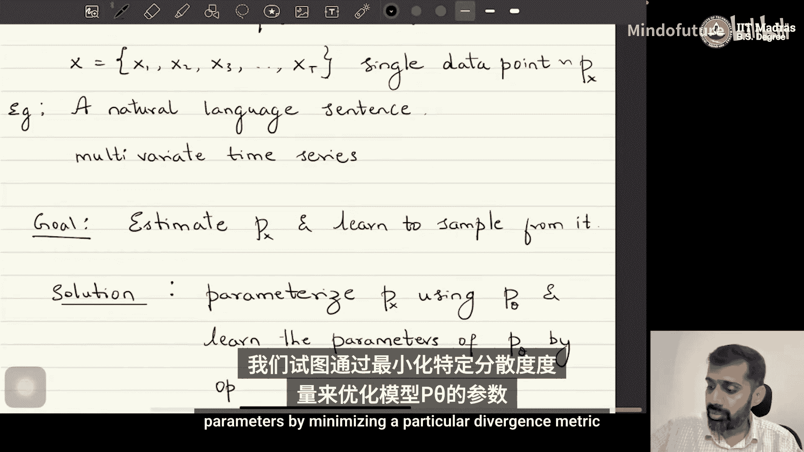
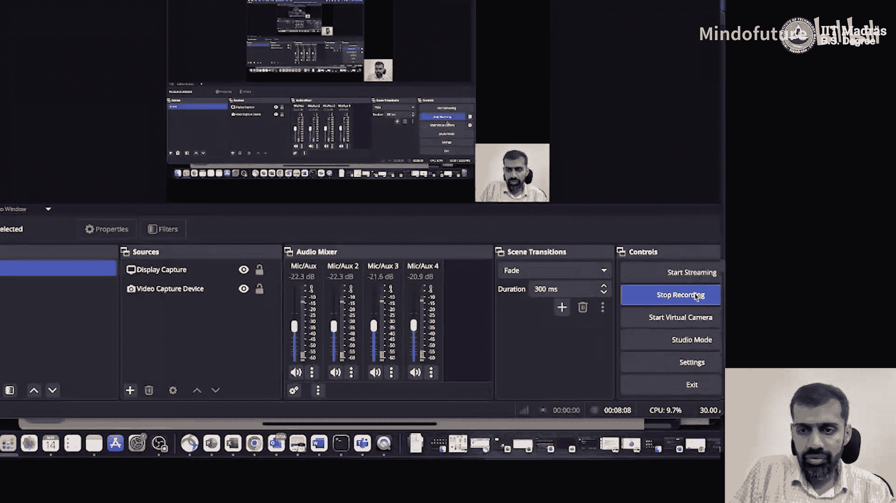
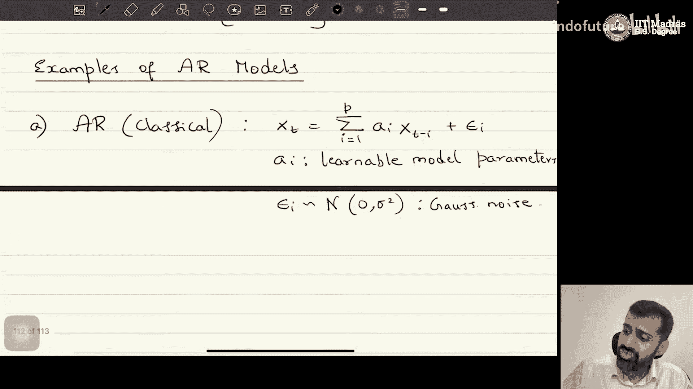
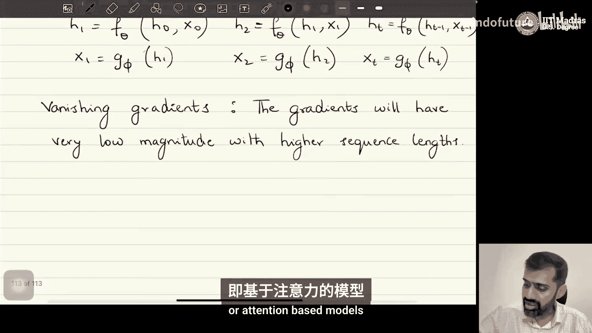

# 055：自回归模型 🎼

在本节课中，我们将学习生成式AI中的另一类重要模型——自回归模型。我们将了解其基本定义、数学原理，并回顾其从经典模型到现代Transformer架构的发展历程。

## 概述

在之前的课程中，我们讨论了扩散模型。接下来我们将要讨论的生成模型被称为自回归模型。自回归模型在历史上被广泛用于时间序列分析和序列数据处理等任务。最近的例子包括基于Transformer的语言模型，它们构成了当今所有主流生成式模型的基础。

## 自回归模型的定义

上一节我们介绍了课程背景，本节中我们来看看自回归模型的具体定义。大多数自回归模型建立在具有序列性质的数据之上。

一个数据点 **x** 可以表示为一个序列：**x = [x₁, x₂, ..., x_T]**。请注意这里的符号变化：在扩散模型中，x₁ 到 x_T 表示不同的潜变量；而在自回归模型中，它们代表构成单个数据点的序列元素。

以下是序列数据点的例子：
*   **自然语言句子**：句子中的每个词是序列的一个元素。
*   **多元时间序列**。
*   **图像**：通过从左到右、从上到下扫描像素，图像也可以被视为序列数据。

我们的目标与整个课程一致：给定从未知分布 **p(x)** 中独立同分布采样的数据点，目标是估计 **p(x)** 并学会从中采样。我们通过参数化一个模型分布 **p_θ(x)**，并通过最小化某个散度度量来学习参数 **θ** 来解决这个问题。数学上，这等价于最大化期望对数似然：

**θ* = argmax_θ E_{x~p(x)}[log p_θ(x)]**

自回归模型的不同之处在于其对 **p_θ(x)** 的特定参数化方式。

## 自回归模型的公式

在自回归模型中，序列数据点 **x** 的似然 **p_θ(x)** 通过概率链式法则建模：

**p_θ(x) = p_θ(x₁) * p_θ(x₂|x₁) * p_θ(x₃|x₁, x₂) * ... * p_θ(x_T|x₁, x₂, ..., x_{T-1})**

**= ∏_{t=1}^{T} p_θ(x_t | x_{<t})**

其中，**x_{<t}** 表示 **x_t** 之前的所有元素（**x₁** 到 **x_{t-1}**）。

这个模型被称为“自回归”，是因为每个元素 **x_t** 都被建模为依赖于其自身的历史（即之前的所有元素）。接下来，我们将看几个自回归模型的例子。

## 自回归模型的例子

以下是自回归模型发展过程中的几个重要类别：

### 1. 经典AR模型
这是历史悠久的经典模型。在P阶线性预测AR模型中，给定数据点 **x_t** 被建模为前P个数据点的线性组合加上噪声：

**x_t = Σ_{i=1}^{P} a_i * x_{t-i} + ε_t**

其中，**a_i** 是可学习的模型参数，**ε_t** 是高斯噪声。该模型假设数据来自高斯分布，适用于依赖关系不太复杂的序列。

### 2. 神经自回归模型
为了建模更复杂的序列（如自然语言），人们转向神经自回归模型。其中条件概率 **p_θ(x_t | x_{<t})** 由某个神经网络建模：

**p_θ(x_t | x_{<t}) = NeuralNetwork_θ(x_{<t})**

这个神经网络可以是全连接多层感知机、卷积神经网络等。通过反向传播算法最大化似然目标来训练。

### 3. 循环神经网络
RNN是另一类重要的自回归模型，包括GRU、LSTM等变体。其核心思想是引入一个隐藏状态 **h_t** 来总结历史信息：

**h_t = f_θ(h_{t-1}, x_{t-1})**
**x_t = g_φ(h_t)**

其中，**f_θ** 和 **g_φ** 是可学习的非线性函数。RNN的关键特性是跨时间步的参数共享（**θ** 和 **φ** 保持不变），这使其能处理任意长度的序列。

然而，RNN也存在两个著名问题：
*   **梯度消失/爆炸问题**：当序列很长时，在反向传播中多次连乘参数会导致梯度变得极小或极大，使得模型难以训练。
*   **信息压缩瓶颈**：最后一个隐藏状态 **h_T** 需要压缩整个序列的历史信息来预测 **x_T**，对于长序列这可能不够。

## 注意力机制与Transformer

为了解决RNN的上述问题，研究者提出了注意力机制和基于注意力的模型，这最终催生了Transformer架构。Transformer完全摒弃了循环结构，转而使用自注意力机制来直接计算序列中任意两个元素之间的依赖关系，从而更有效地处理长程依赖，并成为当今大语言模型（如GPT、Gemini等）的基础。我们将在后续课程中详细探讨Transformer。

## 总结

本节课中我们一起学习了自回归模型的核心概念。我们了解到自回归模型通过链式法则将序列的联合分布分解为一系列条件分布的乘积。我们回顾了从经典的线性AR模型，到神经自回归模型和循环神经网络，再到现代基于注意力机制的Transformer的发展脉络。理解自回归模型是理解当前主流生成式AI（尤其是大语言模型）工作原理的关键基础。在接下来的课程中，我们将深入探讨Transformer的细节及其训练方法。