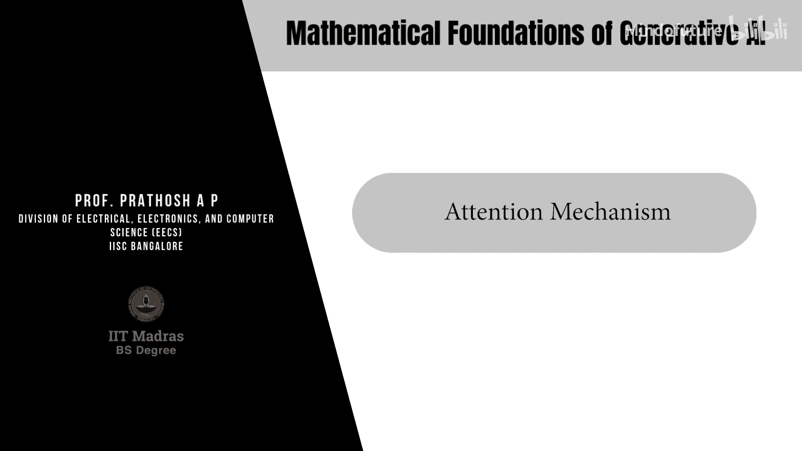
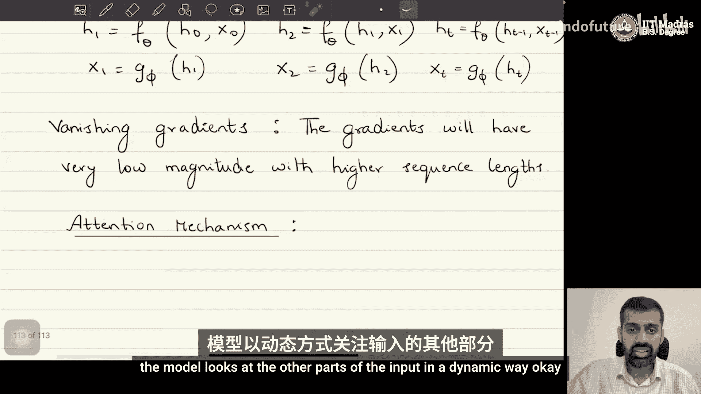
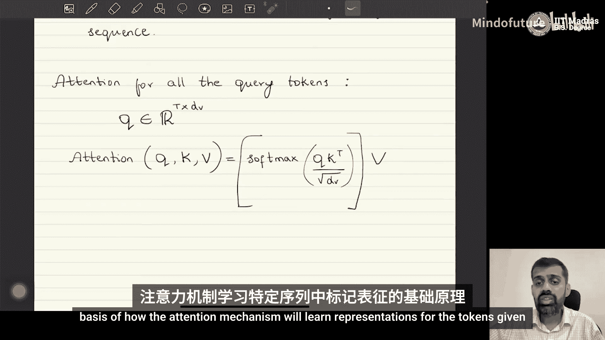

# 056：注意力机制 🎯

在本节课中，我们将学习注意力机制的核心概念。注意力机制是许多现代生成式AI模型（如Transformer）的基础。它的核心思想是让模型在处理整个序列时，能够动态地关注输入序列的不同部分。

## 从自回归模型到注意力机制

上一节我们介绍了自回归模型。在传统的自回归模型（如RNN）中，模型在计算当前时刻 `t` 的隐藏状态 `H_t` 时，需要依赖之前所有时刻 `x1` 到 `x_{t-1}` 的输入信息。模型通过 `H_t` 来“记住”历史信息。

然而，注意力机制采用了一种不同的方式。在计算每个隐藏状态 `H_t` 时，模型以一种**可学习的、动态的方式**去“看”输入序列的其他部分。这解决了传统模型难以捕捉长距离依赖关系的问题。

## 注意力机制的工作原理

接下来，我们来看看注意力机制具体是如何工作的。以下是其核心步骤：

我们给定一个输入数据序列 `X`，它包含 `T` 个标记（token），每个标记是一个 `D` 维向量。因此，输入 `X` 是一个 `T x D` 的矩阵。

### 第一步：计算查询、键和值

首先，我们需要为输入序列计算三组不同的表示，分别称为**查询（Query）**、**键（Key）**和**值（Value）**。

具体做法是，将输入矩阵 `X` 通过三个不同的可学习线性变换（矩阵）进行投影：

*   **查询（Q）**: `Q = X * W_Q`
*   **键（K）**: `K = X * W_K`
*   **值（V）**: `V = X * W_V`

其中，`W_Q`、`W_K`、`W_V` 是可学习的权重矩阵。通常，这三个投影空间的维度是相同的，我们记为 `D_v`。因此，`Q`、`K`、`V` 都是 `T x D_v` 的矩阵。矩阵的每一行对应一个输入标记在相应空间（查询、键、值）中的表示。

### 第二步：计算相似度（注意力分数）

现在，假设我们有一个特定的查询向量 `q`（即 `Q` 矩阵中的某一行），我们想计算它与所有键向量 `k_i`（即 `K` 矩阵的所有行）的相似度。

相似度通常通过**点积**来计算。对于查询 `q` 和所有键 `K`，其相似度向量 `s` 为：
`s = q * K^T`

这个 `s` 是一个 `1 x T` 的向量，它的第 `i` 个元素代表了查询 `q` 与第 `i` 个键 `k_i` 的相似度。直观上，这衡量了当前查询标记与序列中所有其他标记的“匹配”程度。

### 第三步：缩放与归一化

为了防止点积结果过大导致梯度不稳定，我们通常对相似度进行缩放：
`s_scaled = s / sqrt(D_v)`

接着，我们使用 **Softmax 函数** 将缩放后的相似度向量转换为一个概率分布（和为1，值在0到1之间）：
`alpha = softmax(s_scaled)`

得到的 `alpha` 向量中的每个元素 `alpha_i` 可以理解为当前查询 `q` 对序列中第 `i` 个标记的“关注权重”。

### 第四步：计算加权和（注意力输出）

最后，注意力机制的输出是**所有值向量 `v_i` 的加权和**，权重就是上一步计算出的 `alpha_i`：
`Attention(q, K, V) = sum_{i=1}^{T} (alpha_i * v_i)`

这个输出向量就是查询 `q` 对应的注意力表示。它融合了序列中所有标记的信息，但根据 `q` 与各标记的“相关性”（由 `alpha` 决定）进行了加权。

### 矩阵形式的完整计算

在实际操作中，我们会对所有查询（即 `Q` 矩阵的所有行）同时进行计算。注意力机制的完整矩阵运算公式如下：
`Attention(Q, K, V) = softmax( (Q * K^T) / sqrt(D_v) ) * V`

这个公式一次性为序列中的所有标记计算了其对应的注意力表示。

## 总结

本节课中，我们一起学习了注意力机制。我们了解到，注意力机制通过为输入序列计算**查询（Q）、键（K）、值（V）**三组表示，并利用**点积相似度**和**Softmax归一化**来动态计算每个位置应“关注”序列中其他位置的权重。最终，输出是**值（V）的加权和**。这种机制使得模型能够直接捕捉序列中任意两个位置之间的关系，克服了传统循环神经网络在处理长序列时的局限性，成为Transformer等强大模型的核心组件。