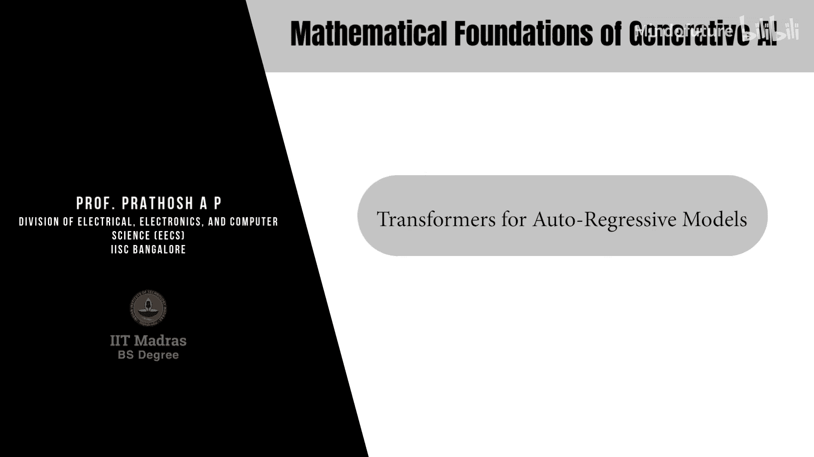
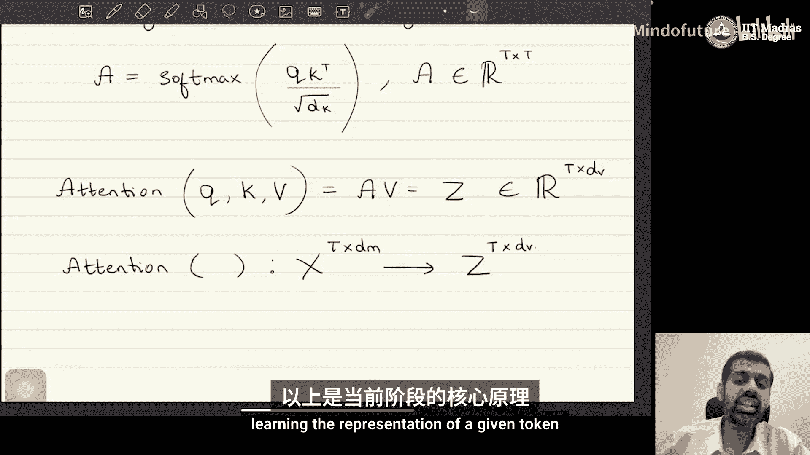

# 057：用于自回归模型的Transformer

## 概述
在本节课中，我们将学习Transformer架构，这是一种专门用于自回归建模的流行架构。我们将详细探讨其核心组件——注意力机制，并了解它如何被用来建模序列数据中下一个标记的概率分布。

## 自回归模型回顾
上一节我们介绍了自回归模型。本节中，我们来看看如何用Transformer架构来实现它。

自回归模型处理具有序列形式的数据。假设我们有一个数据点，其序列形式可表示为 **x₁, x₂, x₃, …, x_T**。请注意，这里的 **x₁** 到 **x_T** 表示一个单一的数据点，该数据点具有序列性质。自然语言就是一个例子，其中每个句子是一个数据点，由一系列词或字符（通常称为标记）组成。

自回归模型对该数据点施加的概率密度函数（也称为似然函数）由以下公式给出：
**p_θ(x₁, …, x_T) = ∏_{t=1}^T p_θ(x_t | x_{<t})**
其中，每个条件密度函数 **p_θ(x_t | x_{<t})** 捕获了在给定序列中所有前序标记 **x_{<t}** 的情况下，第 **t** 个标记 **x_t** 出现的可能性。这就是“自回归”名称的由来——模型对数据自身进行回归。

每个标记 **x_t** 通常属于一个有限的离散集合 **V**，称为词汇表。现代自回归模型的词汇表大小可达数万甚至数十万。

## Transformer架构简介
我们的核心任务是建模条件分布 **p_θ(x_t | x_{<t})**。Transformer是一种用于建模此分布的特定架构选择。它主要基于注意力机制的思想。

Transformer本身不是一种生成模型的方法论，而是一种架构。当前最先进的生成模型（如GPT系列）主要基于Transformer架构的自回归建模。

## Transformer的核心：注意力机制
Transformer架构的核心是注意力机制。它用于将输入序列的表示从一个空间转换到另一个空间，同时量化序列中每个标记对其他标记表示的重要性。

以下是实现注意力机制的关键步骤。

### 步骤1：输入表示与嵌入
我们从一个数据矩阵 **X** 开始，其维度为 **T × D_m**，其中 **T** 是序列长度，**D_m** 是模型维度（一个可任意选择的超参数，如512或768）。矩阵的每一行对应序列中的一个标记。

初始时，每个标记 **x_i** 使用其词汇表中的独热编码表示。然后，通过一个可学习的嵌入层，将独热向量投影到 **D_m** 维的连续空间。这个嵌入矩阵 **X** 本身也是模型训练过程中通过梯度下降学习的参数。

### 步骤2：计算查询、键和值矩阵
给定嵌入矩阵 **X**，Transformer的第一步是计算三个不同的投影：查询矩阵 **Q**、键矩阵 **K** 和值矩阵 **V**。

计算公式如下：
**Q = X W_Q**
**K = X W_K**
**V = X W_V**

其中：
*   **W_Q** ∈ ℝ^{D_m × D_k} 是可学习的查询权重矩阵。
*   **W_K** ∈ ℝ^{D_m × D_k} 是可学习的键权重矩阵。
*   **W_V** ∈ ℝ^{D_m × D_v} 是可学习的值权重矩阵。

**D_k** 和 **D_v** 是超参数。通常，为了便于计算点积注意力，**D_k**（查询和键的维度）被设置为相同，而 **D_v**（值的维度）可以不同。在仅解码器模型中，三者常被设为相同。

经过此步骤，我们将原始数据从 **D_m** 维空间投影到了三个不同的子空间：查询空间、键空间和值空间。**Q** 和 **K** 的维度为 **T × D_k**，**V** 的维度为 **T × D_v**。

### 步骤3：计算注意力权重
接下来，需要计算注意力权重。注意力权重通过查询矩阵 **Q** 和键矩阵 **K** 的点积，并经过Softmax归一化得到。

注意力权重矩阵 **A** 的计算公式为：
**A = softmax( (Q K^T) / √{D_k} )**

这里，**Q K^T** 得到一个 **T × T** 的矩阵，其中每个元素 **A_{i,j}** 表示第 **i** 个查询向量（对应第 **i** 个标记）与第 **j** 个键向量（对应第 **j** 个标记）之间的关联强度。除以 **√{D_k}** 是为了稳定梯度。Softmax函数沿着键的维度（即矩阵的行）进行归一化，使得每一行的权重之和为1。

### 步骤4：计算注意力输出
最后，利用注意力权重矩阵 **A** 对值矩阵 **V** 进行加权求和，得到注意力机制的输出矩阵 **Z**。

计算公式为：
**Z = A V**

输出矩阵 **Z** 的维度为 **T × D_v**。它的每一行是值向量 **V** 的加权组合，权重由对应标记的注意力分数决定。直观上，**Z** 的第 **t** 行包含了序列中所有标记的信息，但根据它们与第 **t** 个标记的相关性进行了重新加权。

### 自注意力机制
在上述过程中，查询、键和值都来自同一个输入序列 **X**。这种机制被称为**自注意力**。它允许模型在处理序列时，动态地关注并整合序列中任何其他部分的信息，从而学习每个标记更丰富的上下文表示。

如果查询和键/值来自不同的序列（例如在编码器-解码器架构中），则称为**交叉注意力**。

## 从注意力到自回归建模
回顾我们的目标：建模 **p_θ(x_t | x_{<t})**。注意力机制 **Z** 为我们提供了序列中每个标记基于全局上下文的增强表示。

然而，标准的自注意力允许标记“看到”序列中所有位置的信息，包括未来的标记。这对于自回归生成来说是不允许的，因为在生成 **x_t** 时，模型只能依赖于 **x_{<t}**。

因此，在自回归Transformer中，我们使用**因果注意力**（或掩码注意力）。这通过在计算注意力权重时，添加一个掩码矩阵来实现。该掩码矩阵将 **Q K^T** 矩阵中对应于未来位置（即 **j > i**）的元素设置为一个非常大的负数（如 -∞），这样在Softmax之后，这些位置的注意力权重就变为0。

因果注意力的计算公式为：
**A = softmax( (Q K^T + M) / √{D_k} )**
其中 **M** 是一个上三角矩阵，主对角线及以下为0，以上为 -∞。

通过这种方式，第 **t** 个标记的表示 **z_t** 仅依赖于序列中前 **t** 个标记（**x_{<t}**）的信息。这个 **z_t** 随后会被送入一个前馈神经网络，最终通过一个Softmax层映射到词汇表 **V** 上的概率分布，即 **p_θ(x_t | x_{<t})**。

## 总结
本节课中，我们一起学习了Transformer架构如何用于自回归建模。

我们首先回顾了自回归模型的目标是建模序列数据的联合概率。接着，我们深入探讨了Transformer的核心——注意力机制，详细介绍了从输入嵌入到计算查询、键、值矩阵，再到计算注意力权重和输出的完整过程。我们特别强调了在自回归生成中必须使用的因果注意力掩码，以确保模型在预测下一个标记时不会“偷看”未来信息。

Transformer通过自注意力机制，能够高效地捕捉序列中长距离的依赖关系，这使其成为当今最强大生成模型（如大语言模型）的基石架构。