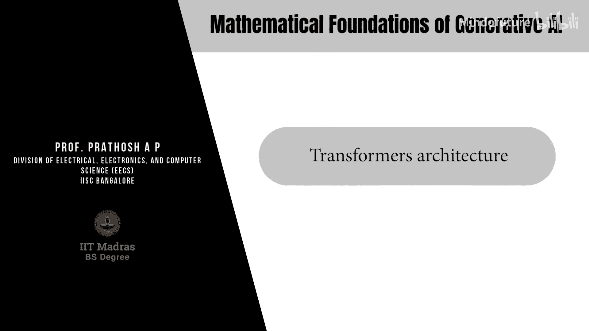
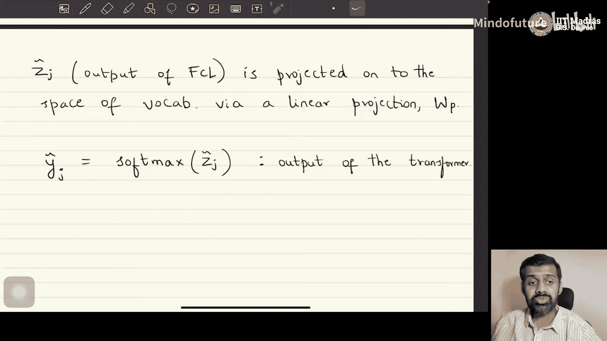

# 058：Transformer架构

## 概述
在本节课中，我们将学习Transformer架构中的两个核心概念：因果注意力（Causal Attention）与多头注意力（Multi-head Attention）。我们将了解如何通过修改注意力机制来确保模型的自回归特性，以及如何通过多头设计来增强模型的表达能力。

---

## 因果注意力（Causal Attention）

上一节我们介绍了基本的注意力机制。本节中我们来看看如何确保注意力机制符合自回归模型的要求。

在自回归模型中，第 `t` 个标记 `x_t` 仅依赖于其之前的标记 `x_1` 到 `x_{t-1}`，而不依赖于未来的标记。然而，我们之前定义的注意力权重计算方式，假设了序列中的每个标记都依赖于所有其他标记，无论其位置如何。

为了确保我们构建的模型是真正的自回归模型，必须修改注意力机制，使其只关注过去的标记。这是通过一个称为**掩码矩阵（Mask Matrix）**的机制来实现的。

### 掩码矩阵的定义
定义一个掩码矩阵 `M`，其维度为 `T x T`（`T` 是序列长度）。该矩阵的元素定义如下：
- 如果 `j < i`（即 `j` 是 `i` 的过去），则 `M_{ij} = 0`。
- 如果 `j >= i`（即 `j` 是 `i` 的现在或未来），则 `M_{ij} = -∞`（一个非常大的负数）。

### 修改注意力权重
原始的注意力权重 `A` 计算为：
`A = softmax( (Q * K^T) / sqrt(d_k) )`

为了引入因果性，我们将掩码矩阵 `M` 按元素加到 `(Q * K^T) / sqrt(d_k)` 上，然后再进行 softmax 操作：
`A_masked = softmax( (Q * K^T) / sqrt(d_k) + M )`

由于 `M` 中未来位置的值是 `-∞`，在 softmax 的指数运算中，这些位置对应的权重会趋近于 0。这样，每个标记的表示就只依赖于其过去的标记，而不依赖于未来。

通过添加掩码矩阵 `M` 这一技巧，我们确保了所构建的模型具有自回归性质。得到的 `A_masked` 再与值矩阵 `V` 相乘，就得到了符合因果依赖关系的数据新表示。

---

## 多头注意力（Multi-head Attention）

在理解了如何实现因果注意力后，我们接下来探讨另一个提升模型能力的关键技术：多头注意力。

到目前为止，我们讨论的注意力机制是将 `m` 维的数据向量一次性投影到 `d_v` 维空间。这意味着所有 `m` 个数据维度都使用同一组查询、键、值矩阵进行变换。

然而，为了提高模型的表达能力，我们可以将数据维度 `d_m` 划分为多个子部分，并为每个子部分学习独立的查询、键、值矩阵。这就是多头注意力的基本思想。

### 多头注意力的定义
设 `h` 为一个正实数标量，代表**注意力头（Attention Heads）**的数量。通常，我们会设置 `d_k = d_m / h`，即将模型维度 `d_m` 均匀地分割给 `h` 个头。

对于第 `j` 个头（`j` 从 1 到 `h`），我们执行以下操作：
1.  计算该头独有的查询、键、值矩阵：
    - `Q_j = X * W_j^Q` （维度：`T x d_k`）
    - `K_j = X * W_j^K` （维度：`T x d_k`）
    - `V_j = X * W_j^V` （维度：`T x d_v`）
    其中 `W_j^Q`, `W_j^K`, `W_j^V` 是可学习的参数矩阵。
2.  计算该头的注意力输出 `Z_j`：
    `Z_j = Attention(Q_j, K_j, V_j) = softmax( (Q_j * K_j^T) / sqrt(d_k) ) * V_j`
    `Z_j` 的维度为 `T x d_v`。

### 合并多头输出
计算完所有 `h` 个头的输出后，我们将它们沿着特征维度进行拼接（Concatenate）：
`Z_concat = Concat(Z_1, Z_2, ..., Z_h)`
此时 `Z_concat` 的维度为 `T x (h * d_v)`。通常我们会设置 `h * d_v = d_m`，以恢复到原始的模型维度 `d_m`。

最后，为了灵活地组合各个头的信息，我们使用一个额外的可学习投影矩阵 `W^O` 对拼接后的结果进行线性变换，得到最终的多头注意力输出 `Z`：
`Z = Z_concat * W^O`
其中 `W^O` 的维度为 `(h * d_v) x d_m`，因此 `Z` 的维度为 `T x d_m`。

简而言之，多头注意力不是学习一组全局的查询、键、值矩阵，而是将数据维度拆分，为每个子空间学习独立的注意力机制，最后再将结果合并并投影回目标维度。这增加了模型的表达能力和灵活性。

---

## 前馈神经网络层（Fully Connected Layers）

在Transformer架构中，计算完多头注意力后，通常会接着应用一个或多个全连接层（前馈神经网络）。

注意力机制主要由矩阵乘法构成，这些是线性操作。为了建模自然语言处理等任务中复杂的非线性输入-输出关系，仅靠线性变换是不够的。

根据神经网络理论，单隐藏层的前馈神经网络是通用函数逼近器。只要隐藏层有足够多的神经元，它可以以任意精度逼近任何函数。因此，在多头注意力层之后添加全连接层，能为整个架构引入非线性，从而极大地增强其表达能力和灵活性。

### 前馈层的应用方式
值得注意的是，这些全连接层是**独立地应用于每个标记（Token）**的。假设经过注意力层后，我们得到序列表示 `Z`，其维度为 `T x d_m`（`T` 个标记，每个是 `d_m` 维向量）。

对于序列中的第 `j` 个标记 `Z_j`（一个 `d_m` 维向量），我们对其单独应用前馈网络。一个典型的单隐藏层前馈网络操作如下：
`Z_j' = σ( Z_j * W_1 + b_1 ) * W_2 + b_2`
其中：
- `σ` 是非线性激活函数（如 ReLU, Sigmoid, Tanh）。
- `W_1`, `b_1`, `W_2`, `b_2` 是可学习参数。`W_1` 的维度通常是 `d_m x d_ff`（`d_ff` 是隐藏层维度），`W_2` 的维度是 `d_ff x d_m`。
- 输出 `Z_j'` 的维度与输入 `Z_j` 相同，均为 `d_m`。

这样，我们对 `T` 个标记分别进行变换，得到新的表示序列 `Z'`，其维度仍为 `T x d_m`。

---

## 输出层与概率分布生成

经过前馈网络层处理后，我们得到了每个标记的最终表示 `Z_j‘`。接下来，我们需要将这些表示转换为对词汇表中所有可能标记的概率分布，这是生成任务的核心。

### 线性投影到词汇表空间
首先，通过一个线性投影层，将 `d_m` 维的标记表示映射到词汇表大小 `V` 维的空间：
`S_j = Z_j' * W_p + b_p`
其中 `W_p` 是可学习参数矩阵，维度为 `d_m x V`。`S_j` 是一个 `V` 维的实值向量。

### 通过Softmax生成概率分布
这个 `V` 维向量 `S_j` 包含了模型对于下一个标记是词汇表中每个词的可能性“分数”。为了将其转化为一个合法的概率分布（即所有概率之和为1），我们应用 **softmax** 函数：
`ŷ_j = softmax( S_j )`
`ŷ_j` 的第 `i` 个分量 `ŷ_{j,i}` 表示在给定上下文和当前位置 `j` 的情况下，下一个标记是词汇表中第 `i` 个词的概率。

通过这种方式，Transformer架构的最终输出，对于输入序列中的每一个位置 `j`，都给出了一个在完整词汇表上的离散概率分布 `ŷ_j`。在训练时，我们可以通过比较这个预测分布与真实的下一个标记（使用交叉熵损失）来优化模型参数。在推理（生成）时，我们可以从这个分布中采样或取最可能的词，作为模型生成的输出。

---

## 总结
本节课我们一起学习了Transformer架构中确保自回归特性的**因果注意力**机制，以及提升模型表达能力的**多头注意力**设计。我们还了解了**前馈神经网络层**如何为模型引入必要的非线性变换。最后，我们看到了模型如何通过**线性投影和softmax函数**，将内部的连续表示转化为对词汇表的概率分布，从而完成生成任务的核心步骤。这些组件共同构成了现代生成式AI模型，特别是解码器（Decoder）部分的基础。