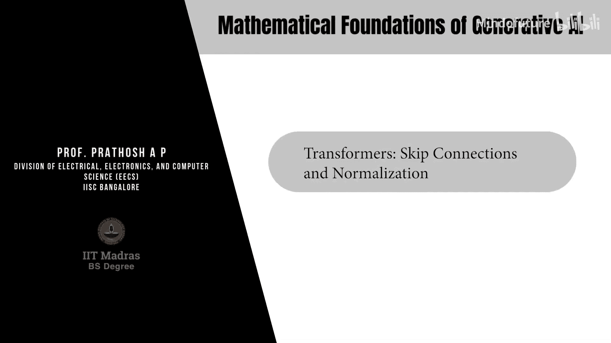
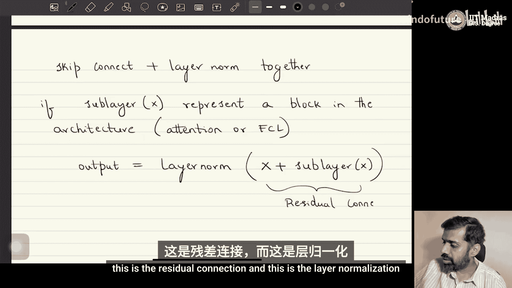

# 059：跳跃连接与归一化

在本节课中，我们将学习Transformer架构中的两个关键组件：跳跃连接（或称残差连接）与层归一化。理解它们的作用和实现方式，对于掌握现代生成式AI模型至关重要。

## 概述

在深入探讨如何训练自回归模型之前，有必要先描述几个重要的模型组件。其中之一就是跳跃连接与层归一化。本节将详细解释这两个概念。

## 跳跃连接

跳跃连接，或称残差连接，是深度神经网络中的一种设计。其核心思想是在网络的某一层或某个模块中，将输入直接“跳过”该层的处理，并与该层的输出相加。

以下是其基本公式：

**公式：**
`y = x + F(x)`

其中：
*   `x` 是输入。
*   `F(x)` 是当前层或模块对输入 `x` 进行的变换操作。
*   `y` 是最终输出。

这种设计也被称为残差连接，并构成了如ResNet等架构的基础。

跳跃连接的目的在于确保网络架构具备显式地学习恒等映射的能力。观察上述公式，整个模块的输出是“恒等操作（即输入 `x`）”加上“该模块预期执行的操作 `F(x)`”。在某些情况下，如果我们希望网络的后续阶段不受当前模块影响，或者当前模块无需对特定特征进行变换，跳跃连接就提供了一条直接的路径，让输入可以原封不动地传递到输出。这相当于在架构层面施加了一种正则化，强制网络学习恒等映射。

在实践中，跳跃连接解决了深度网络训练中的一个难题。研究表明，单纯增加网络深度并不总能带来更好的学习效果，有时甚至会导致性能下降或过拟合。跳跃连接的引入，确保了即使在增加深度时，网络也能稳定地学习，因为它保留了将输入直接传递的可能性，从而缓解了梯度消失等问题。在基于Transformer的架构中，跳跃连接被广泛使用。

## 层归一化

层归一化是一种对神经网络中每一层的特征向量进行标准化的技术。其目的是稳定训练过程，使数据分布保持相对稳定。

以下是层归一化的计算过程：

**公式：**
给定一个维度为 `D_m` 的输入向量 `x`：
1.  计算均值 `μ`：
    `μ = (1 / D_m) * Σ_{k=1}^{D_m} x_k`
2.  计算方差 `σ²`：
    `σ² = (1 / D_m) * Σ_{k=1}^{D_m} (x_k - μ)²`
3.  进行归一化：
    `x_norm = (x - μ) / √(σ² + ε)`
    （其中 `ε` 是一个很小的数，如 `0.01`，用于防止除以零的错误）
4.  应用可学习的缩放和平移参数：
    `y = γ * x_norm + β`

其中 `γ` 和 `β` 是可学习的参数。

层归一化的思想很简单：它确保给定向量经过处理后，具有零均值和单位方差。具体做法是计算向量在所有维度上的均值和方差，然后进行标准化。

那么，参数 `γ` 和 `β` 的作用是什么呢？虽然将特征向量中心化并归一化到单位方差通常是个好主意，但有时这可能并不合适。为了确保模型能够自主选择是否应用归一化效果，我们引入了这两个可学习的参数。从数学上很容易证明，通过选择合适的 `γ` 和 `β` 值，可以“撤销”括号内的归一化操作。如果模型认为需要层归一化，`γ` 可以趋近于1，`β` 趋近于0；如果模型认为不需要，它可以通过学习 `γ` 和 `β` 来恢复原始输入 `x` 的分布。这就是Transformer中典型的层归一化过程。

## 在Transformer中的结合应用

在Transformer架构中，跳跃连接和层归一化通常结合使用。

以下是其结合方式：

**公式：**
`输出 = LayerNorm( 输入 + Sublayer(输入) )`

其中 `Sublayer` 可以代表架构中的一个块，例如注意力块或前馈全连接层块。

这个公式的含义是：
*   `输入 + Sublayer(输入)` 部分实现了跳跃连接（残差连接）。
*   然后，对这个相加后的结果应用层归一化 `LayerNorm`。

这种设计（残差连接后接层归一化）是Transformer每个子层（如自注意力层和前馈网络层）的标准配置，它极大地促进了深层网络的稳定和高效训练。

## 总结

本节课我们一起学习了Transformer架构中的两个核心组件：跳跃连接与层归一化。跳跃连接通过将输入直接加到输出上，帮助网络学习恒等映射并缓解深度网络训练中的梯度问题。层归一化则通过标准化每层的激活值来稳定训练过程，其引入的可学习参数 `γ` 和 `β` 赋予了模型灵活选择是否应用归一化的能力。在Transformer中，这两者通常结合使用，构成了 `输出 = LayerNorm(输入 + Sublayer(输入))` 的标准子层结构，为构建强大的生成式AI模型奠定了坚实的基础。