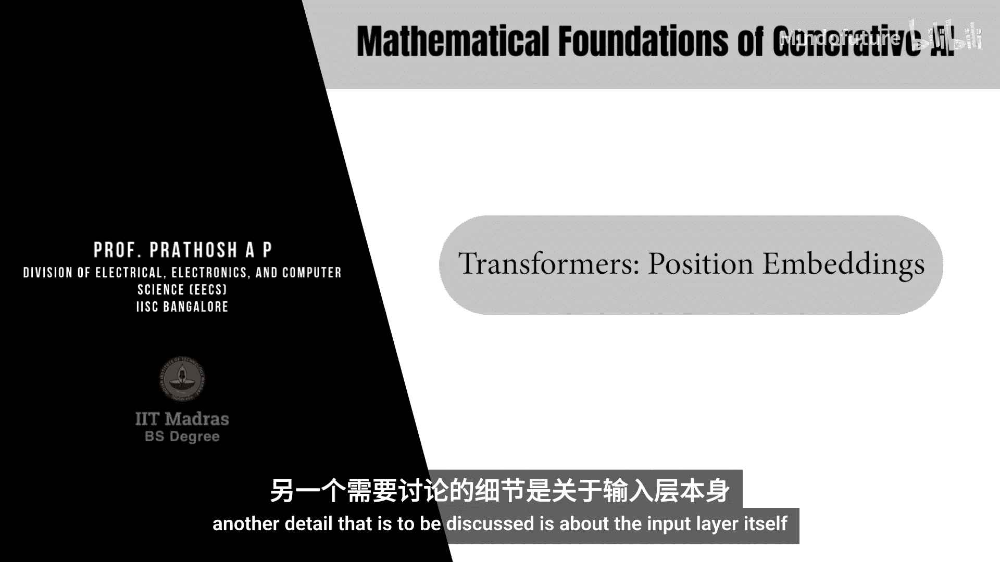

生成式AI的数学基础：P60：Transformer架构中的位置嵌入



在本节课中，我们将学习Transformer架构中的一个关键组成部分：位置嵌入。我们将了解为什么需要它，它是如何工作的，以及它在整个Transformer模型中的位置。

---

### 概述

Transformer模型在处理输入序列时，面临一个根本性问题：它本身无法感知序列中元素的顺序。因为输入通常被表示为独立的向量，模型无法知道哪个词先出现，哪个词后出现。为了解决这个问题，我们需要向模型注入关于序列顺序的信息，这就是**位置嵌入**的作用。

上一节我们介绍了Transformer的基本注意力机制，本节中我们来看看如何让模型“记住”顺序。

---

### 为什么需要位置嵌入？

Transformer的输入层将每个词元（token）编码为一个向量。然而，这些向量本身不包含任何关于该词元在原始句子中位置的信息。模型无法区分“猫追老鼠”和“老鼠追猫”，因为词向量“猫”和“老鼠”是相同的，无论它们出现在哪里。

简而言之，模型需要一种方法来**保留输入序列的顺序信息**。

---

### 什么是位置嵌入？

位置嵌入是一个与输入词元向量**维度相同**的固定向量。这个向量被加到对应的词元向量上，从而将位置信息编码到输入表示中。这个过程也称为**位置编码**。

这与我们在扩散模型中看到的思路类似，都是将时间或顺序信息作为额外输入提供给模型。

有多种方法可以实现位置编码，其中一种著名的方法是使用**正弦余弦编码**。

---

### 正弦余弦位置编码公式

假设我们有一个序列，其中每个位置用索引 `j` 表示。模型的嵌入维度是 `D_model`。那么，位置 `j` 的编码向量 `P(j)` 定义如下：

对于向量中**偶数索引**（`i = 0, 2, 4, ...`）的元素：
`P(j, 2i) = sin( j / (10000^(2i / D_model) ) )`

对于向量中**奇数索引**（`i = 1, 3, 5, ...`）的元素：
`P(j, 2i+1) = cos( j / (10000^(2i / D_model) ) )`

**代码描述**：
```python
import numpy as np

def get_positional_encoding(position, d_model):
    angle_rates = 1 / np.power(10000, (2 * (np.arange(d_model)//2)) / np.float32(d_model))
    angle_rads = position * angle_rates
    # 对偶数索引应用sin，奇数索引应用cos
    pos_encoding = np.zeros(d_model)
    pos_encoding[0::2] = np.sin(angle_rads[0::2])  # 偶数索引
    pos_encoding[1::2] = np.cos(angle_rads[1::2])  # 奇数索引
    return pos_encoding
```

这个公式为每个位置 `j` 生成一个唯一的、固定长度的向量 `P(j)`。这个向量会被加到对应位置的输入词元嵌入向量上。

---

### 在Transformer架构中的位置

现在，让我们看看位置嵌入如何整合到完整的Transformer架构中。

以下是Transformer的一个基础架构流程：

1.  **输入嵌入**：首先，输入的词元（通常是one-hot向量）通过一个可学习的嵌入矩阵，被转换为稠密的词嵌入向量 `X`。
2.  **添加位置编码**：将计算得到的位置嵌入向量 `P` 加到词嵌入向量 `X` 上。即，对于序列中位置 `j` 的输入，其最终输入表示为 `X(j) + P(j)`。
3.  **多头注意力块**：带有位置信息的输入向量被送入**多头注意力**模块进行处理。
4.  **残差连接与层归一化**：注意力模块的输出会与**该模块的原始输入**（即 `X(j) + P(j)`）进行相加（残差连接），然后进行**层归一化**。这有助于稳定训练。
5.  **前馈神经网络**：归一化后的结果通过一个**全连接层**（前馈网络）。
6.  **再次残差连接与层归一化**：全连接层的输出会与**进入全连接层之前的向量**再次进行残差连接和层归一化。
7.  **线性层与Softmax**：最后，经过处理的向量通过一个**线性层**和**Softmax函数**，输出最终的预测结果（例如，下一个词的概率分布）。

这个基础块（多头注意力 + 前馈网络，各自带有残差连接和归一化）可以被堆叠多次，构成更深的Transformer模型。

---

### 总结

本节课中我们一起学习了Transformer模型中的位置嵌入机制。我们了解到：

*   **目的**：为了解决Transformer模型无法感知输入序列顺序的问题。
*   **方法**：为序列中的每个位置生成一个独特的、固定的向量（位置嵌入），并将其加到对应的词元嵌入向量上。
*   **经典实现**：使用正弦和余弦函数生成位置编码，确保模型能够捕捉到相对和绝对位置信息。
*   **架构整合**：位置嵌入在输入处理阶段被加入，随后数据流经包含多头注意力、前馈网络、残差连接和层归一化的标准Transformer块。


位置嵌入是Transformer能够成功处理序列任务（如机器翻译、文本生成）的基础组件之一。