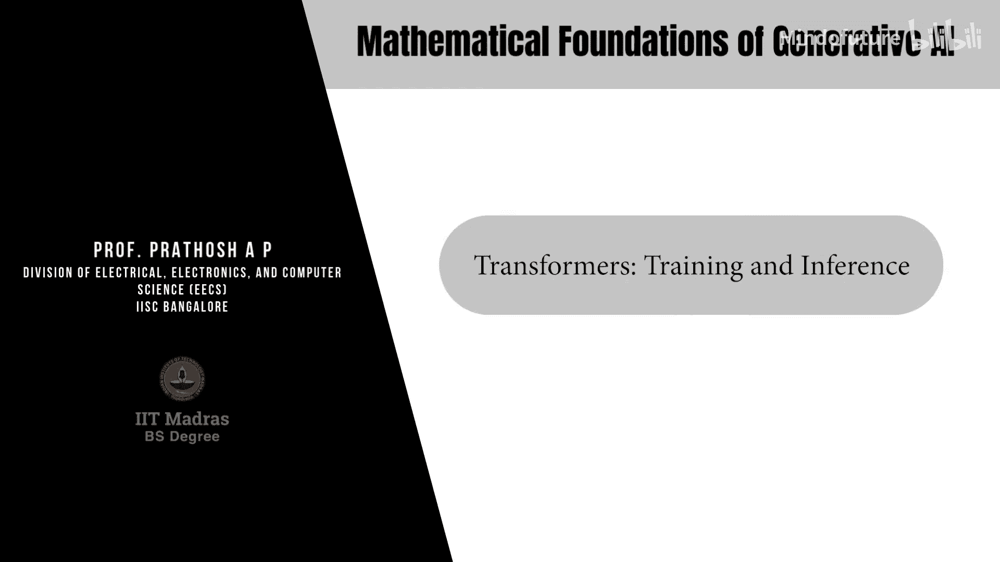
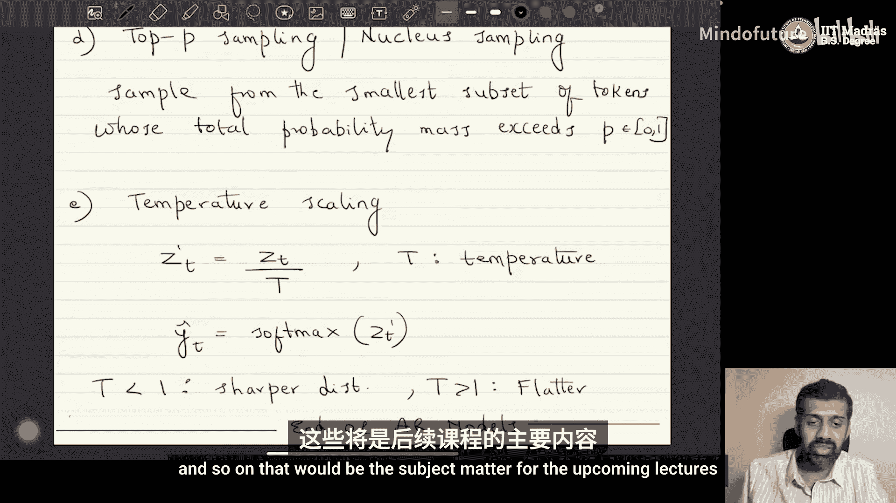

# 061：Transformer的训练与推理

## 概述
在本节课中，我们将学习如何训练和推理基于Transformer架构的自回归生成模型。我们将首先介绍使用“教师强制”方法的训练过程，然后探讨几种常见的推理策略，包括贪婪解码、采样以及它们的变体。

---

## 训练：使用教师强制法

上一节我们介绍了Transformer的架构，本节中我们来看看如何使用这种架构来训练一个自回归生成模型。

我们被给定一个标记序列：`x1, x2, ..., xT`，其中每个 `xt` 属于词汇表 `V`。在自回归模型中，我们的目标是学习整个序列的联合概率，并将其建模为条件概率的乘积：

**P(x1, ..., xT) = ∏ Pθ(xt | x<t)**

这里的 `Pθ(xt | x<t)` 正是Transformer模型在位置 `t` 的输出所表示的概率分布。

为了以无监督的方式训练模型，我们采用一种称为“教师强制”的方法。其核心思想如下：

*   **输入标记**：我们取序列 `x1, x2, ..., xT-1`（丢弃最后一个标记）。
*   **目标标记**：我们取序列 `x2, x3, ..., xT`（即输入标记向右移动一位）。

通过这种方式，我们隐式地要求Transformer模型根据之前的所有标记 `x<t` 来预测当前标记 `xt`。损失函数定义为负对数似然：

**L = -∑ log(ŷt, xt)**

其中，`ŷt, xt` 是Transformer在时间步 `t` 输出的、对应于标记 `xt` 的概率。具体来说，`ŷt` 是一个在词汇表 `V` 上的softmax分布：

**ŷt = softmax(žt)**

因此，`ŷt, xt` 就等于模型预测标记 `xt` 为正确下一个标记的概率。我们通过最小化这个损失函数来训练模型。

这种训练是完全无监督的。虽然也可以用于有监督的序列对任务，但在标准的语言模型预训练中，目标标记是通过这种“教师强制”方式自动生成的。

---

## 推理：生成新序列

训练完成后，我们进入推理阶段，即使用训练好的模型生成新的序列。自回归模型的推理有多种方式，以下是几种常见的方法。

### 贪婪解码
这是一种最简单直接的方法。在每一个时间步 `t`，模型会输出一个在词汇表上的概率分布 `ŷt`。贪婪解码选择概率最高的那个标记作为输出：

**y*_t = argmax_v ŷt, v**

以下是贪婪解码的特点：
*   **优点**：速度非常快，计算简单，并且是确定性的（相同的输入总是产生相同的输出）。
*   **缺点**：缺乏多样性，输出可能过于保守和重复，不适合需要“创造性”输出的场景。

### 完全采样
与贪婪解码的确定性相反，完全采样从模型输出的整个概率分布中进行随机采样：

**y*_t ~ Categorical(ŷt)**

以下是完全采样的特点：
*   **优点**：能产生更多样化的输出。
*   **缺点**：由于完全随机，可能会采样到低概率、不连贯的标记，导致生成内容质量不稳定。

### Top-k 采样
为了在多样性和质量之间取得平衡，Top-k采样是一种折衷方案。它只从概率最高的k个标记构成的子集中进行采样。

具体步骤如下：
1.  从分布 `ŷt` 中选出概率最高的前k个标记，构成集合 `Vk`。
2.  将 `ŷt` 在这k个标记上的概率重新归一化，得到一个新的分布 `Pk`。
3.  从这个新的分布 `Pk` 中进行采样：**y*_t ~ Categorical(Pk)**

这种方法通过限制采样范围，降低了生成低质量标记的风险，同时保留了随机性。

### 核采样（Top-p 采样）
核采样是Top-k采样的一种自适应变体。它不固定采样标记的数量k，而是设定一个概率阈值p（例如0.9）。

具体步骤如下：
1.  将词汇表标记按概率从高到低排序。
2.  从概率最高的标记开始累加，直到累积概率超过阈值p。
3.  用这些被选中的标记构成一个集合，并将其概率重新归一化。
4.  从这个新的分布中进行采样。

这种方法能根据当前上下文输出的分布动态调整采样池的大小，更加灵活。

### 温度缩放
温度缩放是一种在采样前调整输出分布“平滑度”的技术。它在进行softmax操作之前，对模型的logits（`žt`）进行缩放：

**ž‘_t = žt / T**

其中，`T` 是一个称为“温度”的超参数。调整温度会影响最终的输出分布：
*   **T < 1**：会使分布变得更“尖锐”（概率差异增大），降低随机性，输出更接近贪婪解码。
*   **T > 1**：会使分布变得更“平坦”（概率差异减小），增加随机性，输出更多样。

然后，我们基于缩放后的logits计算softmax：**ŷt = softmax(ž‘_t)**，再从这个分布中进行采样或贪婪解码。

除了上述方法，还有束搜索等更复杂的推理算法，但本节课不展开讨论。

---

## 总结
本节课中我们一起学习了Transformer模型在自回归生成任务中的关键流程。
1.  **训练**：我们使用“教师强制”方法，通过将输入序列偏移一位作为目标来定义损失函数，以无监督的方式训练模型预测下一个标记。
2.  **推理**：我们探讨了多种从训练好的模型中生成序列的策略，包括确定性的**贪婪解码**、完全随机的**采样**，以及平衡两者的**Top-k采样**、**核采样**和**温度缩放**技术。

以Transformer为骨干的自回归模型构成了当今大多数主流生成式AI（如GPT、Gemini等）的基础。从下一节课开始，我们将转向新的主题：如何利用强化学习技术，对这些在大规模数据上预训练的模型进行对齐和微调，使其更符合人类偏好。我们将重点学习策略梯度算法以及PPO、DPO等算法。