# 062：DDPM噪声估计的实现 🎼

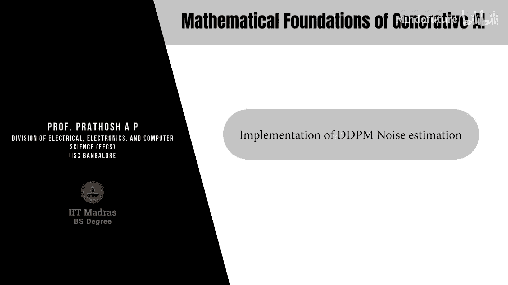


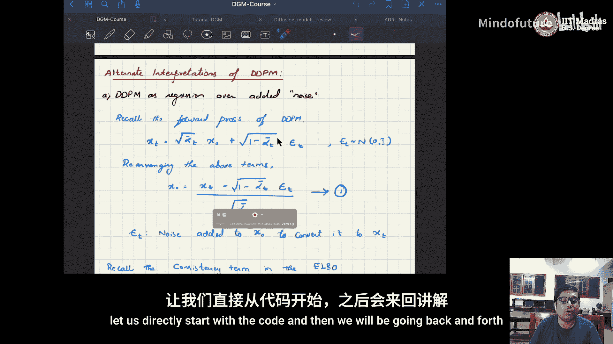

欢迎来到本教程。在本节中，我们将理解DDPM的另一种视角：将其视为对添加噪声的回归。

在上一节教程中，我们已经了解了U-Net架构，以及训练和推理过程的实现方式。本节将介绍一种替代解释，即DDPM作为噪声回归模型。我们将直接通过代码来理解这一观点，并观察它与之前版本的最小差异。

## 概述

在本节中，我们将学习如何实现一个将DDPM视为噪声回归模型的版本。我们将逐步解析代码，理解如何修改训练目标，从预测原始图像转向预测在扩散过程中添加的噪声。

## 代码结构与准备

当前代码的结构与之前预测图像本身的“原始”DDPM版本略有不同。代码中包含了大量注释，以便作为实现其他替代视角（如均值预测或分数预测）的基础。

以下是必要的库导入和基本参数设置。

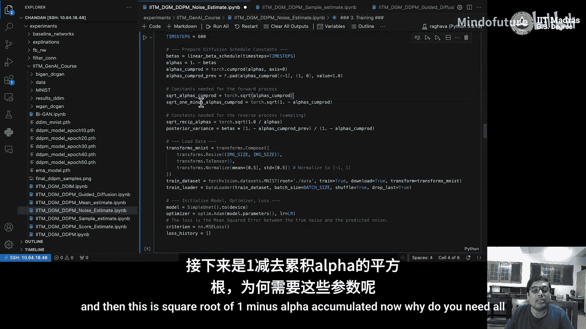

```python
# 基本参数
image_size = 32
batch_size = 128
epochs = 25
learning_rate = 1e-3
timesteps = 600
```

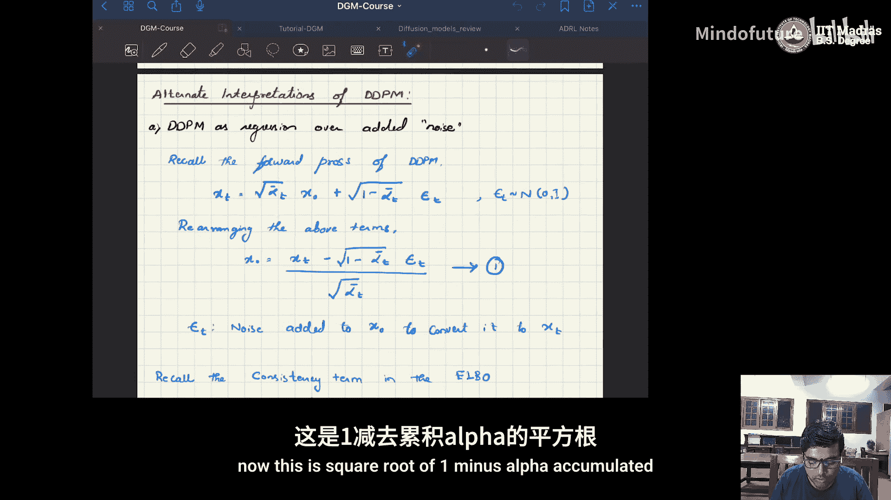

首先，我们需要定义噪声调度表 `beta`。`beta` 是 `alpha` 的修改版本，其中 `alpha = 1 - beta`。

```python
# 定义线性beta调度
def linear_beta_schedule(timesteps, start=0.0001, end=0.02):
    return torch.linspace(start, end, timesteps)

betas = linear_beta_schedule(timesteps)
alphas = 1. - betas
alphas_cumprod = torch.cumprod(alphas, axis=0) # 累积乘积 α_bar_t
sqrt_alphas_cumprod = torch.sqrt(alphas_cumprod) # sqrt(α_bar_t)
sqrt_one_minus_alphas_cumprod = torch.sqrt(1. - alphas_cumprod) # sqrt(1 - α_bar_t)
```

我们预先计算这些常量列表，以便在后续方程中方便地获取特定时间步 `t` 的值。

## U-Net模型架构

接下来，我们查看用于噪声估计的U-Net模型。其结构与之前类似，但输出通道数为1（因为MNIST是单通道图像），并且时间嵌入维度为32。

```python
class UNet(nn.Module):
    def __init__(self, image_channels=1, down_channels=(64, 128, 256),
                 up_channels=(256, 128, 64), out_dim=1, time_emb_dim=32):
        super().__init__()
        # 时间嵌入层
        self.time_mlp = nn.Sequential(
            SinusoidalPositionEmbeddings(time_emb_dim),
            nn.Linear(time_emb_dim, time_emb_dim),
            nn.ReLU()
        )
        # 初始卷积层
        self.conv0 = nn.Conv2d(image_channels, down_channels[0], 3, padding=1)
        # 下采样模块
        self.downs = nn.ModuleList([
            Block(down_channels[i], down_channels[i+1], time_emb_dim)
            for i in range(len(down_channels)-1)
        ])
        # 上采样模块
        self.ups = nn.ModuleList([
            Block(up_channels[i], up_channels[i+1], time_emb_dim, up=True)
            for i in range(len(up_channels)-1)
        ])
        # 最终输出层
        self.output = nn.Conv2d(up_channels[-1], out_dim, 1)

    def forward(self, x, timesteps):
        # 获取时间嵌入
        t = self.time_mlp(timesteps)
        # 初始卷积
        x = self.conv0(x)
        # 存储残差连接
        residual_inputs = []
        # 下采样过程
        for down in self.downs:
            x = down(x, t)
            residual_inputs.append(x)
        # 上采样过程
        for up in self.ups:
            residual_x = residual_inputs.pop()
            # 拼接特征图
            x = torch.cat((x, residual_x), dim=1)
            x = up(x, t)
        # 最终输出
        return self.output(x)
```

模型中的 `Block` 类负责处理卷积、批量归一化、激活函数以及时间嵌入的融合。根据是下采样还是上采样，它会选择不同的卷积操作。

## 前向扩散过程

前向扩散过程根据以下公式，将噪声逐步添加到原始图像 `x0` 上，得到 `t` 时刻的噪声图像 `xt`：

**公式：** `xt = sqrt(α_bar_t) * x0 + sqrt(1 - α_bar_t) * ε`

其中 `ε` 是从标准正态分布中采样的噪声。

以下是该过程的实现：

```python
def forward_diffusion_sample(x0, t, device):
    """
    根据给定时间步t，对图像x0添加噪声。
    返回噪声图像xt和所使用的噪声ε。
    """
    noise = torch.randn_like(x0) # 采样噪声 ε ~ N(0, I)
    sqrt_alphas_cumprod_t = get_index_from_list(sqrt_alphas_cumprod, t, x0.shape)
    sqrt_one_minus_alphas_cumprod_t = get_index_from_list(sqrt_one_minus_alphas_cumprod, t, x0.shape)

    # 根据公式计算 xt
    xt = sqrt_alphas_cumprod_t * x0 + sqrt_one_minus_alphas_cumprod_t * noise
    return xt, noise

def get_index_from_list(vals, t, x_shape):
    """
    从预计算的常量列表vals中，获取对应批次中每个样本在时间步t的值。
    并调整形状以匹配输入x。
    """
    batch_size = t.shape[0]
    out = vals.gather(-1, t.cpu())
    return out.reshape(batch_size, *((1,) * (len(x_shape) - 1))).to(t.device)
```

## 训练循环

训练过程的核心是让U-Net模型学会预测在前向扩散过程中添加到图像上的噪声 `ε`。

以下是训练循环的关键步骤：

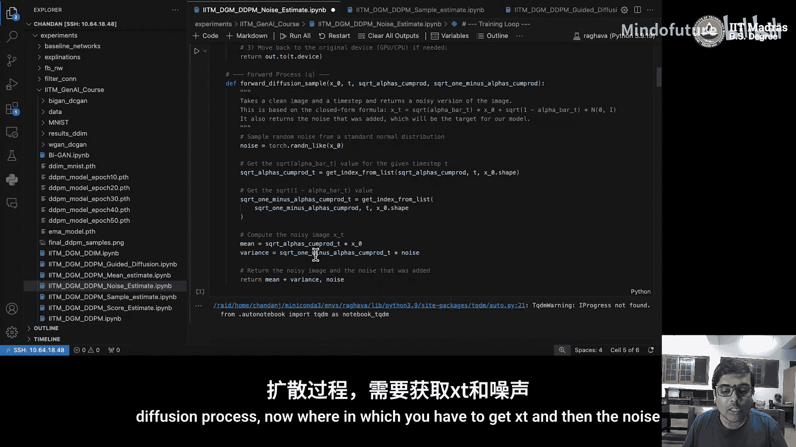

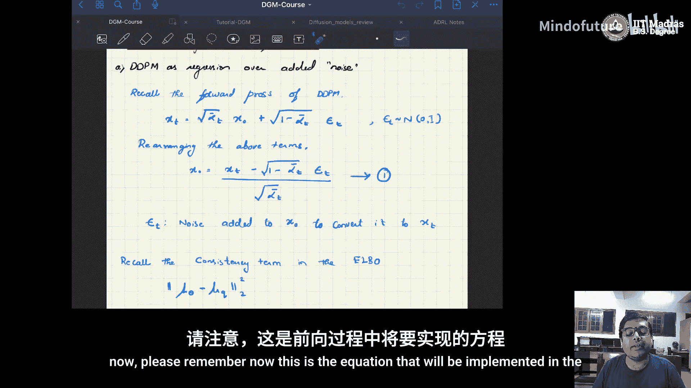

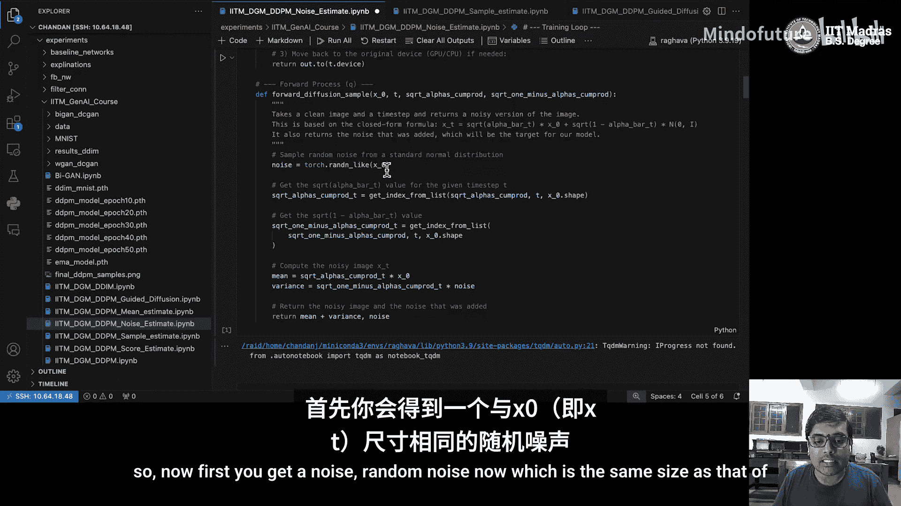

1.  从数据加载器中获取一批原始图像 `x0`。
2.  为批次中的每个图像随机采样一个时间步 `t`。
3.  通过 `forward_diffusion_sample` 函数，得到噪声图像 `xt` 和真实噪声 `noise`。
4.  将 `xt` 和时间步 `t` 输入U-Net模型，得到预测的噪声 `predicted_noise`。
5.  计算预测噪声与真实噪声之间的均方误差（MSE）作为损失。
6.  反向传播并更新模型参数。

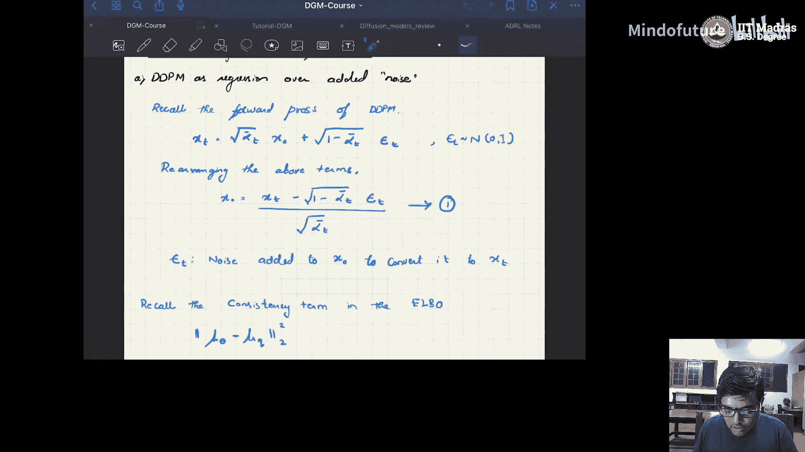

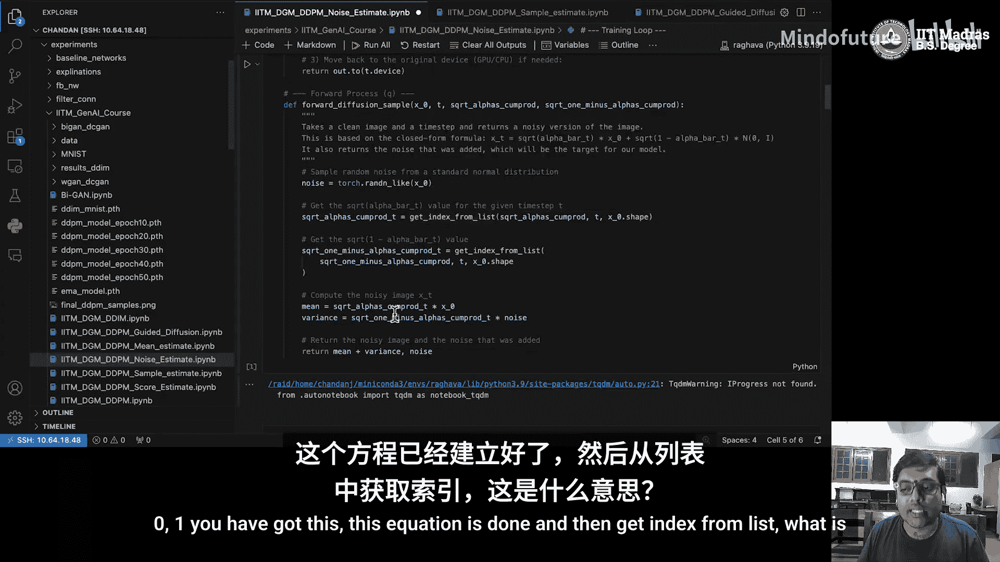

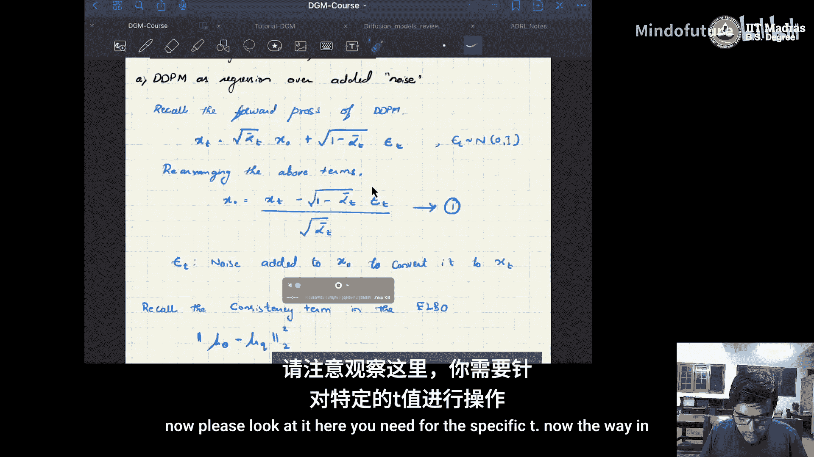

```python
# 训练步骤伪代码
for epoch in range(epochs):
    for batch in dataloader:
        x0 = batch[0].to(device) # 原始图像
        t = torch.randint(0, timesteps, (batch_size,), device=device).long() # 随机时间步
        xt, noise = forward_diffusion_sample(x0, t, device) # 加噪图像和真实噪声
        predicted_noise = model(xt, t) # 模型预测的噪声
        loss = F.mse_loss(noise, predicted_noise) # 损失函数
        optimizer.zero_grad()
        loss.backward()
        optimizer.step()
```

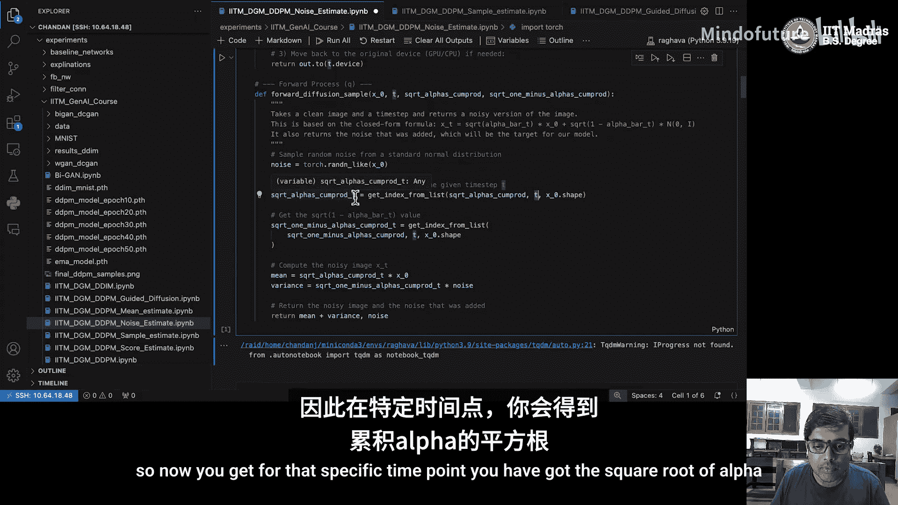

## 反向采样（推理）过程

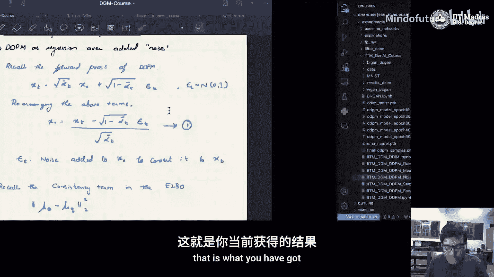

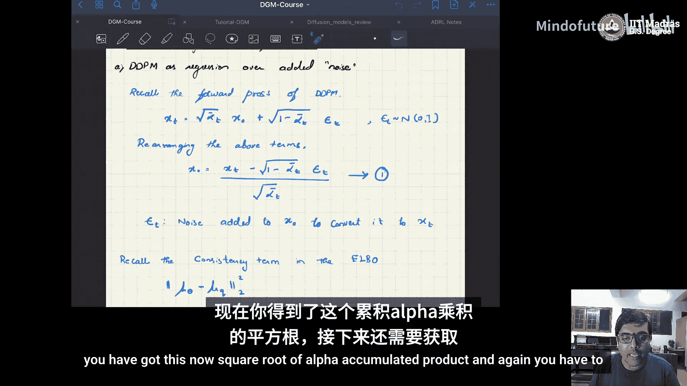

在推理阶段，我们从纯噪声 `xT` 开始，逐步去噪以生成图像。每一步，模型预测当前噪声图像 `xt` 中的噪声，然后根据以下公式计算 `t-1` 时刻的图像 `x_{t-1}`：

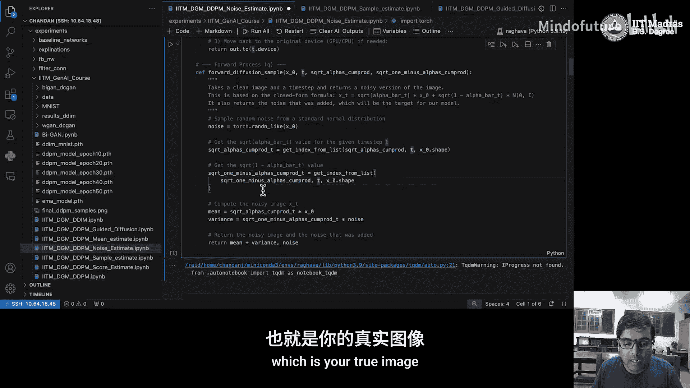

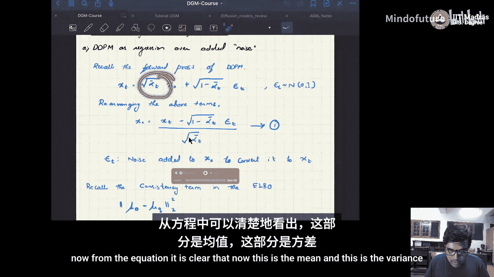

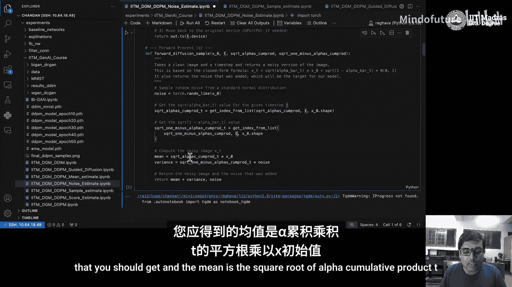

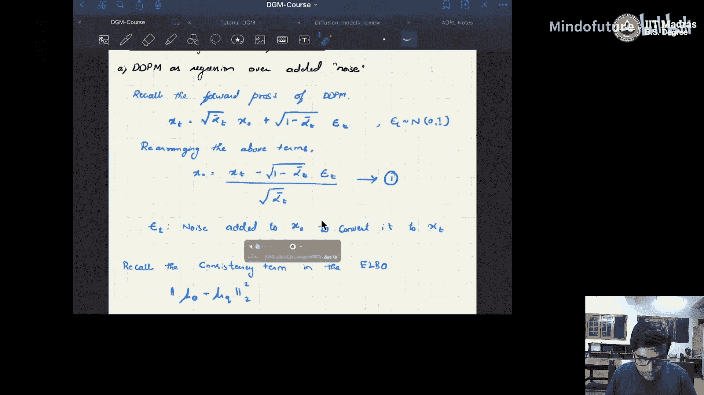

**公式：** `x_{t-1} = (1 / sqrt(α_t)) * (xt - ((1 - α_t) / sqrt(1 - α_bar_t)) * predicted_noise) + σ_t * z`

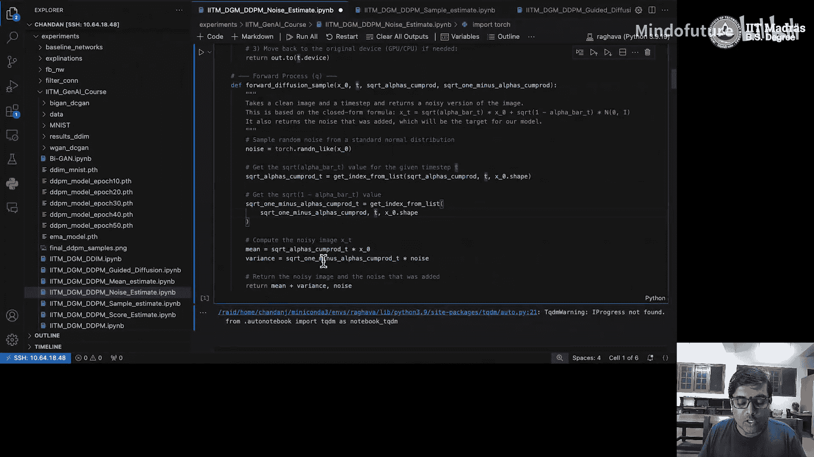

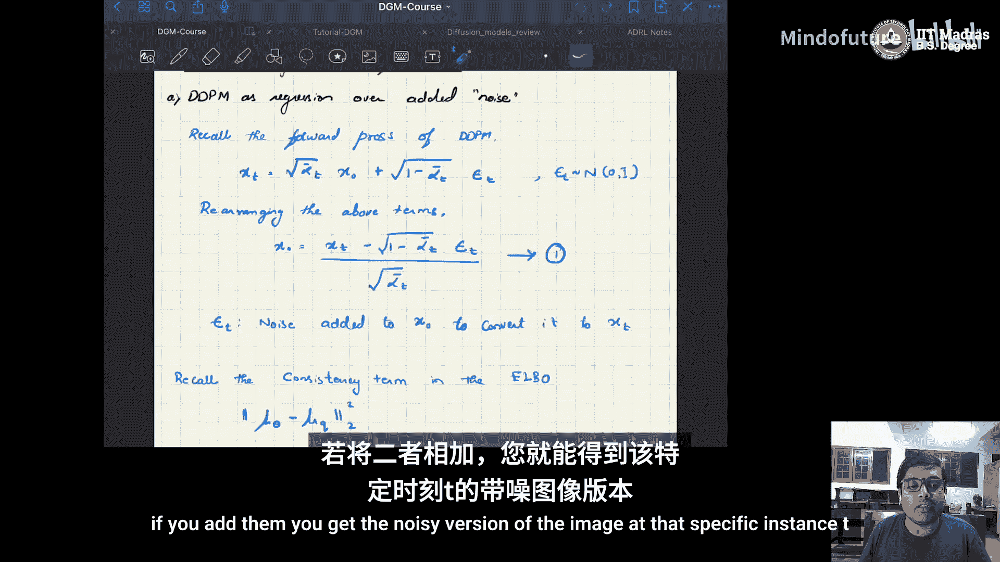

其中，当 `t > 0` 时，`z ~ N(0, I)`，当 `t = 0` 时，`z = 0`。`σ_t` 是后验方差。

以下是反向采样循环的实现：

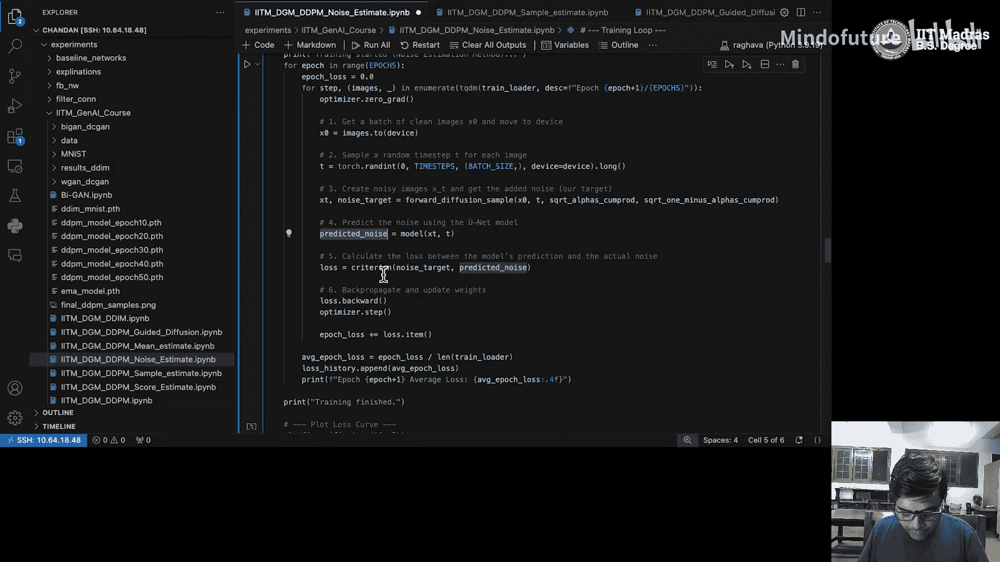

```python
@torch.no_grad()
def sample(model, image_size, batch_size=16, channels=1):
    # 从纯噪声开始
    x = torch.randn((batch_size, channels, image_size, image_size), device=device)
    for i in reversed(range(0, timesteps)):
        t = torch.full((batch_size,), i, device=device, dtype=torch.long)
        predicted_noise = model(x, t) # 预测噪声
        # 根据公式计算均值
        sqrt_recip_alphas_t = get_index_from_list(torch.sqrt(1. / alphas), t, x.shape)
        sqrt_one_minus_alphas_cumprod_t = get_index_from_list(sqrt_one_minus_alphas_cumprod, t, x.shape)
        # x_{t-1}的均值部分
        model_mean = sqrt_recip_alphas_t * (x - ((1. - alphas[t]) / sqrt_one_minus_alphas_cumprod_t) * predicted_noise)
        if i > 0:
            # 添加随机噪声
            noise = torch.randn_like(x)
            posterior_variance_t = get_index_from_list(betas, t, x.shape)
            x = model_mean + torch.sqrt(posterior_variance_t) * noise
        else:
            x = model_mean
        # 将像素值限制在[0,1]范围内
        x = torch.clamp(x, 0.0, 1.0)
    return x
```

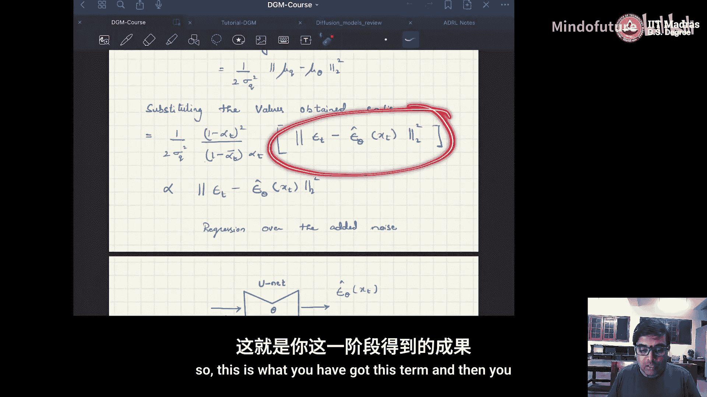

## 结果与练习

运行上述代码可以生成MNIST数字图像。需要注意的是，当前实现生成的图像前景（数字）清晰，但背景可能并非理想的纯黑色，这与标准的MNIST数据集有所不同。

这留作一个有趣的练习：你可以尝试调整超参数（如学习率、训练轮数、时间步数 `timesteps` 或 `beta` 调度表的起止值），或者微调模型架构，以获得更清晰的背景和更高质量的图像。

## 总结

在本节中，我们一起学习了如何将DDPM实现为一个噪声回归模型。我们详细分析了代码的各个部分：

1.  定义了线性 `beta` 调度并计算了相关常量。
2.  构建了用于噪声预测的U-Net模型。
3.  实现了前向扩散过程，将图像与噪声混合。
4.  设置了训练循环，其目标是让模型最小化预测噪声与真实添加噪声之间的MSE损失。
5.  实现了反向采样过程，从噪声中逐步生成图像。

这种将DDPM视为噪声估计的观点是理解其工作原理的核心方式之一。在接下来的教程中，我们将基于相同的代码结构，探索DDPM的其他解释，如均值预测和显式分数估计，届时我们将只关注目标函数的修改，而模型架构和前向过程将保持不变。

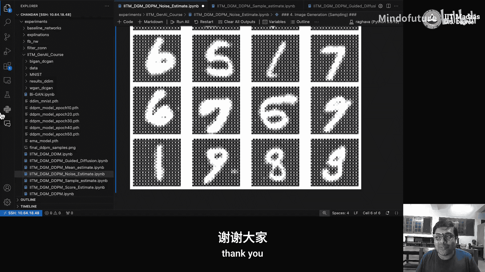

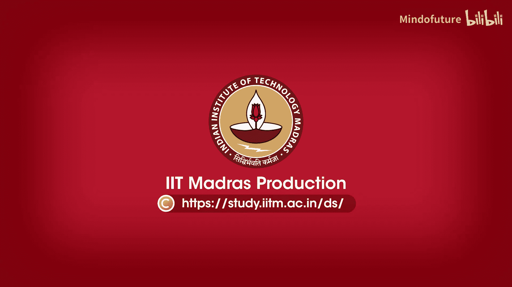


