# 063：DDIM的实现 🎼

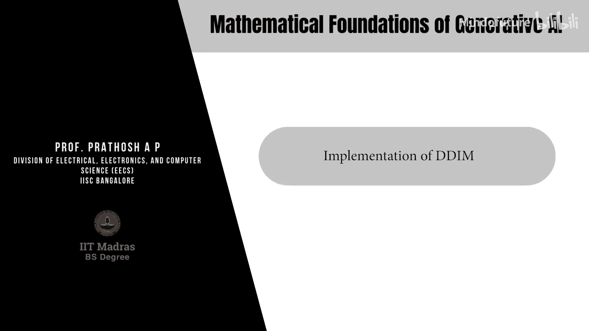


欢迎来到本教程，我们将探讨如何实现DDIM。在本节中，我们将专注于使用DDIM方法进行推理。我们不会进行任何训练，因为从理论课可知，如果在DDPM中训练一个回归网络，它实际上隐含地训练了DDIM所需的一系列模型。我们将使用之前教程中介绍过的噪声预测模型作为基础模型，然后在此基础上通过DDIM过程生成样本。

## 概述

在本节中，我们将学习如何实现去噪扩散隐式模型（DDIM）的采样过程。我们将基于一个预训练的噪声预测模型，编写代码执行DDIM采样，从而从随机噪声生成图像。整个过程只涉及推理，不涉及训练。

## DDIM采样过程回顾

首先，让我们回顾一下DDIM的采样公式。根据讨论，采样过程包含三个部分，需要将它们相加。我们将分别计算这三个部分，最后进行求和。

以下是DDIM采样的核心公式：

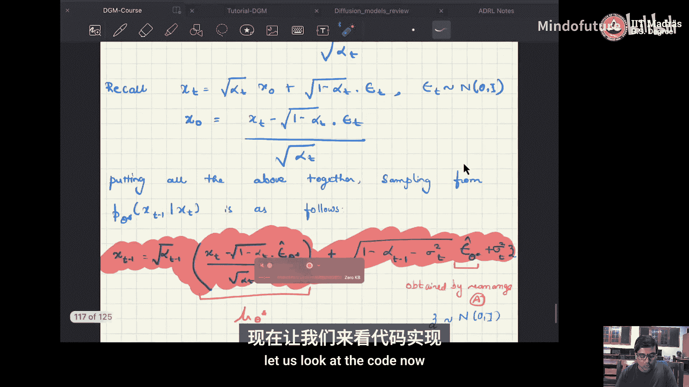

**公式：**
`x_{t-1} = μ_θ(x_t, t) + σ_t * z`

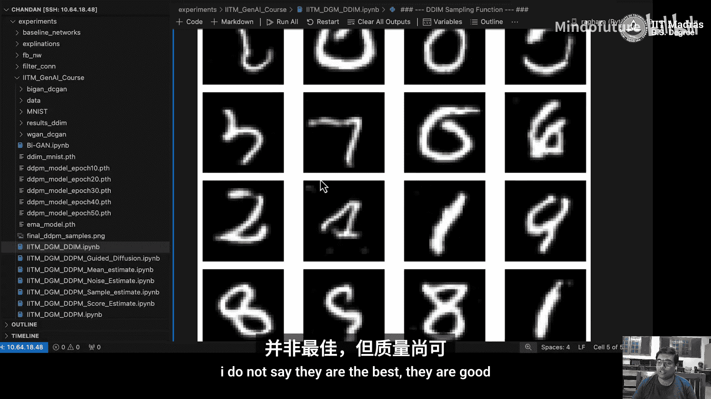

其中：
*   `μ_θ(x_t, t)` 是预测的均值。
*   `σ_t` 是方差项。
*   `z` 是标准高斯噪声。

具体而言，`μ_θ(x_t, t)` 可以通过预测的噪声 `ε_θ(x_t, t)` 和预测的原始图像 `x̂_0` 来计算。在我们的实现中，我们将使用噪声预测模型。

## 代码实现步骤

现在，让我们来看具体的代码实现。我们将逐步解析DDIM采样的关键步骤。

### 1. 初始化与参数设置

首先，我们设置采样所需的参数，包括生成样本的数量、采样步数以及参数 `η`。

**代码：**
```python
num_samples = 16
timesteps = 30
eta = 0
```

我们将模型设置为评估模式，并准备时间步序列。由于在任意时刻，我们都需要当前时间步和下一个时间步，因此我们将时间步处理成对的形式。

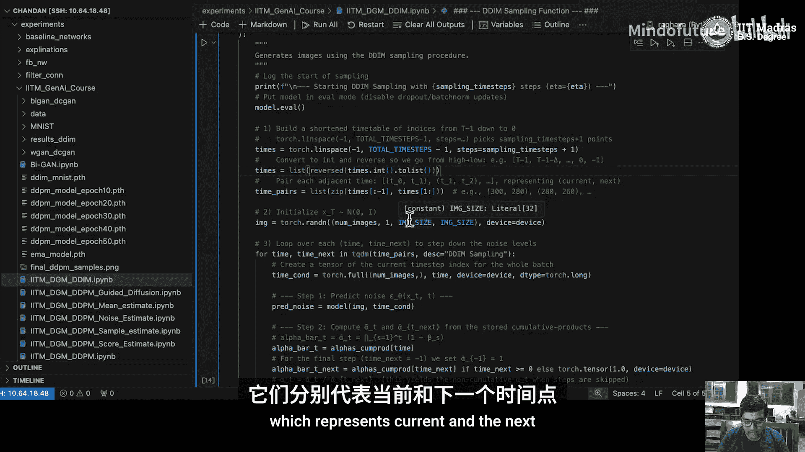

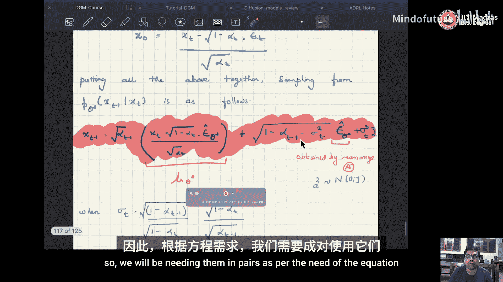

### 2. 采样循环

接下来，我们进入主要的采样循环。对于每一对时间步（当前步 `t` 和下一步 `t_next`），我们执行以下操作。

首先，我们从标准高斯分布中采样初始噪声 `x_t`。

**代码：**
```python
img = torch.randn((num_samples, 3, image_size, image_size), device=device)
```

然后，我们将当前图像 `img` 和时间步 `t` 输入噪声预测模型，得到预测的噪声 `pred_noise`。

**代码：**
```python
pred_noise = model(img, t)
```

### 3. 计算预测均值 `μ_θ`

根据公式，我们可以通过预测的噪声来计算预测的原始图像 `x̂_0`，进而得到预测的均值 `μ_θ`。

**公式：**
`x̂_0 = (x_t - √(1 - ᾱ_t) * ε_θ) / √ᾱ_t`

在我们的代码中，`α_t` 始终表示累积乘积 `ᾱ_t`，这与文献和之前训练过程保持一致，以确保兼容性。

**代码：**
```python
pred_x0 = (img - sqrt(1 - alpha_bar[t]) * pred_noise) / sqrt(alpha_bar[t])
pred_x0 = torch.clamp(pred_x0, -1., 1.)
```

`pred_x0` 即为我们预测的 `x̂_0`。然后，我们可以计算方向指向 `x_t` 的项。

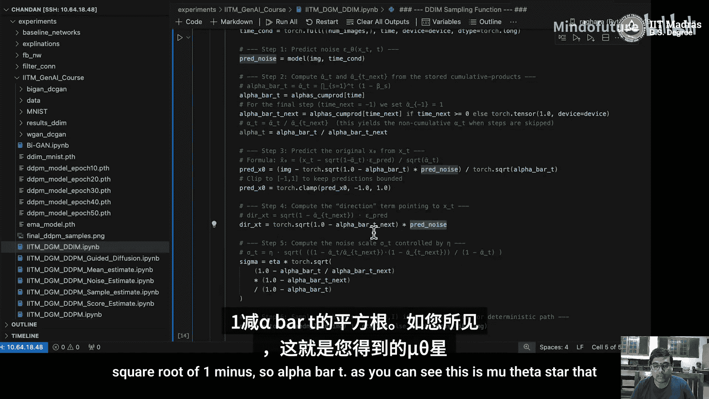

### 4. 计算方向项和噪声项

采样公式中的方向项由预测的噪声和系数组成。

**公式：**
`direction_to_xt = √(1 - ᾱ_{t_next} - σ_t^2) * ε_θ`

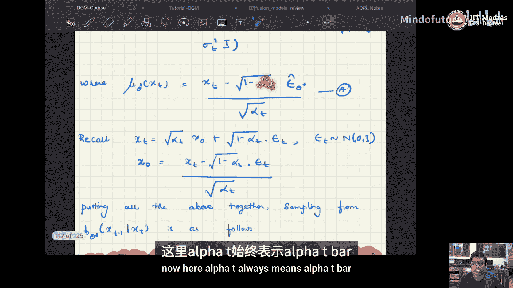

方差项 `σ_t` 的计算如下：

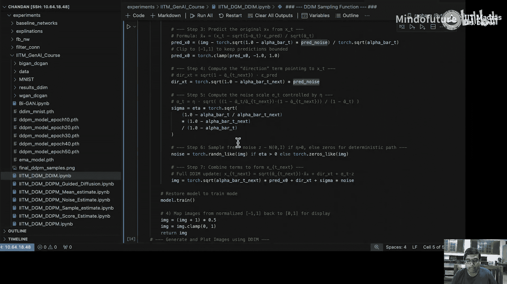

**公式：**
`σ_t = η * √((1 - ᾱ_{t-1})/(1 - ᾱ_t)) * √(1 - ᾱ_t/ᾱ_{t-1})`

在代码中，我们整体计算了平方根内的乘积。当 `η = 0` 时，`σ_t` 项为零，这对应于确定性采样（DDIM）。当 `η = 1` 时，它则包含随机噪声。

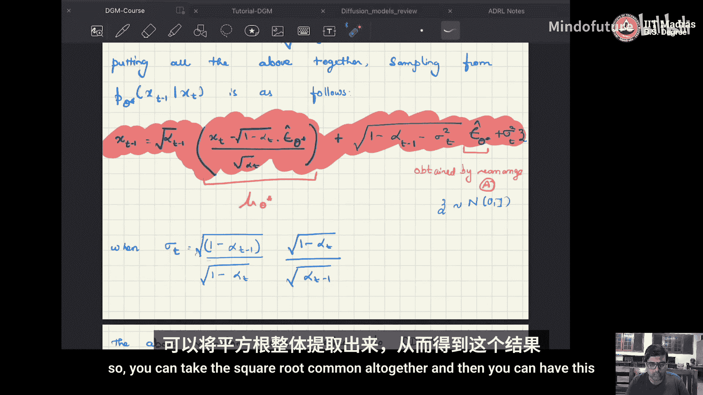

**代码：**
```python
# 计算方向项
dir_xt = sqrt(1 - alpha_bar[t_next] - sigma_t**2) * pred_noise
# 计算噪声项（当eta=0时此项为0）
noise = sigma_t * torch.randn_like(img) if eta > 0 else 0
```

### 5. 更新图像

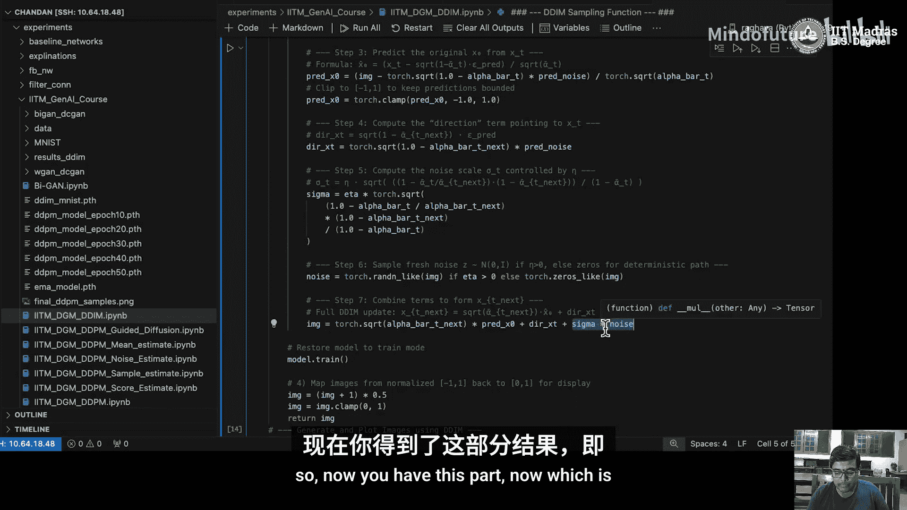

最后，我们将预测均值、方向项和噪声项相加，得到前一个时间步的图像 `x_{t-1}`。

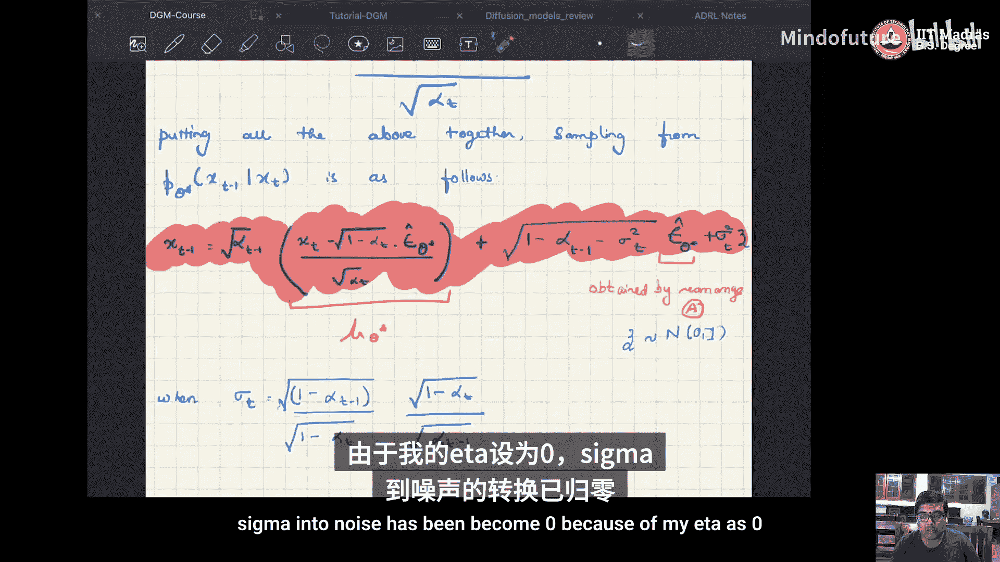

**公式：**
`x_{t-1} = √ᾱ_{t_next} * x̂_0 + direction_to_xt + noise`

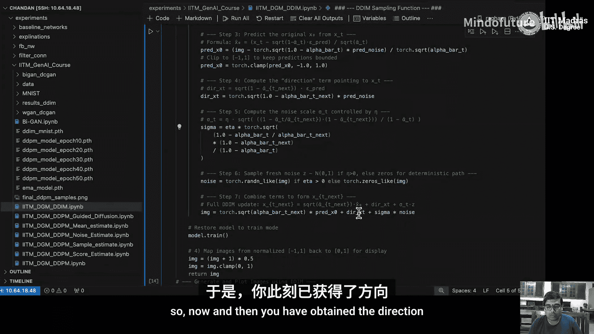

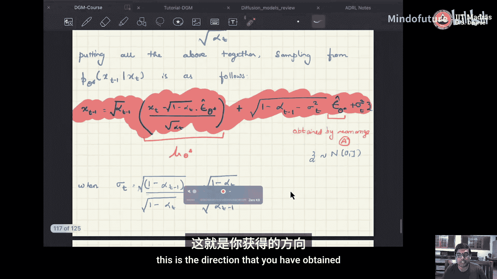

**代码：**
```python
img = sqrt(alpha_bar[t_next]) * pred_x0 + dir_xt + noise
img = torch.clamp(img, -1., 1.)
```

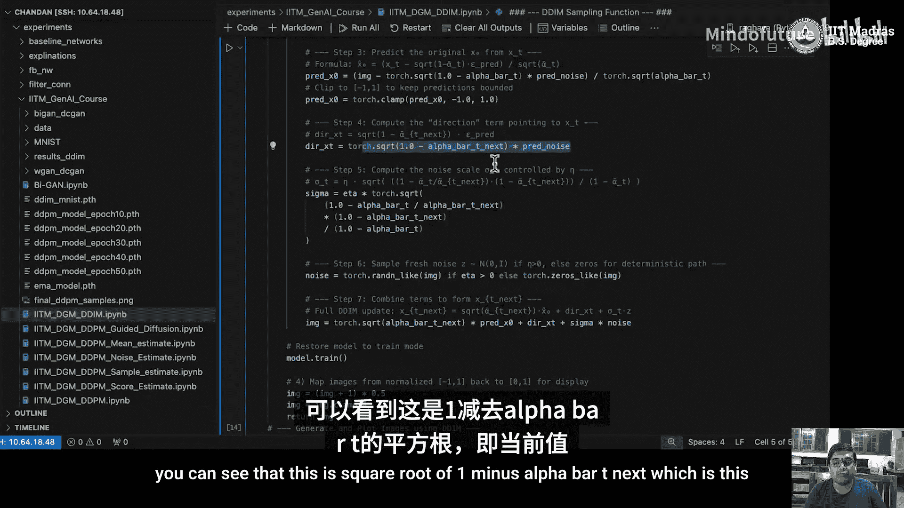

重复此过程，遍历所有的时间步对，最终得到生成的图像。

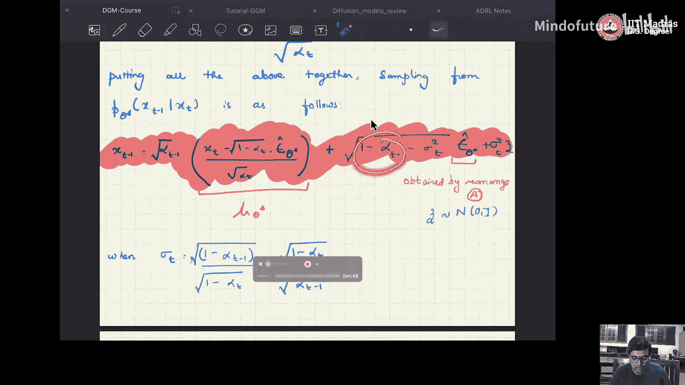

## 结果与比较


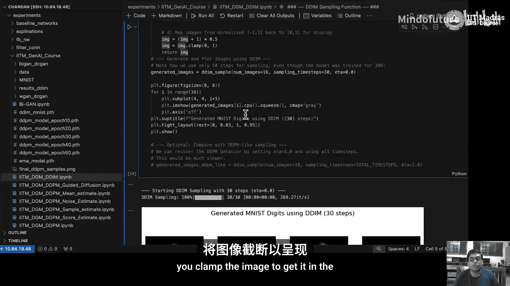

以上是通过DDIM采样生成的图像。它们质量尚可，但并非最佳。通过调整参数，例如使用完整的训练时间步数（例如600步）并将 `η` 设置为1，你可以比较不同设置下的结果，并可能获得更清晰、更锐利的图像。

使用DDIM的主要优势在于采样效率。例如，如果模型使用600个时间步训练，DDIM可以只采样30步，实现了20倍的加速，这是一个非常高效的操作。

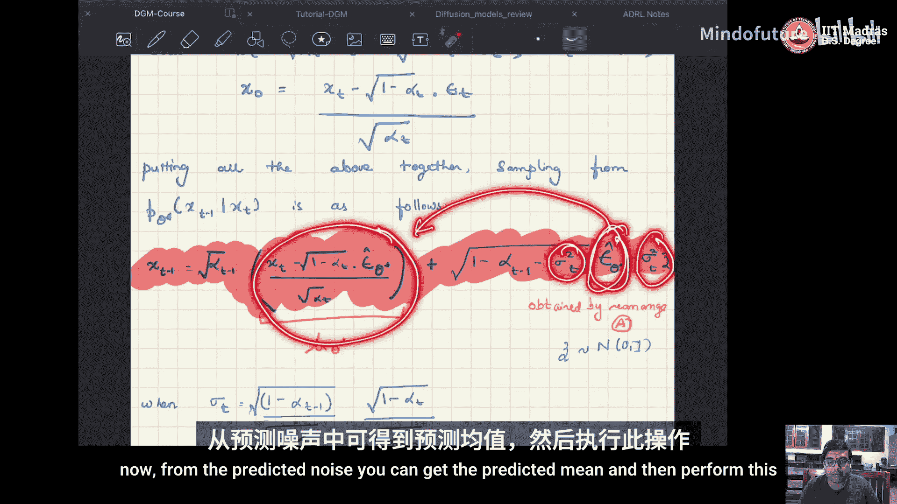

## 总结

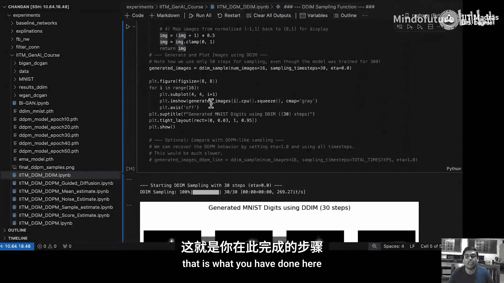

在本节课中，我们一起学习了DDIM（去噪扩散隐式模型）的实现方法。我们回顾了DDIM采样的核心公式，并逐步解析了如何利用预训练的噪声预测模型进行推理生成图像。关键点包括：

1.  **参数设置**：确定了采样步数和 `η` 参数。
2.  **噪声预测**：使用模型预测当前噪声。
3.  **均值与方向计算**：根据公式计算预测均值和指向 `x_t` 的方向。
4.  **图像更新**：结合均值、方向和随机噪声（若 `η>0`）更新图像。

通过将采样步数从训练时的数百步减少到几十步，DDIM显著提高了生成效率。建议你尝试修改参数（如 `timesteps` 和 `eta`），观察并比较生成图像质量的变化。

在接下来的教程中，我们将探讨自回归模型的相关内容。

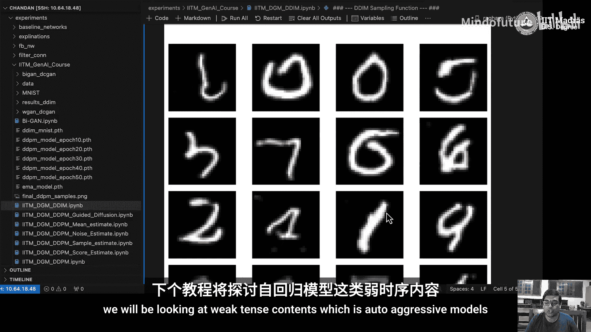

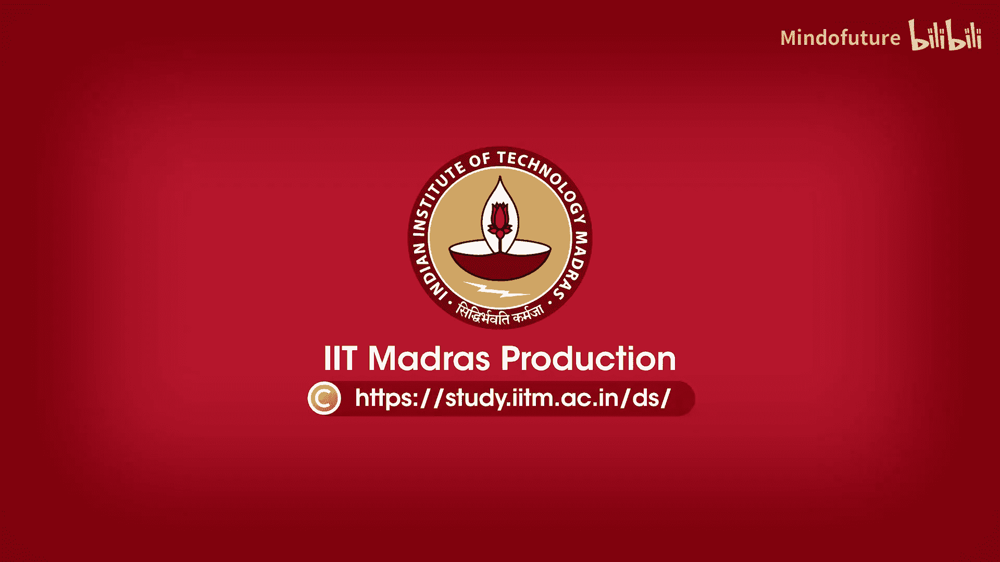


