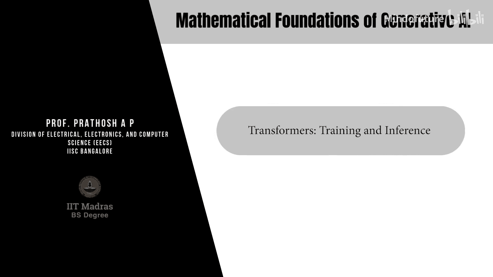
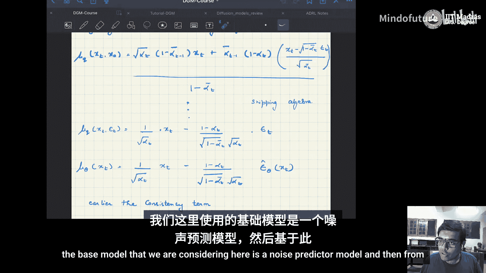
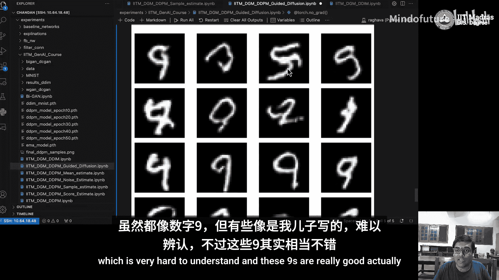
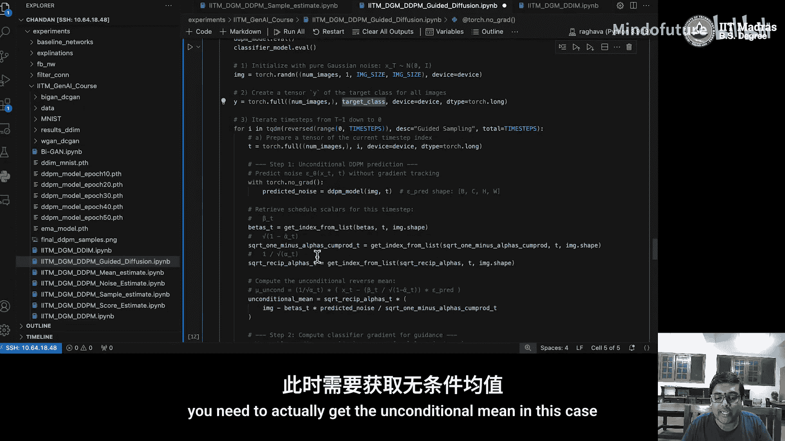
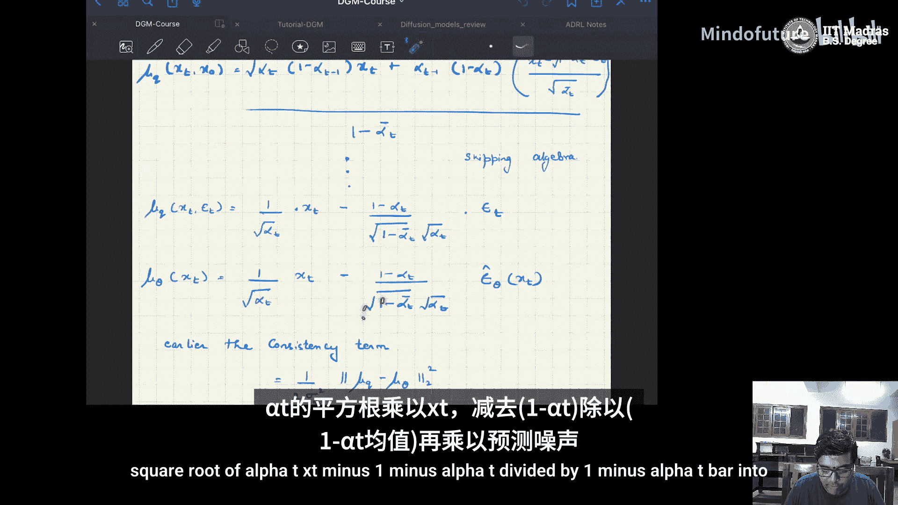
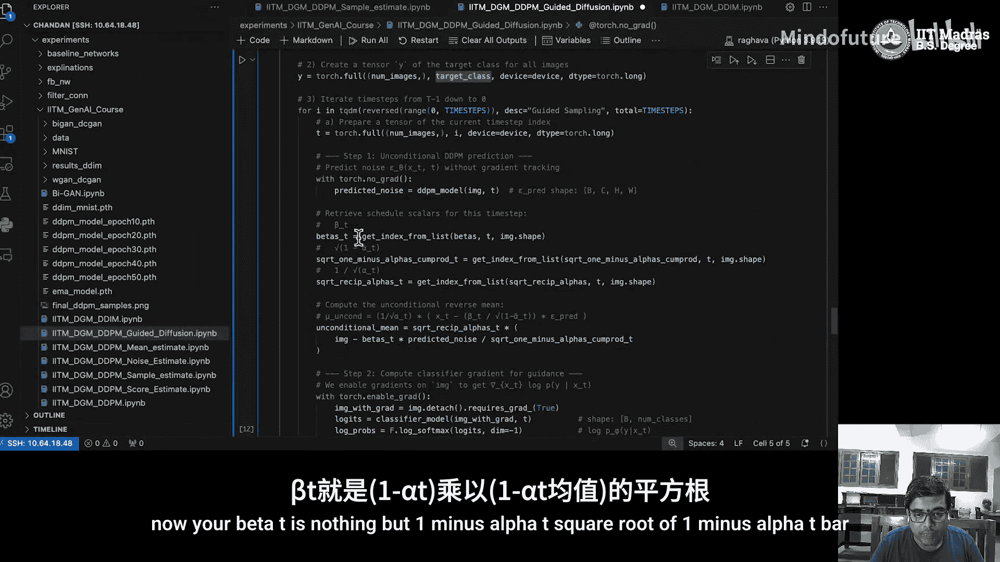
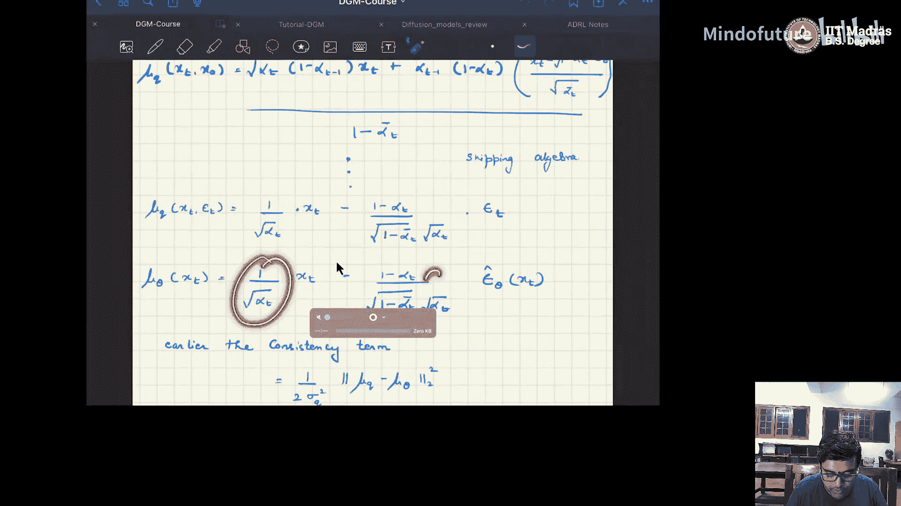
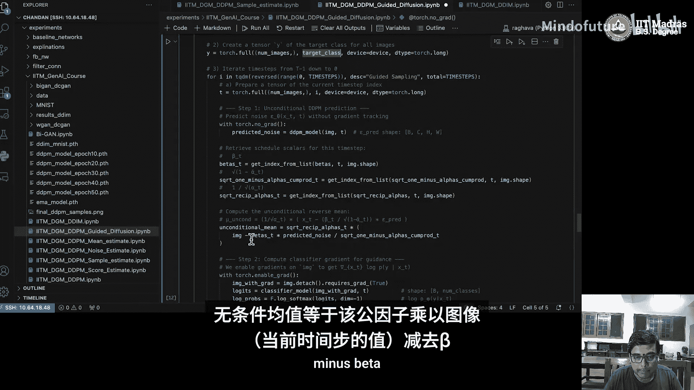
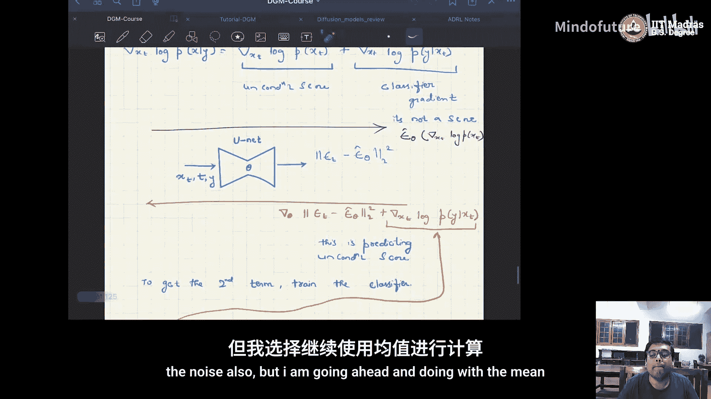
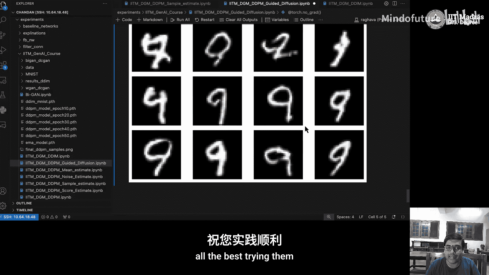

# 064：引导DDPM的实现 🧠





在本教程中，我们将学习如何实现**分类器引导的扩散模型采样**。我们将基于一个噪声预测模型，结合一个噪声分类器，来生成特定类别的图像。

---

## 概述 📋

上一节我们介绍了基础的噪声预测模型。本节中，我们将看看如何通过一个额外的分类器来引导扩散过程，从而生成指定类别的图像。核心在于，我们将一个训练好的无条件扩散模型与一个能对含噪图像进行分类的模型结合起来。

---

## 代码结构与准备 ⚙️

以下是实现所需的基本代码结构和准备工作。这与之前教程中的设置类似。

```python
# 必要的包导入
import torch
import torch.nn as nn
import torch.nn.functional as F
from torchvision import datasets, transforms
import numpy as np
import matplotlib.pyplot as plt

# 设置运行设备
device = torch.device('cuda' if torch.cuda.is_available() else 'cpu')

# 定义线性beta调度和前向扩散的辅助函数
def linear_beta_schedule(timesteps):
    # ... 具体实现
    return betas

def forward_diffusion(x0, t, sqrt_alphas_cumprod, sqrt_one_minus_alphas_cumprod):
    # ... 具体实现
    return noisy_image
```

我们使用了与之前相同的正弦时间嵌入、U-Net块和基础模块。这些部分没有变化。

---



## 噪声分类器 🎯

引导扩散需要的一个关键组件是**噪声分类器**。其核心思想是：在给定的时间步，输入一个含噪图像和时间戳，模型应能预测该图像对应的类别标签。

以下是噪声分类器的结构：



```python
class NoisyClassifier(nn.Module):
    def __init__(self, num_classes=10):
        super().__init__()
        self.time_embedding = nn.Embedding(1000, 128) # 可学习的时间嵌入
        self.conv1 = nn.Conv2d(1, 16, kernel_size=3, padding=1)
        self.conv2 = nn.Conv2d(16, 32, kernel_size=3, padding=1)
        self.pool = nn.MaxPool2d(2)
        self.fc = nn.Linear(32 * 7 * 7, num_classes) # 假设输入为28x28图像

    def forward(self, x, t):
        # x: 含噪图像, t: 时间步
        t_emb = self.time_embedding(t) # 获取时间嵌入
        x = F.relu(self.conv1(x))
        x = self.pool(x)
        x = F.relu(self.conv2(x))
        # 将时间嵌入扩展到与特征图匹配的维度并相加
        t_emb = t_emb.unsqueeze(-1).unsqueeze(-1).expand(-1, -1, x.shape[2], x.shape[3])
        x = x + t_emb
        x = x.flatten(start_dim=1)
        logits = self.fc(x)
        return logits
```



**训练过程**：
1.  首先，像之前一样训练一个**无条件噪声预测模型**。
2.  然后，训练这个**噪声分类器**。关键点在于，训练时输入的不是干净图像 `x0`，而是经过前向扩散过程得到的含噪图像 `xt`。损失函数使用标准的交叉熵损失。



---





## 引导采样：结合模型 🧩



当无条件扩散模型和噪声分类器都训练好后，核心问题是如何在采样过程中利用分类器的信息来生成指定类别的图像。

以下是引导采样的关键步骤：

```python
def guided_sample(model, classifier, target_class, scale=2.0, timesteps=1000):
    model.eval()
    classifier.eval()

    # 1. 从纯噪声开始
    xt = torch.randn((batch_size, 1, 28, 28)).to(device)

    # 目标类别标签
    y = torch.full((batch_size,), target_class, device=device)

    for t in reversed(range(timesteps)):
        # 2. 预测噪声
        predicted_noise = model(xt, torch.tensor([t], device=device))

        # 3. 计算无条件均值
        # 根据公式：μ_uncond = (1 / sqrt(α_t)) * (xt - ( (1-α_t) / sqrt(1-α_t_bar) ) * predicted_noise)
        sqrt_recip_alphas_t = torch.sqrt(1.0 / alphas[t])
        sqrt_one_minus_alphas_bar_t = torch.sqrt(1 - alphas_cumprod[t])
        mu_uncond = sqrt_recip_alphas_t * (xt - ( (1 - alphas[t]) / sqrt_one_minus_alphas_bar_t ) * predicted_noise)

        # 4. 计算分类器梯度
        xt.requires_grad_(True) # 开启梯度以计算分类器对xt的梯度
        logits = classifier(xt, torch.tensor([t], device=device))
        log_probs = F.log_softmax(logits, dim=-1)
        # 获取目标类别的对数概率
        target_log_probs = log_probs[range(batch_size), y]
        # 计算梯度：∇_xt log p(y | xt)
        gradient = torch.autograd.grad(target_log_probs.sum(), xt)[0]
        xt.requires_grad_(False)

        # 5. 调整均值：μ_guided = μ_uncond + scale * Σ_t * ∇_xt log p(y | xt)
        # 其中 Σ_t 是后验方差
        posterior_variance_t = (1 - alphas_cumprod[t-1]) / (1 - alphas_cumprod[t]) * (1 - alphas[t]) if t > 0 else 0
        mu_guided = mu_uncond + scale * posterior_variance_t * gradient

        # 6. 重参数化采样，得到前一时间步的图像
        if t > 0:
            noise = torch.randn_like(xt)
            xt = mu_guided + torch.sqrt(posterior_variance_t) * noise
        else:
            xt = mu_guided # 最后一步直接取均值

        # 可选：将像素值裁剪到合理范围
        xt = torch.clamp(xt, -1.0, 1.0)

    return xt
```

**核心公式**：
引导采样调整了反向扩散的均值。无条件均值 `μ_uncond` 根据噪声预测模型计算。然后，我们加上一个由分类器梯度引导的项：
`μ_guided = μ_uncond + s * Σ_t * ∇_xt log p(y | xt)`
其中：
*   `s` 是引导尺度，控制分类器影响的强度。
*   `Σ_t` 是时间步 `t` 的后验方差。
*   `∇_xt log p(y | xt)` 是分类器关于输入 `xt` 的梯度，它指示了如何改变 `xt` 以增加其属于目标类别 `y` 的概率。

---

## 结果与总结 🎨

通过上述过程，我们成功地将无条件扩散模型与一个噪声分类器相结合，实现了**分类器引导的采样**。在本例中，我们设定目标类别为数字“9”，并生成了相应的图像。虽然生成的图像质量有提升空间，但这清晰地展示了引导生成的基本原理。

**本节课中我们一起学习了**：
1.  **噪声分类器**的概念与实现，它能够对含噪图像进行分类。
2.  如何分别训练无条件扩散模型和噪声分类器。
3.  **引导采样**的核心算法：在反向扩散过程中，利用分类器关于输入图像的梯度来调整采样均值，从而将生成过程导向指定的类别。
4.  引导尺度 `s` 的作用，它平衡了无条件生成与分类器引导之间的强度。




你可以基于提供的代码框架，通过更长时间的训练、调整模型架构或优化超参数来获得更好的生成效果。在接下来的教程中，我们将探讨更高级的扩散模型变体。