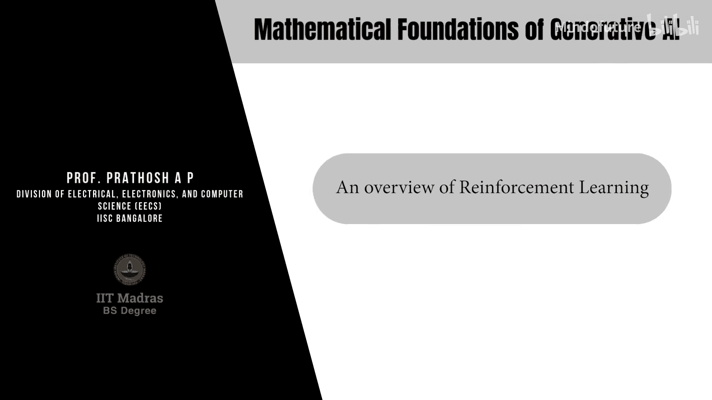
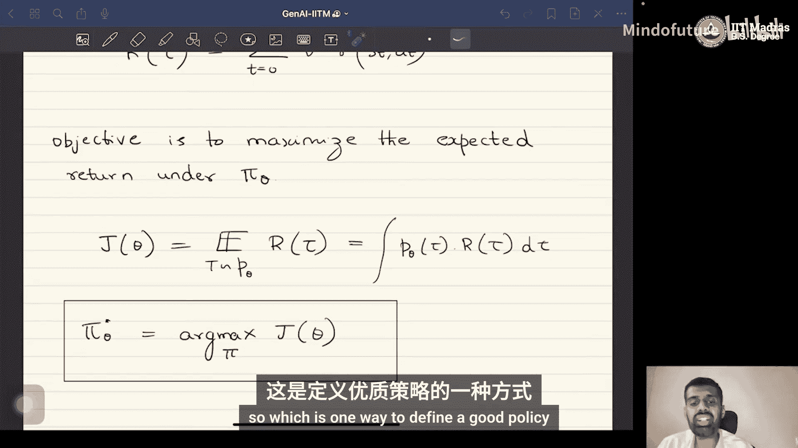

# 065：强化学习概述 🧠



在本节课中，我们将讨论用于语言模型对齐的强化学习方法。我们将从强化学习的基础概念入手，了解其如何应用于调整大型语言模型的行为，使其更符合人类的期望。

## 概述

在之前的课程中我们看到，自回归语言模型学习的是来自词汇表的一系列标记 `X_T` 的分布。具体来说，它学习在给定先前出现的标记序列 `X_{<t}` 的条件下，预测下一个标记 `X_t` 的概率。

这个条件分布 `P(X_t | X_{<t})` 通常使用如Transformer这类具有注意力机制的架构来建模。

由于语言模型是在大量无标签数据上训练的，对齐的目标是确保语言模型的行为与期望的、预定义的行为（由人工标注或固定规则指定）保持一致。这一点至关重要，因为大型语言模型的训练数据（例如来自互联网）通常未经任何监管。模型在这种无监督方式下训练，其行为可能不符合人类期望。为了确保模型的行为方式符合人类预期，模型必须与人类的期望对齐。

一种方法是以完全监督的方式重新训练模型，即提供符合人类用户期望的输入-输出对。然而，这类数据极难获取。相对容易的是，对于一个已训练的语言模型，给定一个输入，可以生成多个候选输出，然后由人类评判员或其他基于机器的机制对这些输出进行评级。基于这些评级或判断，语言模型需要被重新训练或对齐，以确保未来模型的输出能与人类做出的判断保持一致。这就是为什么在模型训练后需要进行对齐的直观目标。

总结来说，大型语言模型在未经监管的数据上训练，这些数据可能包含各种类型的标记。为了确保语言模型的输出以符合人类行为的方式受到监管，需要使用某些方法重新训练模型，使其输出与人类用户的期望兼容。为了实现这一目标，人们提出了许多基于强化学习的算法，它们非常适用于语言模型的对齐领域。

因此，让我们从强化学习的介绍开始。

## 强化学习简介

请注意，强化学习本身是一个非常广阔的领域。本课程的目标并非专门教授强化学习，我们只会概述强化学习的基本概念，并简要了解其中一种用于语言模型对齐的变体。

统计模型学习有三种主要范式：
1.  **监督学习范式**：我们拥有数据和对应的标签，目标是让模型学习标签基于数据的后验分布。
2.  **无监督学习范式**：我们拥有从特定分布采样的数据，但没有对应的标签。我们建模的是给定数据的边缘分布。
3.  **强化学习范式**：其思想是模仿人类的学习方式。人类既没有像监督学习中那样确切的标签，也并非像无监督学习那样完全没有环境反馈。人类的学习方式介于严格的监督学习范式和无任何标签的无监督学习范式之间。

观察人类如何学习：我们执行一个特定动作，基于我们执行的动作，我们所处的环境会给出反馈。这个反馈可以是正面的或负面的。根据收到的反馈类型，我们在未来面对完全相同的情境时会改变行为方式。如果是正面反馈，我们的行为会得到强化；如果是负面反馈，我们则会改变该行为，转向不同的行为方式。这就是人类学习的基本思想，也是强化学习范式所模仿的。

## 强化学习的数学形式化

在强化学习范式中，我们有一个**智能体**和一个**环境**。

智能体在每个离散时间步 `t` 处于一个特定**状态**并执行一个特定**动作**。智能体可能处于的状态来自一个有限的**状态空间** `S`，智能体可以执行的动作来自**动作空间** `A`。

在每个时间步 `t`，智能体根据一个称为**策略**的函数采取特定动作。一旦智能体执行了一个动作，环境会通过提供一个反馈来响应，该反馈由一个称为**奖励函数** `R` 的函数量化。奖励函数从状态空间和动作空间的笛卡尔积映射到一个实数。也就是说，当智能体在状态 `S_t` 采取动作 `A_t` 时，环境返回奖励 `R(S_t, A_t)`。

环境给出奖励后，智能体根据另一个称为**转移核**的分布转移到新状态 `S_{t+1}`。一旦进入状态 `S_{t+1}`，它再次根据策略采取另一个动作，这个过程不断重复。

其思想是以某种方式学习或调整此策略，以优化累积奖励的某种度量。

重复一下设置：有一个智能体在不同的状态下执行一系列因果动作。每次智能体执行一个特定动作，环境都会通过给予反馈来响应，该反馈由奖励函数量化。智能体收到反馈后，根据转移核转移到不同的状态。一旦处于不同的状态，它根据其遵循的策略采取另一个动作。这个过程持续进行。强化学习的目标是更新或学习智能体所遵循的策略，以优化某种累积奖励的概念。这是基本思想。

从数学上讲，我刚才描述的整个过程由一个称为**马尔可夫决策过程** 的概念形式化。MDP由以下五元组定义：`(S, A, P, R, γ, ρ)`。

让我们逐一查看它们的定义：
*   `S` 定义了智能体可能处于的状态集合。它可以是一个包含 `M` 个元素的有限集。集合 `S` 称为MDP的**状态空间**。
*   `A` 定义了可能的动作集合。这也称为**动作空间**。
*   转移核记为 `P(S_{t+1} | S_t, A_t)`。这是在时间 `t` 处于状态 `S_t` 并执行动作 `A_t` 时，在时间 `t+1` 转移到状态 `S_{t+1}` 的概率。
*   奖励函数 `R` 是从状态空间和动作空间的笛卡尔积到实数的函数。`R(S_t, A_t)` 表示在状态 `S_t` 采取动作 `A_t` 所获得的奖励。请注意，奖励的概念是固定的，它取决于环境，我们无法控制环境如何给出奖励。
*   `γ` 是**折扣因子**，是一个介于0和1之间的标量。稍后将描述为什么需要折扣因子的概念。
*   `ρ` 是初始状态分布。由于我们有一个随机离散时间随机过程来模拟智能体的行为，因此需要初始状态分布向量 `ρ`。

此外，我们还有**策略** `π_θ`，如前所述，它是在给定状态 `S` 下动作的分布，即 `π_θ(A_t | S_t)`。该策略由参数 `θ` 参数化。我们的想法是根据收到的奖励类型来改变这个策略。

很容易注意到，智能体的行为完全取决于这个特定的随机策略分布，它会告诉我们处于特定状态时应采取什么动作。这由 `θ` 参数化。

## 轨迹与目标函数

当智能体根据策略 `π_θ` 行动时，我们会得到一条**轨迹**，记为 `τ`。这是一组交替的状态和动作：`τ = (S_0, A_0, S_1, A_1, S_2, A_2, ...)`。

一旦有了这条轨迹，我们就可以定义轨迹的分布，称为**轨迹分布**。在策略 `π_θ` 下的轨迹分布 `P_θ(τ)` 由以下公式给出：

```
P_θ(τ) = ρ(S_0) * ∏_{t=0}^{T-1} [ π_θ(A_t | S_t) * P(S_{t+1} | S_t, A_t) ]
```

这只是概率的链式法则。我们所做的是写出了在策略 `π_θ` 下给定轨迹 `τ` 的分布。智能体从 `S_0` 开始，其概率由初始状态分布 `ρ` 给出。然后在每个时间步 `t`，智能体根据策略行动，这意味着它在状态 `S_t` 下执行动作 `A_t`。根据智能体在状态 `S_t` 下执行的动作，它根据转移核 `P` 转移到状态 `S_{t+1}`。这就是特定轨迹的概率。

定义了轨迹之后，我们需要定义强化学习的目标。目标是学习一个好的策略。问题是如何定义“好”的策略。为此，我们需要定义另一个称为**折扣回报**的量。

一条轨迹 `τ` 的折扣回报 `R(τ)` 定义如下：

```
R(τ) = ∑_{t=0}^{T-1} γ^t * R(S_t, A_t)
```

这里发生的是，我们本可以只取智能体在遍历该特定轨迹时获得的所有奖励之和。然而，人们通常采用折扣奖励，原因是随着我们远离给定时间 `t`，奖励函数对策略改变的影响应该减小。因为更接近给定时间步的动作对策略的影响应该比之后采取的动作更大，这是通过将奖励乘以常数 `γ^t` 来体现的。折扣因子 `γ` 是0到1之间的标量。因此，随着我们离给定的 `t` 越来越远，`γ^t` 会减小，这就是我们乘以折扣因子的原因。

现在，强化学习中的**目标**或**目标函数**是最大化**期望折扣回报**。数学上，目标函数 `J(θ)` 是：

```
J(θ) = E_{τ ∼ P_θ} [ R(τ) ] = ∫ P_θ(τ) * R(τ) dτ
```

我们想要做的是学习策略 `π_θ`，以最大化期望回报。这个优化是针对所有可能的此类策略。这就是强化学习的目标函数。

## 总结

让我们快速回顾一下我们所做的内容。

当智能体与环境交互时，我们获得一条**轨迹**，它是一组交替的状态和动作。我们可以使用特定表达式定义在策略 `π_θ` 下的轨迹分布。强化学习算法的目标是学习一个好的策略。定义策略好坏的一种方法是定义**折扣回报**，它本质上是整个轨迹上经过加权的奖励。一旦有了这个折扣回报，目标就是最大化这个**期望回报**，即在所有可能轨迹的分布下（进而也是在策略的分布下）该折扣回报的期望值。

这是任何强化学习算法的主要目标函数。解决这个优化问题后，我们得到一个能最大化期望折扣回报的策略，这是定义好策略的一种方式。




在本节课中，我们一起学习了强化学习的基本框架及其在语言模型对齐中的应用背景。我们介绍了马尔可夫决策过程的核心组件，包括状态、动作、策略、奖励函数和转移核，并定义了通过最大化期望折扣回报来学习最优策略的目标。在接下来的课程中，我们将探讨如何利用这个框架具体实现语言模型的对齐。