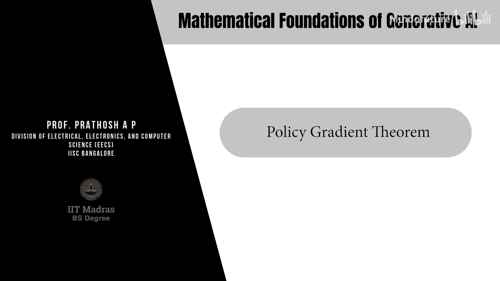
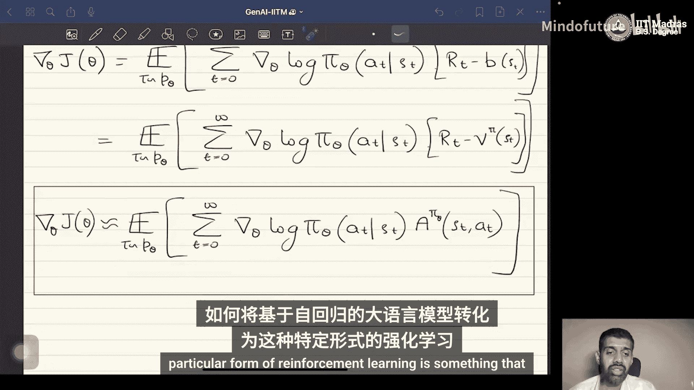

# 066：策略梯度定理 🎼

在本节课中，我们将学习强化学习中一个核心的优化方法——策略梯度定理。我们将了解如何通过梯度下降来优化策略，并推导出计算目标函数梯度的关键公式。这对于后续理解如何将强化学习应用于大语言模型的对齐任务至关重要。

## 优化问题的多种解法

强化学习中的优化问题有多种解决方法。为了本次讨论，我们将关注其中一种流行的方法：策略梯度优化。

## 策略梯度优化的核心思想

其核心思想如下：假设我们优化的策略可以用可微函数（例如神经网络）表示。一个具体的例子是我们正在考虑的情况，即策略由类似Transformer的架构（一种长波模型）表示。在这种情况下，此优化问题可以使用常见的随机梯度方法求解。

## 梯度下降与目标函数梯度

为了实现这一点，我们需要获得特定目标函数的梯度。因为梯度下降法要求我们沿着目标函数的梯度方向更新策略参数。更新公式如下：

`θ_new = θ_old + η * ∇_θ J(θ)`

其中 `η` 是学习率，`∇_θ J(θ)` 是目标函数关于策略参数 `θ` 的梯度。

## 策略梯度定理的必要性

只有当我们可以获得目标函数关于策略参数 `θ` 的梯度时，才能进行这种基于梯度下降的策略更新。为此，我们需要借助一个非常强大且优美的结果——策略梯度定理。这个定理使我们能够找到解决上述优化问题所需的目标函数梯度。

## 策略梯度定理的推导

现在，让我们看看策略梯度定理具体是什么。我们需要计算以下目标函数的梯度：

`∇_θ J(θ) = ∇_θ E_{τ∼p_θ(τ)} [R(τ)]`

其中，目标函数是期望折扣回报 `R(τ)`，期望是关于从分布 `p_θ(τ)` 中采样的轨迹 `τ` 计算的。

### 第一步：将梯度移入期望

由于梯度是线性算子，我们可以将其移入积分（或期望）内部：

`∇_θ J(θ) = ∫ ∇_θ [p_θ(τ) * R(τ)] dτ = ∫ [∇_θ p_θ(τ)] * R(τ) dτ`

这里，`R(τ)` 独立于 `θ`。

### 第二步：应用对数导数技巧

我们需要计算 `∇_θ p_θ(τ)`。这里可以使用对数导数技巧，将其表达为：

`∇_θ p_θ(τ) = p_θ(τ) * ∇_θ log p_θ(τ)`

这个技巧成立是因为 `∇ log f(x) = (∇ f(x)) / f(x)`。将其代入上式，得到：

`∇_θ J(θ) = ∫ p_θ(τ) * [∇_θ log p_θ(τ)] * R(τ) dτ = E_{τ∼p_θ(τ)} [∇_θ log p_θ(τ) * R(τ)]`

### 第三步：分解轨迹概率

现在，让我们考虑 `∇_θ log p_θ(τ)` 这一项。我们知道轨迹概率定义为：

`p_θ(τ) = ρ(s_0) * Π_{t=0}^{∞} [π_θ(a_t|s_t) * p(s_{t+1}|s_t, a_t)]`

其中 `ρ(s_0)` 是初始状态分布，`p(s_{t+1}|s_t, a_t)` 是环境转移概率。对上述取对数并求梯度：

`∇_θ log p_θ(τ) = Σ_{t=0}^{∞} ∇_θ log π_θ(a_t|s_t)`

因为 `ρ(s_0)` 和转移概率 `p` 均与策略参数 `θ` 无关，在求梯度时为零。

### 第四步：得到基本形式

将上述结果代回梯度表达式：

`∇_θ J(θ) = E_{τ∼p_θ(τ)} [ Σ_{t=0}^{∞} ∇_θ log π_θ(a_t|s_t) * R(τ) ]`

这就是策略梯度定理最基本的形式。它指出，用于更新策略的目标函数的梯度由此特定期望给出。

## 从基本形式到实用形式

上一节我们推导了策略梯度定理的基本形式，本节中我们来看看如何将其转化为更高效、方差更低的实用形式。

### 引入“未来回报”

在上述基本形式中，整个轨迹的总回报 `R(τ)` 被应用于所有时间步 `t`，无论动作是何时采取的。我们可以通过定义从时间 `t` 开始的未来折扣回报 `R_t` 来使其更高效：

`R_t = Σ_{k=0}^{∞} γ^k * r_{t+k}`

其中 `γ` 是折扣因子。这样，总回报 `R(τ)` 就等于 `R_0`。梯度可以等价地重写为：

`∇_θ J(θ) = E_{τ∼p_θ(τ)} [ Σ_{t=0}^{∞} ∇_θ log π_θ(a_t|s_t) * R_t ]`

现在，每个时间步 `t` 乘的是从该时刻开始的未来回报 `R_t`，而不是整个轨迹的总回报。

### 引入基线以减少方差

上述梯度估计量的方差通常很大。为了降低方差，常用的方法是从回报 `R_t` 中减去一个仅依赖于状态 `s_t` 的基线函数 `b(s_t)`。可以证明，这不会改变梯度的期望值，但能有效减少方差。

因此，引入基线后的新梯度估计为：

`∇_θ J(θ) = E_{τ∼p_θ(τ)} [ Σ_{t=0}^{∞} ∇_θ log π_θ(a_t|s_t) * (R_t - b(s_t)) ]`

### 选择价值函数作为基线

文献中的多种算法给出了不同的基线函数选择。一个著名且高效的选择是使用**价值函数** `V^π(s)` 作为基线。

以下是相关函数的定义：

*   **价值函数**：`V^π(s) = E_{τ∼π} [ Σ_{k=0}^{∞} γ^k * r_{t+k} | s_t = s ]`
    *   表示从状态 `s` 开始，遵循策略 `π` 所能获得的期望折扣回报。
*   **动作价值函数（Q函数）**：`Q^π(s, a) = E_{τ∼π} [ Σ_{k=0}^{∞} γ^k * r_{t+k} | s_t = s, a_t = a ]`
    *   表示从状态 `s` 开始并执行动作 `a`，然后遵循策略 `π` 所能获得的期望折扣回报。
*   **优势函数**：`A^π(s, a) = Q^π(s, a) - V^π(s)`
    *   表示在状态 `s` 下采取特定动作 `a`，相比于遵循策略 `π` 的平均表现，所带来的额外期望回报。

### 连接优势函数

一个关键结论是：**未来回报 `R_t` 与价值函数 `V^π(s_t)` 的差值，是优势函数 `A^π(s_t, a_t)` 的一个无偏估计量**。

证明如下：
`E [ R_t - V^π(s_t) | s_t, a_t ] = E [ R_t | s_t, a_t ] - V^π(s_t) = Q^π(s_t, a_t) - V^π(s_t) = A^π(s_t, a_t)`

因此，`(R_t - V^π(s_t))` 可以看作是优势函数的一个单样本估计。

## 策略梯度定理的最终形式

综合以上步骤，我们得到了策略梯度定理最终常用的形式：

`∇_θ J(θ) = E_{τ∼p_θ(τ)} [ Σ_{t=0}^{∞} ∇_θ log π_θ(a_t|s_t) * A^π(s_t, a_t) ]`

这个表达式被大多数先进的、基于策略梯度的算法所采用，也包括用于大语言模型对齐的算法。

## 遗留问题与展望

到目前为止，我们一起学习了策略梯度定理的完整推导和演变。最后，还有两个关键问题需要回答：

1.  **如何将自回归大语言模型嵌入到这个强化学习框架中？** 我们需要将语言模型的生成过程（根据上文生成下一个词）视作一个顺序决策过程。
2.  **在实践中如何计算优势函数？** 通常需要训练一个参数化的奖励模型来估计回报。在拥有奖励模型后，可以使用诸如广义优势估计（GAE）等方法来高效计算优势函数。

我们将在后续课程中探讨如何训练参数化奖励模型，并详细讲解如何将大语言模型与策略梯度优化方法结合起来，从而完成对齐的闭环。

## 总结

本节课中，我们一起学习了策略梯度定理。我们从优化策略的基本目标出发，推导了目标函数梯度的基本表达式。为了提升学习效率并降低估计方差，我们引入了未来回报、基线函数等概念，并最终将梯度表达为策略对数梯度与优势函数乘积的期望。这个最终形式 `∇_θ J(θ) = E [ Σ_t ∇_θ log π_θ(a_t|s_t) * A^π(s_t, a_t) ]` 构成了现代策略梯度算法（如用于大模型对齐的RLHF方法）的核心数学基础。