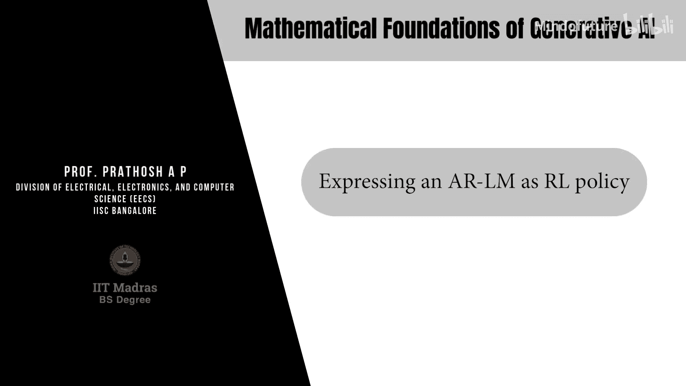
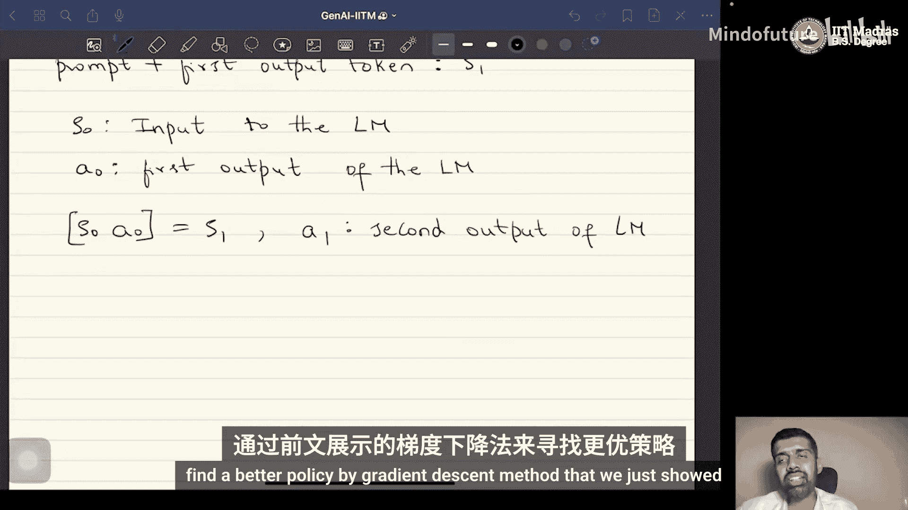

# 067：将自回归语言模型表达为强化学习策略

在本节中，我们将学习如何将自回归语言模型（AR-LM）的生成过程，形式化地表达为一个强化学习（RL）策略。这是应用强化学习理论来优化语言模型的关键第一步。

## 概述

上一节我们介绍了强化学习中的策略梯度定理。为了将该理论应用于语言模型，我们首先需要将自回归语言模型表述为一个强化学习策略。本节将详细阐述这一对应关系的建立过程。

## 将语言模型视为策略

在自回归语言模型中，我们建模的是给定历史词元（tokens）序列后，下一个词元的条件概率分布。其核心操作是预测：
**P_θ(x_t | x_{<t})**
其中，`θ` 是模型参数，`x_t` 是当前要预测的词元，`x_{<t}` 是之前所有已生成的词元。

在强化学习的框架下，我们将这个语言模型本身视为一个策略 `π_θ`。策略的功能是：在给定当前状态 `s_t` 时，选择动作 `a_t`。对于语言模型，这个对应关系非常直接：
**π_θ(a_t | s_t) = P_θ(x_t | x_{<t})**
这意味着，语言模型根据当前已生成的文本（状态），生成下一个词元（动作）的概率分布，就是我们的策略。

## 构建语言模型的轨迹

为了应用策略梯度等强化学习算法，我们需要定义语言模型生成过程中的“轨迹”。轨迹由一系列状态和动作交替组成：`τ = (s_0, a_0, s_1, a_1, ...)`。

以下是语言模型中轨迹的构建步骤：

1.  **初始状态 `s_0`**：初始状态是提供给语言模型的输入，通常称为“提示”（prompt）。

2.  **第一个动作 `a_0`**：语言模型根据初始提示 `s_0`，通过某种推理过程（如采样或贪婪解码）生成第一个输出词元。这个词元即为第一个动作 `a_0`。

3.  **后续状态 `s_1`**：将初始提示 `s_0` 和第一个动作 `a_0` 拼接起来，构成新的文本序列，这个序列就是下一个状态 `s_1`。

4.  **后续动作与状态**：语言模型基于新状态 `s_1` 生成第二个词元，作为动作 `a_1`。再将 `a_1` 拼接到 `s_1` 之后，形成状态 `s_2`。以此类推，不断重复，直到生成结束标志或达到长度限制。

通过这种方式，语言模型的一次完整文本生成过程，就被构建成了一条强化学习所需的轨迹 `τ`。

## 应用策略梯度优化

一旦我们将语言模型定义为策略 `π_θ`，并将其生成过程构建为轨迹 `τ`，强化学习的框架便完全适用。我们可以使用策略梯度定理来计算目标函数（例如期望奖励）关于模型参数 `θ` 的梯度。

梯度公式的核心形式为：
**∇_θ J(θ) ≈ E_{τ∼π_θ} [ Σ_t (∇_θ log π_θ(a_t | s_t)) * R(τ) ]**
其中，`R(τ)` 是评估整个生成轨迹 `τ` 质量的奖励函数。通过梯度上升法更新参数 `θ`，我们可以优化策略（即语言模型），使其生成的文本能获得更高的奖励。

## 总结

本节课中，我们一起学习了将自回归语言模型转化为强化学习策略的关键步骤。我们明确了语言模型的条件概率分布即为策略本身，并详细说明了如何将文本生成过程构建成状态-动作轨迹。这为后续直接应用策略梯度等强化学习算法来优化语言模型的生成质量奠定了坚实的理论基础。下一节，我们将探讨如何设计合适的奖励函数 `R(τ)` 来指导语言模型的优化方向。