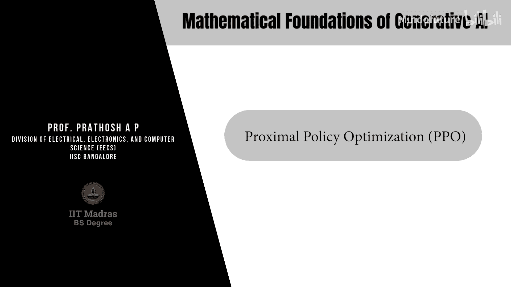

# 068：近端策略优化（PPO） 🎯

## 概述
在本节中，我们将学习两种用于将语言模型与人类偏好对齐的策略梯度算法的改进版本。第一种是**近端策略优化算法**，第二种是**直接偏好优化算法**。这两种是目前用于对齐自回归语言模型与特定人类偏好数据的非常流行的算法。

## 从策略梯度到重要性采样

上一节我们介绍了策略梯度算法的基础。在强化学习框架中，语言模型被视为一个参数化的策略。策略梯度算法用于对齐该策略。参数更新遵循梯度上升，目标函数J(θ)的梯度估计为：

**公式：**
∇J(θ) = E[∇log π_θ(a_t|s_t) * A_t]

其中，期望是关于从策略π_θ中采样的轨迹。我们可以使用样本平均来近似这个期望，得到梯度估计：

**公式：**
Ĝ = (1/B) Σ_{t=0}^{T-1} [∇log π_θ(a_t|s_t) * Â_t]

这里的动作a_t和状态s_t来自当前策略的“展开”。在语言模型中，这对应于给定提示并生成响应。

然而，这个估计器是**同策略**的，这意味着每次参数更新都需要从正在优化的同一策略中采集新的样本。这个过程计算成本高昂，并且由于每次更新后都丢弃旧轨迹，可能导致高方差。我们希望复用从旧策略收集的轨迹数据来更新当前策略，即转向**异策略**学习。这可以通过一种经典的统计技术——**重要性采样**——来实现。

## 重要性采样原理

重要性采样是一种用于评估随机变量函数期望的通用方法。问题在于计算函数f(x)关于分布p(x)的期望：

**公式：**
E_{x~p}[f(x)] = ∫ p(x) f(x) dx

假设我们有另一个分布q(x)。我们可以将上述期望重写为：

**公式：**
E_{x~p}[f(x)] = ∫ [p(x)/q(x)] f(x) q(x) dx = E_{x~q}[(p(x)/q(x)) f(x)]

这样，关于p(x)的期望就被转换成了关于q(x)的期望，只需在函数f(x)上乘以两个密度的比值p(x)/q(x)。这个技术就是重要性采样。

## 在策略梯度中应用重要性采样

现在，让我们看看如何将重要性采样的思想应用到策略梯度中。我们的目标是计算梯度∇J(θ)，其期望是关于当前策略π_θ的。

假设我们从另一个策略π_{θ_old}中采样轨迹。应用重要性采样，我们可以将梯度期望重写为：

**公式：**
∇J(θ) = E_{(s_t, a_t)~π_{θ_old}} [ (π_θ(a_t|s_t) / π_{θ_old}(a_t|s_t)) * ∇log π_θ(a_t|s_t) * A_t ]

可以证明，上式中的项(π_θ/π_{θ_old}) * ∇log π_θ 等于 ∇(π_θ/π_{θ_old})。因此，我们定义一个新的**替代损失函数**：

**公式：**
L_{IS}(θ) = E_{(s_t, a_t)~π_{θ_old}} [ (π_θ(a_t|s_t) / π_{θ_old}(a_t|s_t)) * A_t ]

这个替代损失函数的梯度与原始目标函数J(θ)的梯度相同。现在，期望是关于固定的旧策略π_{θ_old}的，这允许我们复用旧策略采集的数据进行多次更新，从而提高了数据效率。

## 近端策略优化的核心思想

然而，上述重要性采样公式存在一个问题：如果新策略π_θ与旧策略π_{θ_old}偏离太多，重要性权重(π_θ/π_{θ_old})的方差会变得非常大，导致训练不稳定。

为了避免这个问题，PPO算法对目标函数施加了约束，以限制新策略偏离旧策略的程度。这是通过引入一个分布散度度量（通常是KL散度）作为约束来实现的。

PPO没有直接使用带约束的优化，而是提出了两种主要的替代目标函数形式，它们在实践中更容易优化：

**1. PPO-裁剪**
这种方法通过裁剪重要性权重比率来防止过大的更新。

**公式：**
L^{CLIP}(θ) = E_t [ min( r_t(θ) * Â_t, clip(r_t(θ), 1-ε, 1+ε) * Â_t ) ]
其中， r_t(θ) = π_θ(a_t|s_t) / π_{θ_old}(a_t|s_t)

**2. PPO-自适应KL惩罚**
这种方法在目标函数中添加了一个基于KL散度的自适应惩罚项。

**公式：**
L^{KLPEN}(θ) = E_t [ (π_θ(a_t|s_t) / π_{θ_old}(a_t|s_t)) * Â_t - β * KL[π_{θ_old}(·|s_t), π_θ(·|s_t)] ]

其中，系数β会根据当前KL散度与目标值的比较进行自适应调整。

以下是PPO算法（裁剪版本）的核心步骤概述：

**算法步骤：**
1.  使用当前策略π_θ与环境交互，收集一批轨迹数据（状态、动作、奖励）。
2.  使用广义优势估计等方法，计算每个时间步的优势函数估计值Â_t。
3.  对于多个epoch（例如，K次）：
    *   计算重要性权重 r_t(θ) = π_θ(a_t|s_t) / π_{θ_old}(a_t|s_t)。
    *   计算裁剪后的目标函数 L^{CLIP}(θ)。
    *   使用梯度上升法更新策略参数θ，以最大化 L^{CLIP}(θ)。
4.  用更新后的策略π_θ覆盖旧策略π_{θ_old}。
5.  重复步骤1-4。

## 总结

本节课我们一起学习了近端策略优化算法。我们从标准的策略梯度算法出发，指出了其同策略学习导致的数据效率低下问题。通过引入重要性采样技术，我们将梯度估计转换为基于旧策略的期望，从而能够复用数据。最后，为了控制新策略的更新幅度并保证训练稳定性，PPO通过裁剪重要性权重或添加KL散度惩罚项，构造了一个易于优化且稳健的替代目标函数。这使得PPO成为对齐大型语言模型等任务中非常有效且流行的算法。