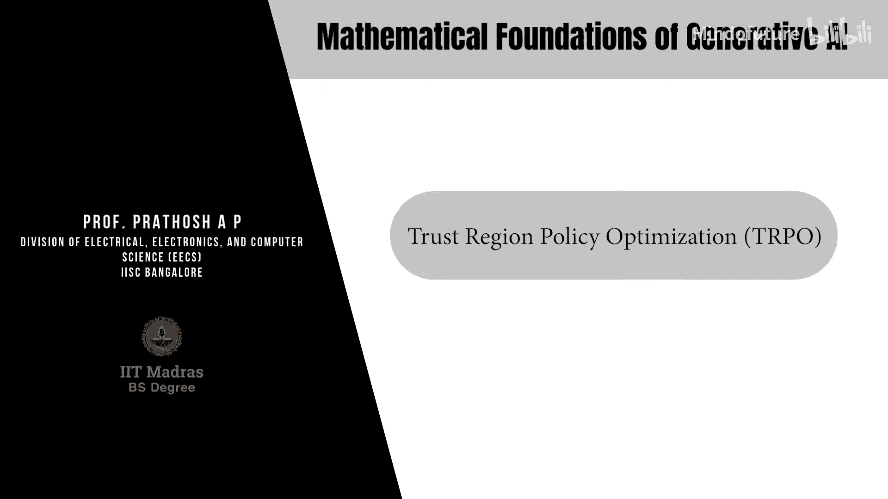
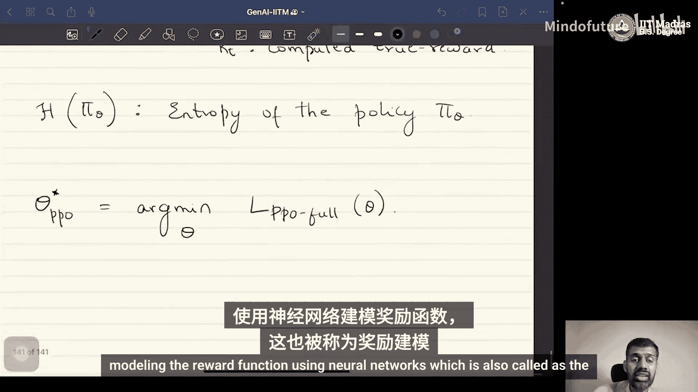

# 069：信任区域策略优化（TRPO）与近端策略优化（PPO） 🧠

在本节课中，我们将学习两种重要的策略优化算法：信任区域策略优化（TRPO）和近端策略优化（PPO）。我们将了解它们如何通过约束策略更新的幅度来稳定训练过程，并详细解析PPO算法的目标函数构成。

## 概述

上一节我们介绍了策略梯度定理的基本思想。本节中，我们来看看如何在实际应用中稳定策略更新。直接应用策略梯度可能导致更新步幅过大，使新策略与旧策略差异巨大，进而导致训练不稳定甚至崩溃。为了解决这个问题，研究者提出了信任区域策略优化（TRPO）及其更实用的变体——近端策略优化（PPO）。

## 信任区域策略优化（TRPO）

TRPO算法的核心思想是：在更新策略时，确保新策略与旧策略之间的差异不会太大。它通过约束新旧策略之间的KL散度来实现这一点。

TRPO的目标函数如下：

**目标函数**：
\[
\max_{\theta} \mathbb{E}_{s, a \sim \pi_{\theta_{old}}} \left[ \frac{\pi_{\theta}(a|s)}{\pi_{\theta_{old}}(a|s)} A^{\pi_{\theta_{old}}}(s, a) \right]
\]

**约束条件**：
\[
\mathbb{E}_{s \sim \pi_{\theta_{old}}} \left[ D_{KL}(\pi_{\theta_{old}}(\cdot|s) \| \pi_{\theta}(\cdot|s)) \right] \leq \delta
\]

其中，\(\delta\) 是一个超参数。这个约束确保了新旧策略的KL散度被限制在一个“信任区域”内，从而实现了平缓、稳定的更新。

然而，直接求解这个带约束的优化问题在计算和实现上并非易事。正是由于这个挑战，催生了更易于实现的近端策略优化算法。

## 近端策略优化（PPO）

由于TRPO的约束优化问题求解困难，PPO提出了一种替代方案。它不显式计算KL散度，而是通过“裁剪”目标函数来间接约束策略更新。

首先，我们定义重要性采样比率 \(r_t(\theta)\)：
\[
r_t(\theta) = \frac{\pi_{\theta}(a_t|s_t)}{\pi_{\theta_{old}}(a_t|s_t)}
\]

PPO的核心是使用一个裁剪后的替代目标函数。以下是PPO目标函数的第一部分（裁剪目标）：

**裁剪替代目标**：
\[
L^{CLIP}(\theta) = \mathbb{E}_{t} \left[ \min\left( r_t(\theta) \hat{A}_t, \text{clip}(r_t(\theta), 1-\epsilon, 1+\epsilon) \hat{A}_t \right) \right]
\]

其中，\(\hat{A}_t\) 是优势函数的估计值，\(\epsilon\) 是一个小的超参数（例如0.1或0.2）。

这个公式的工作原理如下：
*   当优势函数 \(\hat{A}_t\) 为正时，我们希望增加该动作的概率（即希望 \(r_t(\theta)\) 增大）。但如果 \(r_t(\theta)\) 增长过大（超过 \(1+\epsilon\)），`clip`操作会将其值限制在 \(1+\epsilon\)，从而防止新策略与旧策略偏离太远。
*   当优势函数 \(\hat{A}_t\) 为负时，我们希望减少该动作的概率。但如果 \(r_t(\theta)\) 减小过多（低于 \(1-\epsilon\)），`clip`操作会将其值限制在 \(1-\epsilon\)。
*   `min`操作确保了在裁剪生效时，我们采用更保守的更新目标，从而进一步稳定训练。

## 完整的PPO目标函数

一个完整的PPO算法目标通常包含三个部分，旨在同时优化策略、价值函数并鼓励探索。

**完整目标函数**：
\[
L^{PPO}(\theta) = \mathbb{E}_{t} \left[ L^{CLIP}_t(\theta) - c_1 (V_{\theta}(s_t) - R_t)^2 + c_2 H(\pi_{\theta}(\cdot|s_t)) \right]
\]

以下是该目标函数三个组成部分的详细说明：

1.  **策略目标（\(L^{CLIP}\)）**：即上文所述的裁剪替代目标，用于在信任区域内改进策略。
2.  **价值函数损失**：这是一个回归任务，\(V_{\theta}(s_t)\) 是价值网络对状态 \(s_t\) 的估值，\(R_t\) 是实际获得的回报（或目标值）。最小化其均方误差可以训练一个更准确的价值函数，而准确的价值函数对于估计优势函数 \(\hat{A}_t\) 至关重要。
3.  **策略熵奖励**：\(H(\pi_{\theta}(\cdot|s_t))\) 是策略在状态 \(s_t\) 下的熵。最大化熵（即公式中减去负熵）可以鼓励策略保持一定的随机性，从而促进探索，避免过早收敛到次优策略。\(c_1\) 和 \(c_2\) 是控制各部分权重的系数。

## 总结

本节课中我们一起学习了稳定策略梯度更新的两种关键方法。
*   我们首先介绍了**信任区域策略优化（TRPO）**，它通过显式地约束新旧策略之间的KL散度来限制更新幅度。
*   接着，我们探讨了**近端策略优化（PPO）**，它通过一个巧妙的裁剪目标函数来隐式实现类似的约束，从而避免了TRPO中复杂的约束优化问题，使其更易于实现和应用。
*   最后，我们解析了完整的PPO目标函数，它集成了策略改进、价值函数拟合和探索鼓励三项任务。

目前，整个算法流程中还缺少一个关键环节：**奖励函数 \(R_t\) 是如何得到的？** 在基于人类反馈的强化学习等场景中，这个奖励通常由一个独立的神经网络来建模，这个过程称为“奖励建模”。这将是我们在下一节中要探讨的核心内容。