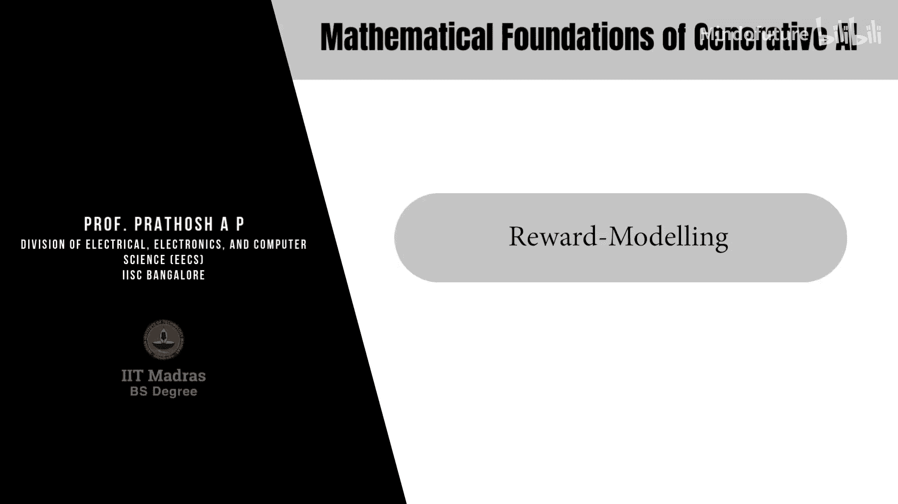
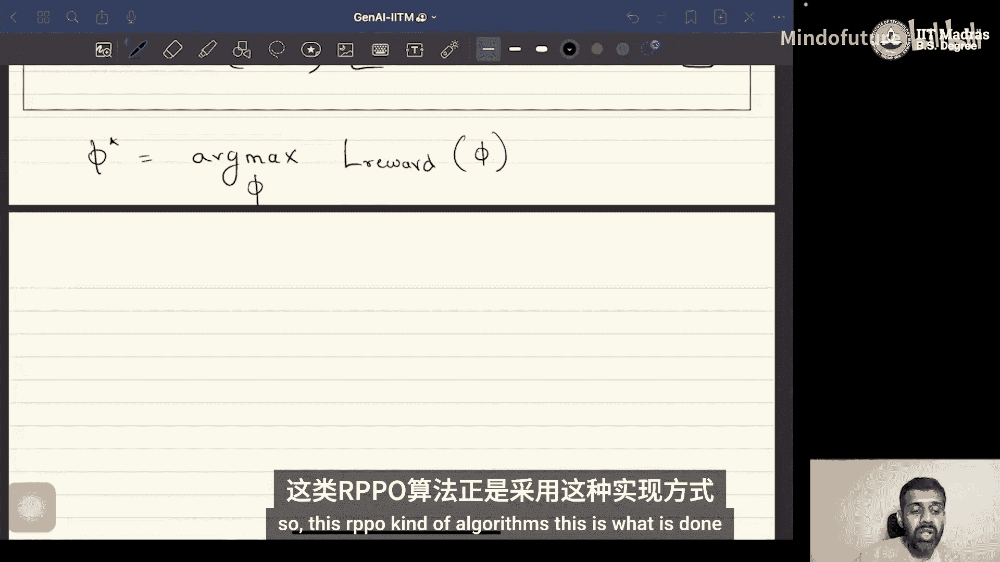

# 070：奖励建模 🎯

在本节课中，我们将要学习强化学习中一个至关重要的组成部分：奖励建模。我们将探讨为什么直接获取奖励数据很困难，并介绍一种更实用的替代方法——使用偏好数据来训练奖励模型。

## 概述

在基于策略梯度的强化学习算法中，奖励函数建模至关重要，因为优势函数和价值函数都基于奖励，而这些函数会出现在所有策略梯度优化算法的损失函数中。

## 奖励函数的作用

奖励函数是一个定义在状态空间和动作空间笛卡尔积上的函数，它将一个状态-动作对映射到一个实数。

**公式**：`R(s, a) -> r`

从实践角度看，它接收一个状态 `s` 和一个动作 `a` 作为输入，并输出一个实数 `r`。这个数值代表了在给定状态下执行该动作的“好坏”程度。

## 监督学习方法的挑战

乍一看，如果我们拥有标注了奖励值的数据，那么在经典的监督学习框架下训练奖励模型似乎是简单的，因为这本质上是一个回归问题。

以下是所需的数据格式和训练思路：

**数据格式**：`(s, a, reward)`

**训练方法**：
*   奖励模型 `R_φ` 通常由一个神经网络参数化。
*   可以通过经验风险最小化（ERM）框架，即基于梯度下降的目标最小化方法进行学习。

然而，获取这种标注了精确奖励值的数据在实践中往往非常困难，尤其是在涉及大规模数据集的情况下。此外，奖励的概念具有很强的主观性。对于相同的输入，一个人认为好的响应，另一个人可能不认同。因此，获取一个能在不同标注者间标准化的标量分数并非易事。

## 偏好数据：一种替代方案

为了解决上述问题，研究者们开始寻求不同的数据格式和奖励模型训练方法。其中一种被广泛使用的数据称为“偏好数据”。

以下是偏好数据的格式：

**数据格式**：`(x, y_W, y_L)`
*   `x`：输入（在RL中可以是状态，在LLM中可以是提示）。
*   `y_W`：被偏好的输出或响应。
*   `y_L`：不被偏好的输出或响应。

与为每个响应获取一个标量奖励相比，收集这种相对比较的数据要容易得多。例如，一些商业大语言模型会生成两个回答，并让用户选择更喜欢哪一个，这正是在收集用户偏好数据。由于是相对比较，它也避免了标度不一致的问题。

## 基于偏好数据构建奖励模型

现在，核心问题是：给定偏好数据，我们如何构建一个奖励模型？

有多种方法可以回答这个问题。接下来，我们将介绍一种经典且著名的模型——布拉德利-特里模型。

### 布拉德利-特里模型

该模型的核心思想是：对给定的输入 `x`，模型 `y_W` 优于 `y_L` 的概率，可以通过两个响应所获奖励的差异来计算。

**数学模型**：
`P(y_W ≻ y_L | x) = σ( R_φ(x, y_W) - R_φ(x, y_L) )`

其中，`σ` 是逻辑函数（Sigmoid函数）：

**公式**：`σ(t) = 1 / (1 + e^{-t})`

这个公式非常直观：如果 `y_W` 的奖励远高于 `y_L` 的奖励，那么 `y_W` 被偏好的概率就接近1；如果两者奖励相近，概率就接近0.5。

### 训练奖励模型

我们的目标是找到一个奖励模型 `R_φ`，使得它对数据集中所有偏好对 `(y_W, y_L)` 的预测概率最大化。

因此，我们可以定义奖励模型的损失函数为负对数似然，并对其进行最小化：

**损失函数**：
`L(φ) = - E_{(x, y_W, y_L) ~ D} [ log σ( R_φ(x, y_W) - R_φ(x, y_L) ) ]`

**训练目标**：
找到最优参数 `φ*`，使得上述损失函数最小化（或等价地，使对数似然最大化）。

通过使用梯度下降法优化这个目标，我们可以训练出奖励模型 `R_φ`。这个模型学会了为更受偏好的响应分配更高的奖励分数。

## 总结

本节课我们一起学习了奖励建模的关键知识。我们首先了解了奖励函数在策略梯度算法中的核心作用，以及直接使用标量奖励数据进行监督学习所面临的困难。接着，我们引入了更易于获取的“偏好数据”作为解决方案。最后，我们详细讲解了如何使用布拉德利-特里模型，利用偏好数据来训练一个有效的奖励模型。训练好的奖励模型随后可以被集成到策略梯度优化算法中，用于指导智能体的学习。