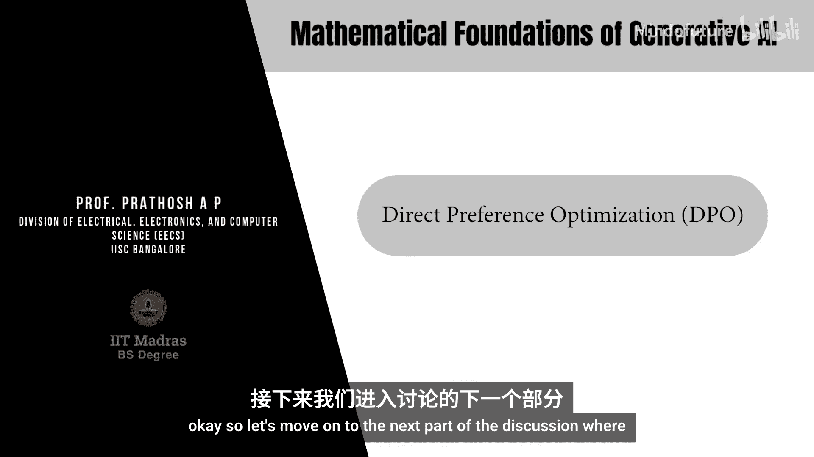
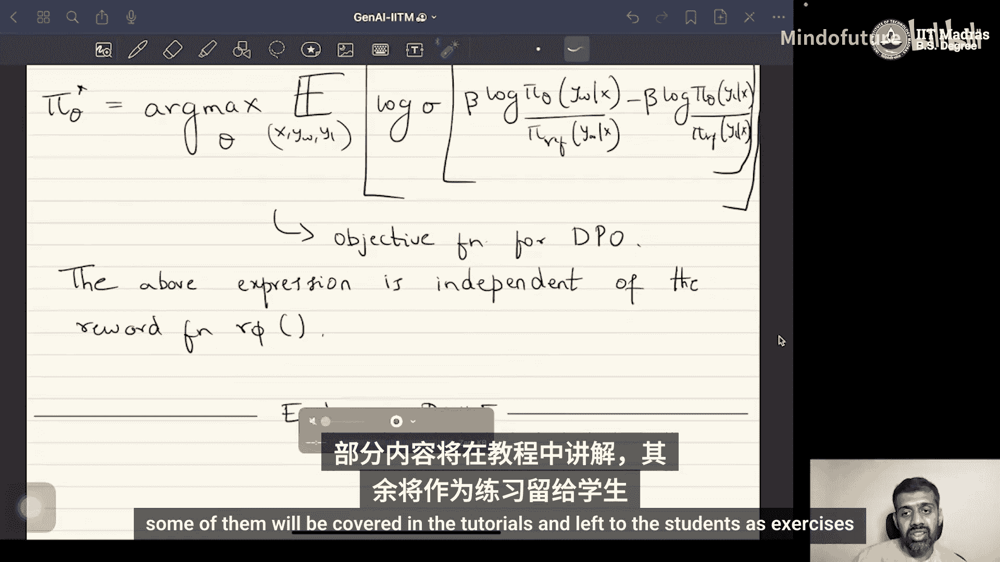

# 071：直接偏好优化（DPO）

## 概述
在本节课中，我们将要学习一种名为“直接偏好优化”（Direct Preference Optimization, DPO）的算法。该算法的核心目标是：**在不依赖显式奖励模型的情况下，仅使用偏好数据来优化策略（例如语言模型）**。我们将从DPO的动机出发，逐步推导其数学原理，并解释它为何比传统的PPO等方法更高效。

## 动机与问题定义
上一节我们介绍了基于人类反馈的强化学习（RLHF），它通常需要先训练一个奖励模型，再使用PPO等策略梯度算法来更新策略。这种方法存在两个主要问题：
1.  策略更新的质量严重依赖于奖励模型的性能。
2.  训练一个好的奖励模型本身就是一个计算成本高昂的优化问题。

因此，DPO提出的核心问题是：**能否绕过奖励模型，直接使用偏好数据来优化策略？**

## 理论基础：带约束的策略优化
首先，我们回顾带约束的策略优化目标。其目标是最大化期望奖励，同时最小化新策略 `π_θ` 与某个参考策略 `π_ref` 之间的KL散度。这可以表述为以下优化问题：

**目标**：`max_π E_(x,y)~π [r(x, y)] - β * D_KL(π(y|x) || π_ref(y|x))`

其中，`β` 是拉格朗日乘子，用于控制与参考策略的偏离程度。

可以严格证明，上述优化问题的最优策略 `π*` 具有以下解析形式（即玻尔兹曼分布）：

`π*(y|x) = (1 / Z(x)) * π_ref(y|x) * exp( (1/β) * r(x, y) )`

这里，`Z(x)` 是归一化常数，定义为对所有可能的响应 `y` 求和：`Z(x) = Σ_y π_ref(y|x) * exp( (1/β) * r(x, y) )`。

然而，由于响应空间 `y` 通常极其庞大（例如所有可能的文本序列），`Z(x)` 是难以计算的（intractable）。

## 从最优策略推导最优奖励
虽然无法直接计算最优策略，但我们可以利用上述关系，反推出最优奖励函数 `r*` 的表达式。对最优策略的公式两边取对数并整理，可以得到：

`r*(x, y) = β * log( π*(y|x) / π_ref(y|x) ) + β * log Z(x)`

这个公式表明，**最优奖励函数可以通过最优策略与参考策略的对数比值来表示**（加上一个与 `y` 无关的常数项 `β * log Z(x)`）。

## 核心推导：绕过奖励模型
接下来，我们将这个最优奖励 `r*` 的表达式，代入之前用于训练奖励模型的布拉德利-特里（Bradley-Terry）偏好模型中。布拉德利-特里模型假设，给定输入 `x`，偏好 `y_w` 优于 `y_l` 的概率为：

`P(y_w ≻ y_l | x) = σ( r(x, y_w) - r(x, y_l) ) = exp(r(x, y_w)) / [ exp(r(x, y_w)) + exp(r(x, y_l)) ]`

将 `r*` 的表达式代入上述模型。经过一系列代数运算（此处省略推导细节），我们可以得到一个关键结果：偏好概率可以**完全用策略参数 `θ` 来表示**，而不再显式包含奖励函数 `r`。

具体地，代入后得到：

`P(y_w ≻ y_l | x) = σ( β * log( π_θ(y_w|x) / π_ref(y_w|x) ) - β * log( π_θ(y_l|x) / π_ref(y_l|x) ) )`

## DPO目标函数
我们的目标是找到策略参数 `θ`，使得模型预测的偏好概率与人类提供的偏好数据 `D = { (x, y_w, y_l) }` 尽可能一致。这等价于最大化这些偏好数据对的似然。

因此，DPO的最终目标函数是最大化以下对数似然：

**L_DPO(π_θ; π_ref) = E_(x, y_w, y_l)~D [ log σ( β * log( π_θ(y_w|x) / π_ref(y_w|x) ) - β * log( π_θ(y_l|x) / π_ref(y_l|x) ) ) ]`

以下是DPO目标函数的关键组成部分：
*   `π_θ(y|x)`：待优化的策略（例如，我们想要对齐的语言模型）。
*   `π_ref(y|x)`：参考策略（通常是在大规模无监督数据上预训练得到的初始模型）。
*   `β`：控制与参考策略偏离程度的超参数。
*   `σ(·)`：逻辑函数（sigmoid）。
*   `(x, y_w, y_l)`：来自偏好数据集 `D` 的样本，其中 `y_w` 是优于 `y_l` 的响应。

## DPO的优势与总结
本节课中我们一起学习了直接偏好优化（DPO）的原理。

**核心优势**：DPO通过巧妙的数学变换，将策略优化问题转化为一个**仅依赖于策略本身和偏好数据**的目标函数。它完全绕过了训练独立奖励模型的步骤，从而：
1.  **简化了训练流程**：避免了奖励模型训练不准带来的误差传播。
2.  **提升了计算效率**：减少了训练环节和总体计算开销。
3.  **保持了稳定性**：目标函数直接针对最终策略进行优化，通常更稳定。

**应用场景**：DPO非常适用于拥有大量**成对偏好数据**（即标注了哪个回答更好）的场景，是当前对齐大型语言模型（LLM）与人类价值观的主流高效方法之一。

**补充说明**：并非所有任务都适合DPO。对于拥有**可验证奖励**的任务（例如代码生成，可以通过测试用例通过率定义奖励），传统的基于PPO的策略梯度方法可能更合适。在实际的LLM训练中（如GPT系列），通常的流程是：首先在大规模无监督语料上通过“下一个词预测”目标预训练一个基础模型；然后收集大量人类偏好数据；最后使用DPO（或类似的RLHF方法）对这个基础模型进行对齐微调。