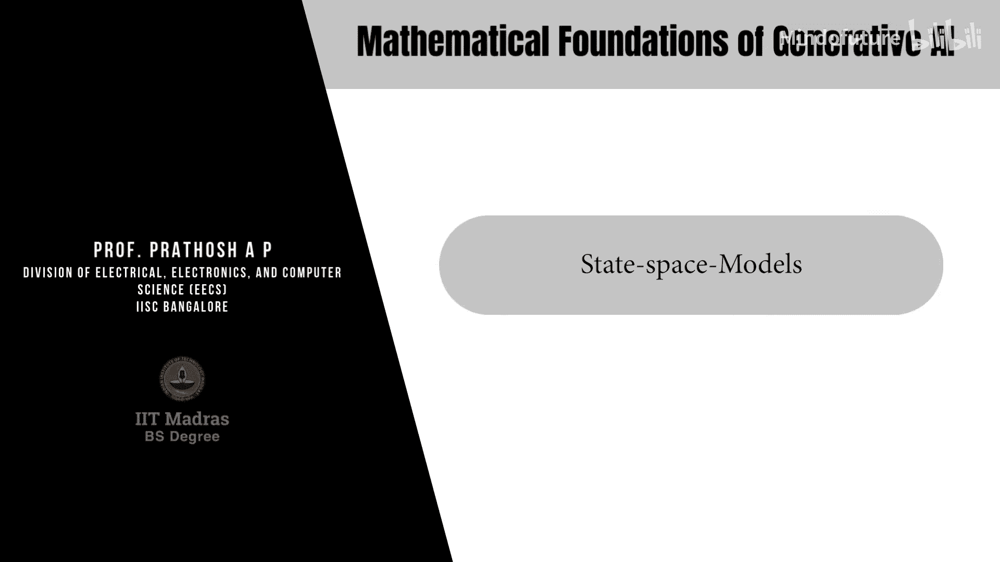

# 072：状态空间模型 🧠



在本节课中，我们将学习状态空间模型。这是一种用于处理序列数据的重要模型家族，旨在解决Transformer模型在处理长序列时计算量过大的问题。

## 概述

我们处理的大量数据本质上是序列化的，例如构成基础模型核心的自然语言文本。建模序列，尤其是长序列，在这些场景中至关重要。Transformer一直是处理此类序列数据的首选模型。然而，当上下文长度（即序列长度）增长时，Transformer所需的计算量会**呈平方级增长**。这是因为在处理每个标记时，都需要计算它与序列中所有其他标记的注意力分数。对于一个长度为 `L` 的序列，训练和推理都需要 `O(L²)` 的计算量。

为了解决这个问题，研究社区考虑了一种称为**状态空间模型**的替代模型家族。在这种模型中，训练和推理所需的计算量不会随序列长度呈平方级增长，而是**线性增长**。

## 状态空间模型的数学定义

上一节我们介绍了序列数据建模的挑战，本节我们来看看状态空间模型是如何定义的。

一个状态空间模型由以下方程定义。首先，我们假设输入和输出序列都是一维的。设 `u(t)` 和 `y(t)` 分别表示输入和输出序列。两者都是一维信号。

给定一维的输入和输出序列，状态空间模型定义如下：

```
dx(t)/dt = A * x(t) + B * u(t)
y(t) = C * x(t) + D * u(t)
```

这是状态空间模型的定义。其中：
*   `x(t)` 是一个 `n` 维的**隐藏状态向量**。
*   `A, B, C, D` 是**可学习的系统参数**（模型参数）。
*   `dx(t)/dt` 表示 `x(t)` 对时间的导数。

这个模型描述的是：给定一个一维输入信号 `u(t)`，它被投影到一个 `n` 维的状态空间（或潜在空间）`x(t)` 上。状态空间中的时间动态演化由第一个方程通过矩阵 `A` 和 `B` 学习得到。输出 `y(t)` 通过矩阵 `C` 与状态空间相连，而矩阵 `D` 直接将输出与输入 `u(t)` 相连。

这与循环神经网络有相似之处，区别在于循环神经网络中连接这些量的关系是非线性的，而在线性状态空间模型中，这些关系是线性的。

在文献中，通常省略 `D` 矩阵，因为它可以通过一个可学习的跳跃连接来实现。因此，最终连续时间状态空间模型由以下方程给出：

```
dx(t)/dt = A * x(t) + B * u(t)
y(t) = C * x(t)
```

其中 `A, B, C` 是可学习的模型参数。

## 模型的离散化

我们刚刚定义了连续时间信号的状态空间模型。但在实践中，我们处理的是离散序列（例如文本数据）。因此，应用此模型的第一步是**离散化**。

离散化意味着将连续时间信号转换为离散时间信号，通常通过采样实现。假设我们有一个离散输入序列 `u[k]`，其中 `u[k] = u(k * Δ)`，`Δ` 是步长。

离散化后，状态空间方程的参数会发生变化，具体形式取决于所采用的离散化方法。一种常用的方法是双线性变换（或图斯汀方法）。离散化后，参数变换如下：

```
Ā = (I - Δ/2 * A)^(-1) * (I + Δ/2 * A)
B̄ = (I - Δ/2 * A)^(-1) * Δ * B
C̄ = C
```

其中 `I` 是适当大小的单位矩阵，`Δ` 是离散化所用的步长。

由此，我们得到离散序列的状态空间模型方程：

```
x[k] = Ā * x[k-1] + B̄ * u[k]
y[k] = C̄ * x[k]
```

上述方程定义了一个**序列到序列的映射**（从输入序列 `u` 到输出序列 `y`），而连续时间模型定义的是函数到函数的映射。这是所有现代状态空间模型实践应用的基础。

## 训练离散状态空间模型

我们已经得到了离散状态空间方程，接下来的目标是通过训练数据找到参数 `Ā, B̄, C̄`。

观察这些方程，它们定义了当前状态与先前状态之间的**递归关系**。这种递归关系可以用来推导出计算高效的训练算法。

假设初始状态向量为 `0`（即 `x[-1] = 0`），展开状态空间模型会得到以下递推关系：

以下是展开后的状态和输出序列：
*   `x[0] = B̄ * u[0]`
*   `x[1] = Ā * B̄ * u[0] + B̄ * u[1]`
*   `x[2] = Ā² * B̄ * u[0] + Ā * B̄ * u[1] + B̄ * u[2]`
*   `y[0] = C̄ * B̄ * u[0]`
*   `y[1] = C̄ * Ā * B̄ * u[0] + C̄ * B̄ * u[1]`
*   `y[2] = C̄ * Ā² * B̄ * u[0] + C̄ * Ā * B̄ * u[1] + C̄ * B̄ * u[2]`

可以将其推广为：
`y[k] = C̄ * Ā^k * B̄ * u[0] + C̄ * Ā^(k-1) * B̄ * u[1] + ... + C̄ * B̄ * u[k]`

仔细观察，这个形式类似于一个我们熟悉的操作——**卷积**。如果我们定义一个长度为 `L` 的卷积核向量 `K̄`：
`K̄ = [C̄*B̄, C̄*Ā*B̄, C̄*Ā²*B̄, ..., C̄*Ā^(L-1)*B̄]`
那么输出 `y[k]` 就是输入序列 `u` 与该卷积核 `K̄` 的卷积结果：
`y = K̄ * u` （其中 `*` 表示卷积操作）

这是一个关键结论：输出序列中的第 `k` 个标记，不过是输入序列 `u` 与一个固定卷积核 `K̄` 的卷积积。这个卷积核是模型参数的函数。这意味着，一旦计算出这个核 `K̄`，对任何输入进行推理就只需计算该输入与这个预计算核的卷积。

## 在频域中实现高效计算

我们转向状态空间模型框架是为了更高效地处理长序列。将输出序列表示为卷积形式的意义在于，根据信号处理原理，时域（或序列域）中的卷积等价于频域中的**乘法**。

由于存在快速算法（如快速傅里叶变换，FFT）可以将序列转换到频域，状态空间模型文献中的核心思想就是：在频域中计算卷积核，通过频域中的乘法运算计算输出，然后通过逆傅里叶变换将输出转换回时域。因为傅里叶变换和逆变换可以利用FFT算法在对数时间内完成，这被认为比Transformer中的平方级计算更快。

因此，接下来的目标是在频域中计算这个卷积核 `K̄`。

## 计算卷积核：生成函数方法

在S4等著名的状态空间模型方法中，卷积核是使用**生成函数**在频域中计算的。

回顾一下，卷积核 `K̄` 的表达式为：`K̄[i] = C̄ * Ā^i * B̄`。其截断生成函数（Z变换）`K̂_L(z)` 定义为：
`K̂_L(z) = Σ_{i=0}^{L-1} K̄[i] * z^{-i} = Σ_{i=0}^{L-1} (C̄ * Ā^i * B̄) * z^{-i}`

通过矩阵几何级数公式，并当 `L` 足够大时，可以证明：
`K̂(z) = C̄ * (I - Ā * z^{-1})^{-1} * B̄`

这就是卷积核生成函数的最终表达式。需要计算的就是这个式子。然而，直接计算这个表达式并不容易，因此不同的模型会对矩阵 `Ā` 施加特定的结构，使核计算变得可行。

## 施加结构：对角矩阵与对角加低秩矩阵

到目前为止，我们尚未对矩阵 `Ā` 的形式做任何特殊假设。不同的方法通过施加不同的结构来使核计算易于处理。我们将在本模块中研究两种特殊情况。

**第一种情况：Ā 为对角矩阵**
当 `Ā` 是对角矩阵 `Λ` 时，可以很容易地证明，核的生成函数可以写成多个柯西核的和的形式：
`K̂(z) = Σ_{i=1}^n (C̄_i * B̄_i) / (1 - Λ_i * z^{-1})`
这种形式下，不再需要计算矩阵 `Ā` 的幂，只需计算这些标量项（柯西核），大大简化了计算。

**第二种情况：Ā 为对角加低秩矩阵**
让 `Ā` 仅为对角矩阵限制性太强。一个更一般的情况是让 `Ā` 具有“对角加低秩”的结构：
`Ā = Λ - P * Q^T`
其中 `Λ` 是对角矩阵，`P` 和 `Q` 是可学习的秩为1的矩阵。应用矩阵求逆引理（Woodbury恒等式）后，可以证明最终的核函数仍然是多个柯西核的线性组合。这意味着在整个核计算中，同样不涉及矩阵 `Ā` 的幂运算。

在S4模型中，矩阵 `Ā` 并非随机初始化，而是初始化为一个特殊的矩阵，称为HiPPO矩阵。经验表明，这种结构能带来更好的泛化性能。

## 扩展到多维数据与训练

到目前为止，我们的分析都假设输入和输出变量是一维的。对于实践中常见的多维数据，状态空间模型是**按维度独立应用**的。这意味着数据的每个维度都使用一个独立的一维状态空间模型进行处理。

多个状态空间模型可以像神经网络层一样堆叠起来。一旦构建好序列模型，就可以使用均方根误差或交叉熵等损失函数，并通过梯度下降来更新状态空间模型的参数。这可以通过有监督或无监督的方式完成。

## Mamba：选择性状态空间模型

S4模型的一个已知缺点是卷积核是**固定的**，因为模型参数 `A, B, C` 不随时间变化。这导致一些简单任务（如选择性复制序列中的特定标记）无法完成。

为了解决这个问题，**Mamba**（或称选择性状态空间模型）将参数变为**时间依赖**的。这是Mamba与S4等之前模型的最大区别。数学上，模型变为：
```
x[k+1] = A(u[k]) * x[k] + B(u[k]) * u[k]
y[k] = C(u[k]) * x[k]
```
注意，`A, B, C` 现在是输入序列 `u` 的函数。

这种变化带来了一个后果：由于参数随时间变化，无法像S4那样推导出一个固定的卷积核并在频域进行高效计算。因此，Mamba的模型前向传播和推理**不在频域进行**，而是在时域本身完成，并使用了更快的**并行扫描算法**。这种状态空间方程的定义类似于计算“前缀和”，而前缀和可以通过并行扫描算法进行高效并行化。此外，Mamba还结合了一些针对GPU架构的硬件优化技巧。

与S4类似，Mamba也是独立应用于数据的每个维度。

## 总结


本节课我们一起学习了状态空间模型。我们从其数学定义出发，探讨了如何将连续时间模型离散化以处理实际序列数据。我们了解到，通过展开方程，状态空间模型的输出可以表示为输入与一个固定卷积核的卷积。为了高效处理长序列，该卷积在频域通过快速傅里叶变换实现。为了简化核的计算，模型（如S4）会对参数矩阵施加特定结构（如对角或对角加低秩）。最后，我们介绍了Mamba模型，它通过使参数依赖于输入，增强了模型的表达能力，但计算方式也转向依赖于时域的并行扫描算法。状态空间模型为处理长序列提供了一种计算高效的Transformer替代方案。