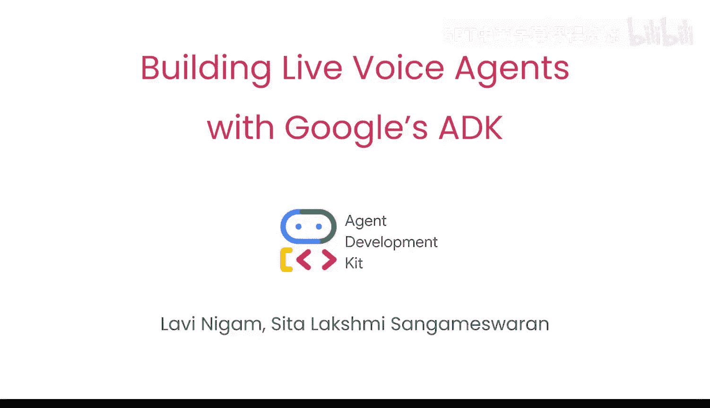
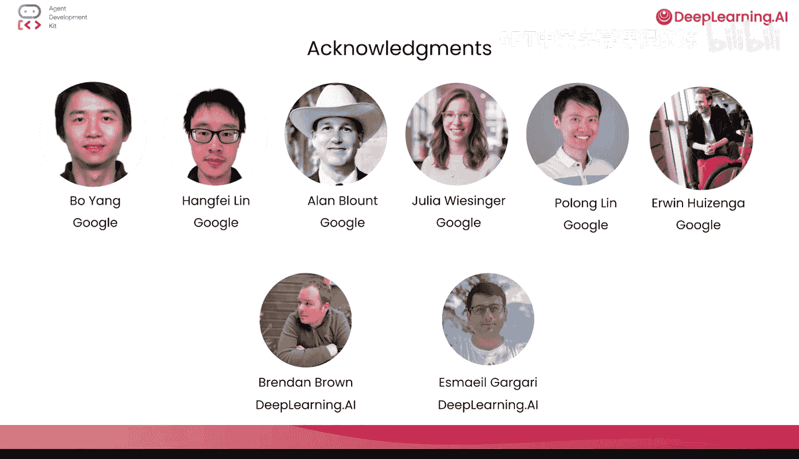

# 001：课程介绍与概述 🎤

在本课程中，我们将学习如何使用 Google 的 Agent Development Kit (ADK) 来构建多智能体 AI 应用。我们将创建一个播客 AI 代理，它能接收用户的实时语音输入、研究主题、规划并起草一集多人对话的播客文稿，最终生成一个播客音频文件。

Google ADK 是一个开源框架，它让构建简单的智能体变得轻而易举，只需几行代码，并且可以扩展到复杂的多智能体系统。ADK 包含了用于控制不同智能体行为的构建工作流模式，并支持灵活的驱动编排，其中一个智能体可以决定执行步骤的序列。它提供了常见的智能体构建模块，包括模型、工具、内存以及可观测性功能，例如提供追踪和评估。

本课程也是对实时语音对话界面的快速入门，你将用几行代码就能构建它。我们还将探索多智能体系统，其中每个智能体专注于特定任务，多个这样的智能体协作完成更复杂的目标。最终，你将构建出自己的智能体系统。

## 课程核心概念与构建模块

上一节我们介绍了课程的整体目标，本节中我们来看看构建智能体所需的核心概念和基础模块。

要开始本课程，你将首先使用 Google ADK 和 Gemini 模型创建一个简单的语音代理。你的代理将接收用户的语音输入，使用语言模型进行推理，然后发送语音输出。你将了解 ADK 的核心构建模块，如会话状态和内存。

*   **会话**：会话就像一个容器，它将一次交互的所有部分保持在一起。如果你开始与一个智能体对话，会话就开始了，你所说的一切和智能体的回复都保留在该会话中。
*   **状态**：状态是你的智能体的便签或短期记忆。它跟踪智能体的进度，这样智能体就不会在流程中忘记正在做什么。
*   **内存**：内存进一步扩展了这一点，它允许智能体回忆过去的输入、输出或工具调用，并在响应时使用。

这些基本构件构成了你用 ADK 构建的每个智能体的基础。

## 扩展智能体能力：工具与回调

智能体通过工具（如 Google 搜索或任何外部 API）变得更加有用。这使你的智能体能够访问更广阔的世界、获取新鲜且真实的信息并执行操作。工具可以是代码中的函数、HTTP 服务或公共 API。

随着你的智能体系统变得更强大，它可以做更多事情，你需要约束或控制它可以做什么以及不应该做什么。这可以通过 ADK 中的回调轻松实现，回调允许你在每次模型、工具和智能体调用之前和之后进行拦截。你可以添加代码、远程 API 或简单地使用一个专门的智能体来处理这些回调。

## 从单智能体到多智能体系统

你将从一个构建单个播客智能体开始，然后将其转变为一个多智能体系统。在多智能体系统中，你可以让一个智能体负责制定计划，第二个智能体进行背景研究，第三个智能体负责撰写。你将看到如何将一个复杂任务分解为子任务，由不同的智能体来执行，这被证明是实现智能体工作流的重要设计模式。

## 致谢与课程价值

许多人参与了本课程的贡献。感谢来自 Google 的 Boy Yao Han Fei L、Alan Bunt、Julia Weiseinger、Hollong L、Erwin Husinger 以及许多幕后使 ADK 成为可能的人。来自 DeepLearning.AI 的 Brendan Brown 和 Imer Greggari 也为本课程做出了贡献。

本课程不仅将帮助你学习如何使用 Google ADK 构建智能体，还将教你如何为你的 AI 应用带来语音功能。

## 总结与下一步

本节课中我们一起学习了课程概述、Google ADK 的核心概念（会话、状态、内存）、如何通过工具和回调扩展智能体能力，以及从单智能体扩展到多智能体系统的设计模式。

在下一课中，你将构建你的第一个语音代理。让我们进入下一个视频，开始动手实践吧。