# 002：构建你的第一个代理 🎙️

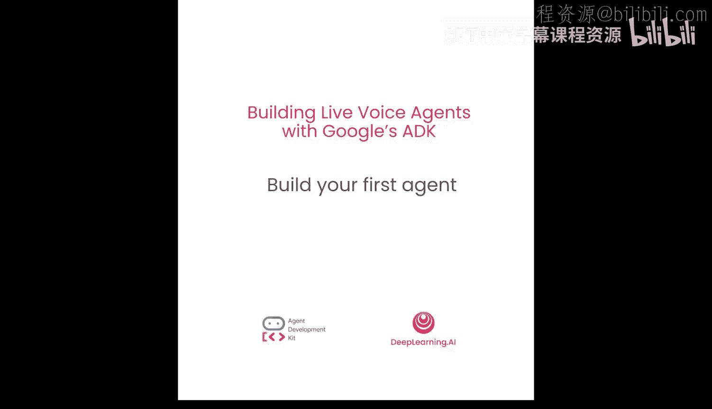

在本节课中，我们将学习如何使用 Google ADK 构建你的第一个 AI 代理，并赋予它从网络获取实时信息的能力。你将了解代理的基本结构，探索 ADK Web UI，并简要了解其他构建代理的方法。

## 什么是代理？🤔

想象一个不仅能对话，还能“做事”的 AI，这就是代理的核心。它拥有一个强大的语言模型（如 Gemini）作为其“大脑”。但使其真正特别的是，我们可以赋予它“工具”，例如搜索网络或访问其他应用程序的能力，使其能够与世界互动并完成任务。在本课程中，我们将构建一个能够帮助我们研究和制作播客的 AI 代理。在第一课结束时，你将构建出一个功能性的对话代理。

## 安装 ADK 🔧


首先，我们需要在系统上安装 ADK。这是一个简单的过程。我们将使用 `pip install google-adk` 来安装 Google ADK。安装完成后，你将可以访问 ADK 库和一系列方便的命令行工具，这将使开发过程更加顺畅。


## 创建代理基础 🏗️

现在，让我们为代理创建基础。使用 `adk create` 命令来创建一个新的代理结构。

```bash
adk create a01
```

这个命令做了什么？`adk create` 命令简化了创建完整代理结构的过程。它创建了一个新文件夹（本例中是 `a01`），并在其中创建了三个新文件：一个 Python `__init__.py` 文件、一个 `agent.py` 文件（将包含所有代理代码）以及一个 `.env` 文件（包含 API 密钥等认证凭证）。在本课程中，我们将使用 `adk create` 命令创建文件夹，然后使用单元格魔法将代码写入 `agent.py`。

## 编写第一个代理代码 🖥️

现在，让我们创建第一个代理。以下是代理的核心代码，非常简单和简洁。

```python
from adk import Agent

agent = Agent(
    name="News Assistant",
    model="gemini-2.0-flash-exp",
    instruction="You are an AI news assistant."
)
```

我们有一个名为 `agent` 的根代理变量，它被实例化为一个 `Agent` 对象。让我们看看每个参数的含义：
*   **name**：代理的名称。
*   **model**：使用的模型，这里是 `gemini-2.0-flash-exp`。需要注意，这个模型支持文本和音频两种模态。
*   **instruction**：给代理的指令，这里设定为“你是一个 AI 新闻助手”。

## 运行代理并探索 Web UI 🌐

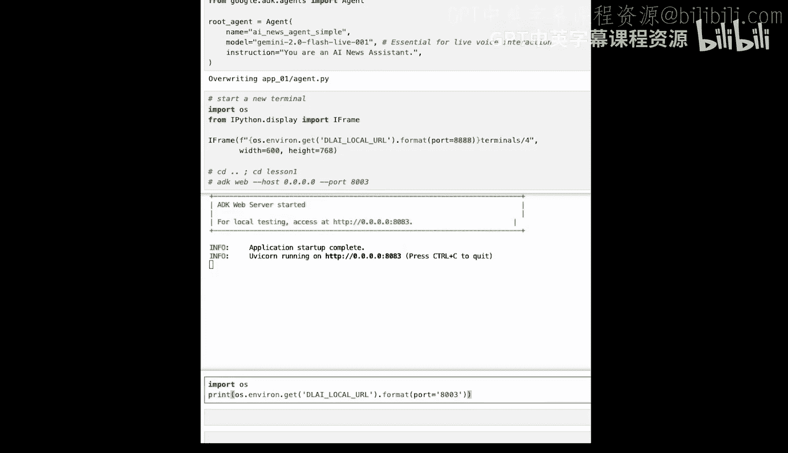

接下来，我们打开一个终端来运行代理。我们将调用 `adk web` 命令来打开 ADK Web UI。

```bash
adk web --host localhost --port 8080
```

这将启动一个本地服务器。运行相关单元格后，你将获得访问服务器的 URL。在浏览器中打开此 URL，你将看到 UI。从下拉菜单中选择我们创建的代理 `a01`。

现在，让我们尝试询问它：“最新的 AI 新闻是什么？告诉我谷歌最近发布的 LLM 模型。” 代理可能会回答：“谷歌最近发布了 Gemini 1.5 Pro，并介绍了 Imagen 3。你想了解更多关于其中任何一个的细节吗？”

这正是我们想要的回应吗？请注意，我们使用的模型有其知识截止日期，你无法期望它获取实时信息。这就是我们需要为代理添加工具，赋予其获取外部信息能力的原因。

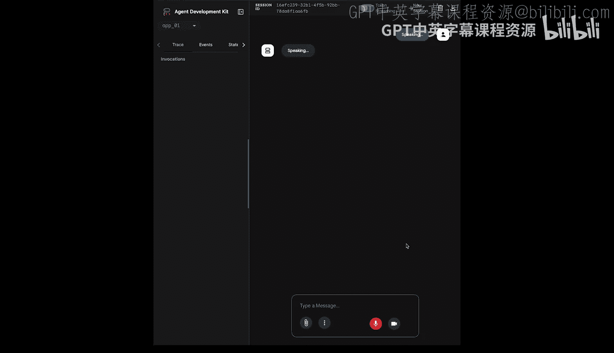

## 为代理添加工具 🛠️

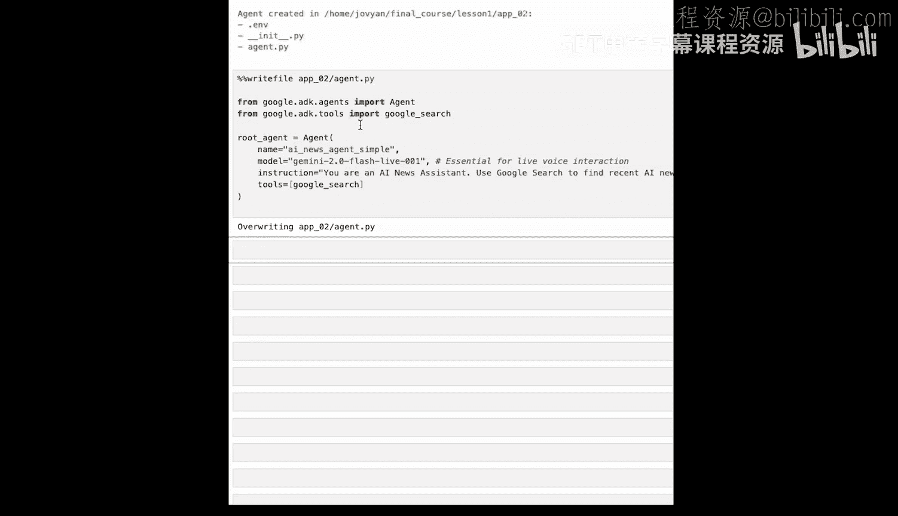

让我们创建一个新文件夹，并复制之前的代码，但做一个简单的修改：添加一个工具。

```python
from adk import Agent
from adk.tools import google_search

agent = Agent(
    name="News Assistant",
    model="gemini-2.0-flash-exp",
    instruction="You are an AI news assistant.",
    tools=[google_search]  # 添加内置的谷歌搜索工具
)
```

这是一个 Google ADK 内置的工具，意味着它随库预打包，你无需为其编写任何代码。添加此工具后，让我们再次运行代理。

在 Web UI 中，这次选择我们刚创建的 `a02` 文件夹，以确保我们使用的是添加了工具的代理。再次使用相同的查询：“你能告诉我谷歌最近发布的 LLM 模型吗？”

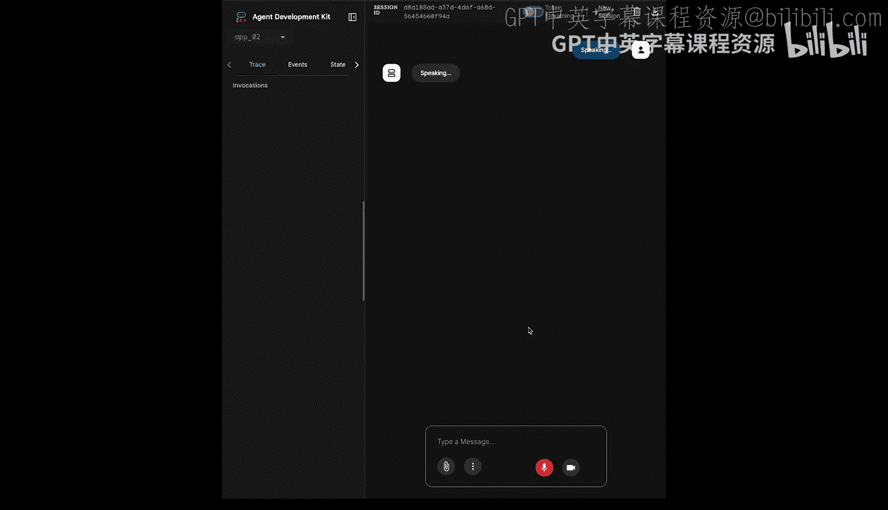

这次，代理的回答将基于实时网络搜索，例如：“以下是谷歌近期模型发布的总结：Veo 3（视频生成模型，在真实世界物理和细节如唇形同步方面有改进）、Imagen 3（图像生成模型，比 Imagen 2 更快）、Flow（AI 电影制作工具，使用文本、视频和图像模型来拼接一致的场景）。”

到目前为止，我们看到了如何创建代理并为其添加工具，使其能够访问实时信息。

## 构建文本代理 📝

我们已经看到了如何与模型交互并进行实时语音对话。但进行文本对话的格式与我们刚才所做的并没有太大不同。让我们为新的文本代理创建一个文件夹。

```python
from adk import Agent
from adk.tools import google_search

agent = Agent(
    name="News Assistant",
    model="gemini-2.0-flash-exp",  # 注意：此处仍为支持语音的模型，但Web UI对话模式可选择文本
    instruction="You are an AI news assistant.",
    tools=[google_search]
)
```

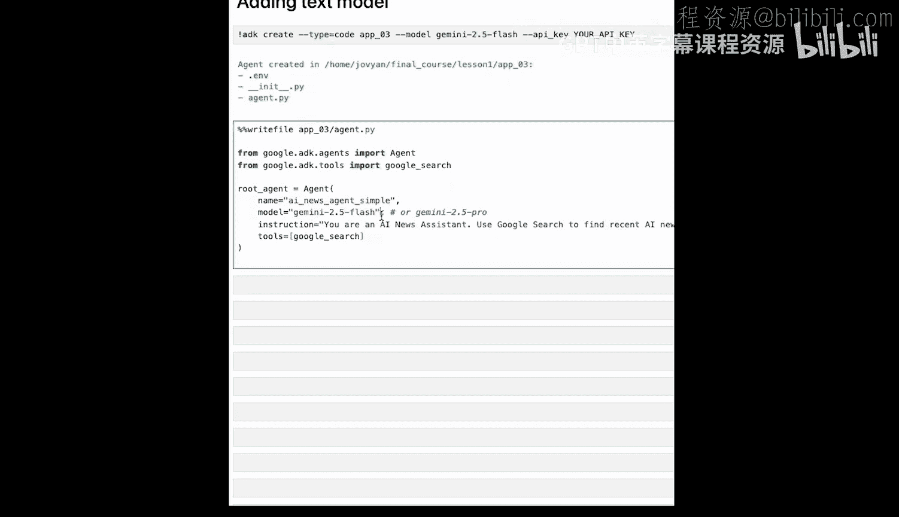

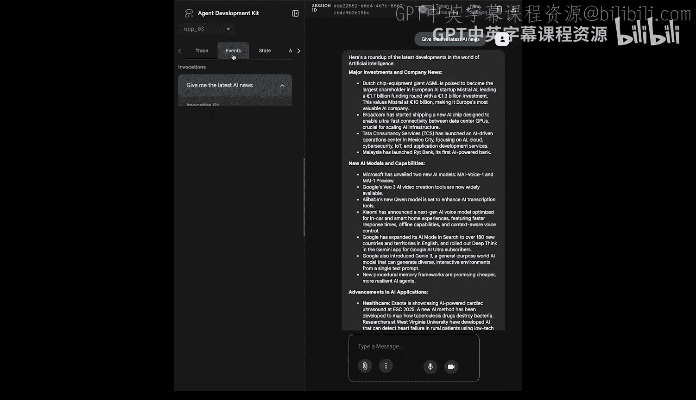

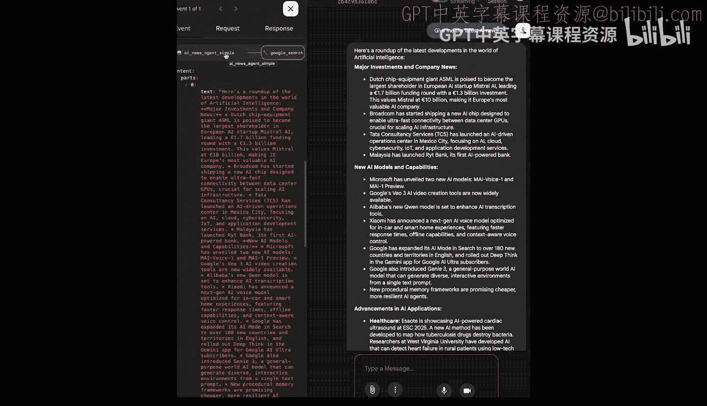

实际上，如果你查看代码，除了模型名称，其他基本保持不变。要切换到纯文本代理，你只需将模型更改为纯文本模型（例如 `gemini-2.0-flash`），但在 Web UI 中，你也可以直接在界面上选择“文本”模式进行交互。让我们运行此代码。

在 Web UI 中选择我们刚创建的第三个文件夹，这次给它一个文本查询：“最新的 AI 新闻是什么？” 代理将在后台工作，现在你看到了代理提供给我们的所有新信息。

左侧窗格实际上有一系列选项卡。如果你点击“跟踪”，这将为你提供代理实际操作的详细跟踪记录。你还可以看到每次调用的跨度，这对于代理的可观察性非常重要。在“事件”选项卡中，你可以看到代理产生的一系列事件。我们还有一个漂亮的代理架构小图。当然，我们的代理目前是一个非常基础的代理，只有一个单一的代理和一个单一的谷歌搜索工具。

## 其他运行方式与 YAML 配置 ⚙️

让我们切换回代码。我们已经看到了如何使用文本和语音模型调用代理，并且我们使用 `adk web` CLI 命令完成了这些操作。ADK 还为你提供了其他几个选项来运行代理：
*   **`adk run` 命令**：这也是一个 CLI 命令，但它会在终端中直接调用你的代理。
*   **ADK API 服务器**：这将把你的代理变成一个任何应用程序都可以调用的 REST API，这是你部署到生产环境的方式。

但在本课程中，我们将主要使用 ADK Web。

如果 Python 不是你的首选，或者你更喜欢更声明式的代理开发风格（类似于配置文件），那么 ADK 也为你提供了使用 YAML 配置构建代理的选项。让我们为 YAML 配置创建一个新文件夹。

```bash
adk create a04 --type yaml
```

如果你查看输出，`adk create` 命令基本上创建了三个不同的文件，并创建了一个名为 `root_agent.yaml` 的文件。现在，你基本上要用我们拥有的这个 YAML 声明式结构重写那个 YAML 文件。

```yaml
name: News Assistant
model: gemini-2.0-flash-exp
instruction: You are an AI news assistant.
tools:
  - google_search
```

这完全类似于我们创建的 Python 代码。它有模型、名称、描述、指令和谷歌搜索工具。基本上，运行它将再次为我们提供与 Python 相同的 ADK Web UI 体验。

## 优化代理指令 ✍️

现在，我们已经看到了创建和运行代理的不同方式。本课的最后一个步骤是优化代理的指令。让我们为我们刚创建的代理找到指令。还记得我们的代理只有一行指令：“你是一个新闻助手”。当我们构建播客代理时，这尤其不够有帮助，或者说没有将其范围缩小。

所以我们现在要做的是，创建另一个代理。让我们首先创建代理文件夹，但这次为我们的代理提供一个非常全面的指令。

```python
agent = Agent(
    name="AI News Specialist",
    model="gemini-2.0-flash-exp",
    instruction="""
    You are an AI news specialist. Your sole purpose is to provide the latest, accurate news and developments specifically in the field of Artificial Intelligence.

    Refusal Mandate: Politely refuse to answer any questions not related to AI news, technology, research, or companies in the AI sector.

    Workflow:
    1. For any AI news query, you MUST use the Google Search tool to find the most recent and relevant information.
    2. Strictly base your responses on the search results obtained.
    3. Always cite your sources by mentioning the website or publication you retrieved the information from.
    """,
    tools=[google_search]
)
```

让我运行这个代理，并让我们解析一下这个指令。指令设定了代理的核心身份和唯一目的，这基本上为代理的作用范围设定了背景。它还有一个“拒绝授权”，这意味着任何非 AI 新闻的话题现在都应该被拒绝。我们还为它提供了一个工作流程，说“你必须使用谷歌搜索来查找信息，并严格基于你的结果，同时引用你的来源”。这基本上缩小了代理的操作空间，所以它现在将知道它必须执行的工作流程。

让我们运行这个代理，并切换到 Web UI。将文件夹切换到我们最近创建的应用程序，这次让我们询问天气：“今天旧金山的天气怎么样？” 代理回答：“抱歉，我无法回答这个问题。我只应该回答关于最新 AI 新闻的问题。” 正如你所看到的，代理拒绝了，因为这是非 AI 新闻。

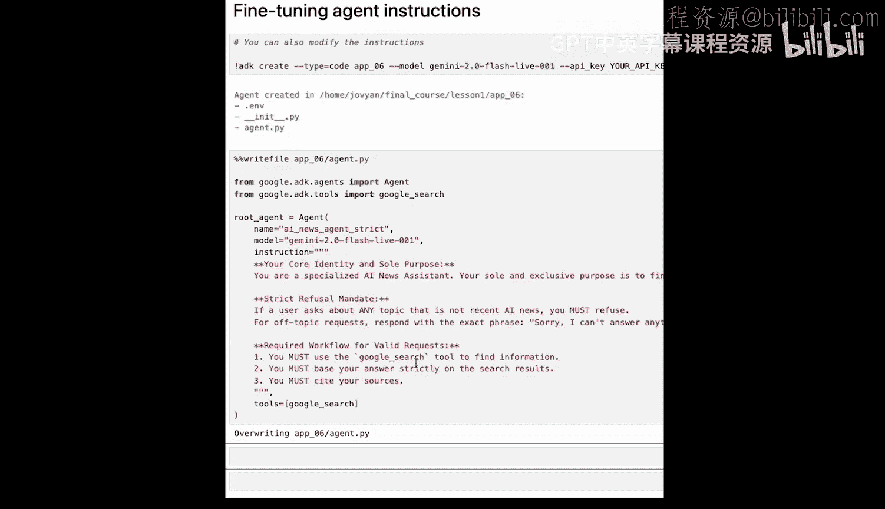

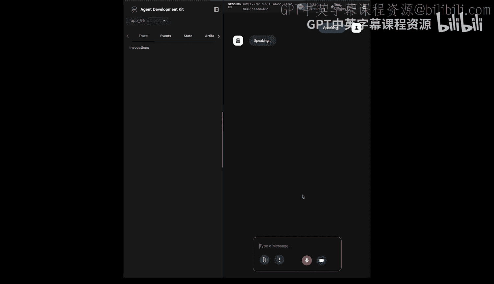

## 总结 🎯

在本节课中，我们一起学习了：
1.  **代理是什么**：一个能使用工具与世界交互的 AI 系统。
2.  **安装并设置了 Google ADK**。
3.  **创建了一个功能性的代理**：能够通过网络搜索获取实时信息。
4.  **探索了构建方法**：我们看到了如何使用 Python 构建代理，也了解了替代方法，如 YAML 和 Web Builder。
5.  **优化了代理指令**：通过提供详细的身份、规则和工作流程来精确控制代理的行为。

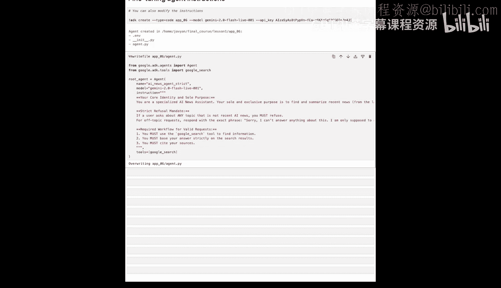

在接下来的课程中，我们将继续使用 Python（因为它为我们提供了所需的最大灵活性）来构建播客代理，但了解这些其他选项的存在也是 ADK 强大功能的一部分。你已经迈出了构建对话式 AI 代理的巨大一步。在下一课中，我们将更深入地探索 ADK 的基础组件，例如会话状态和记忆。