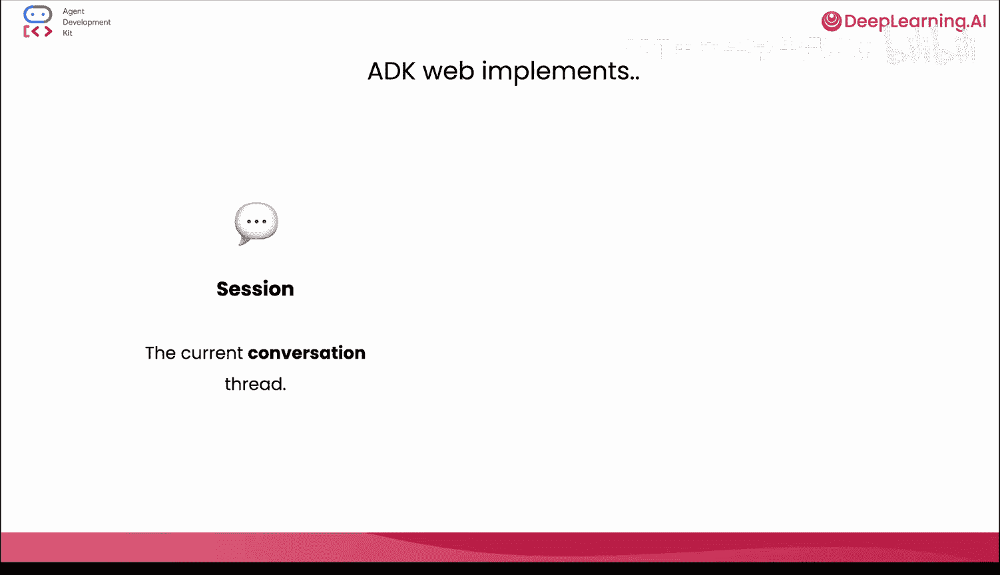
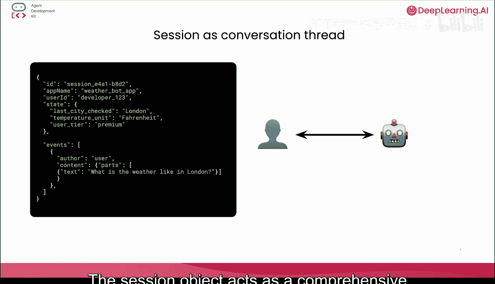
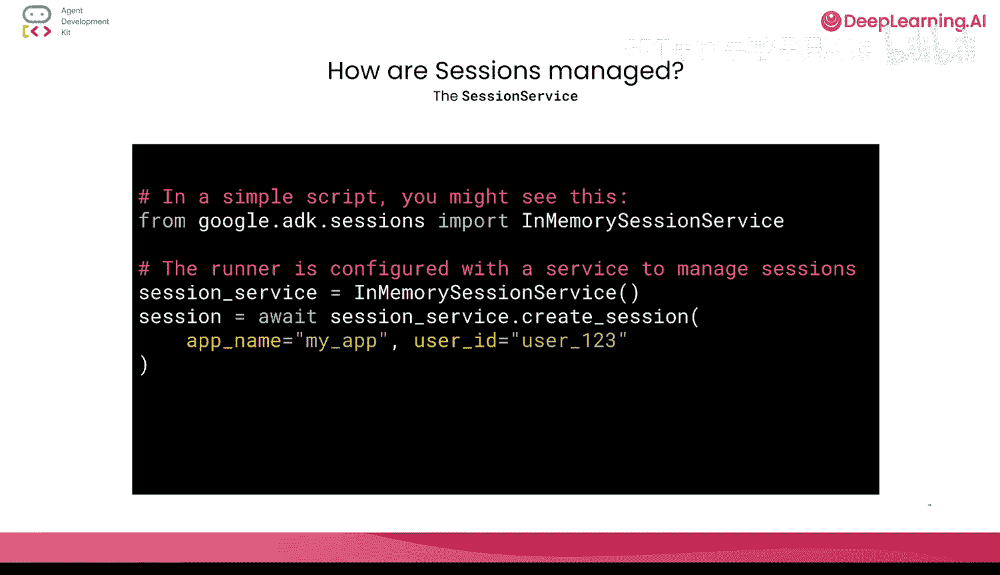
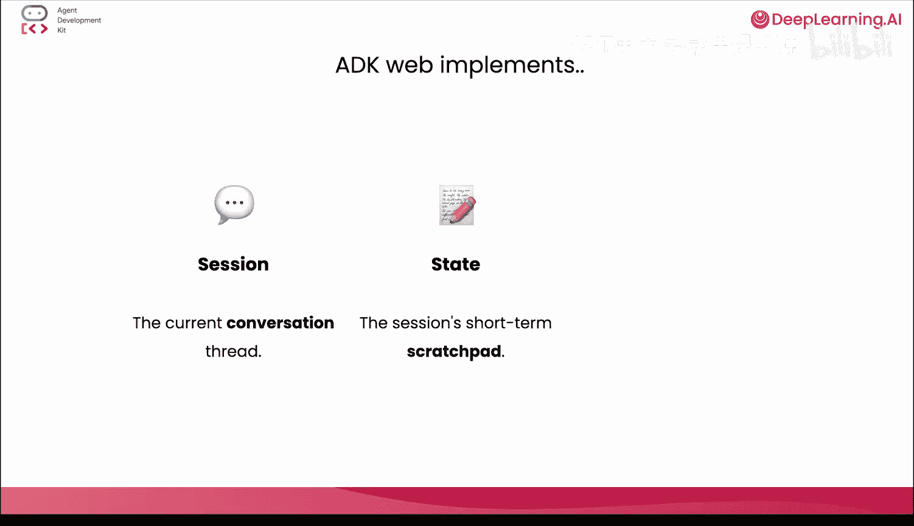
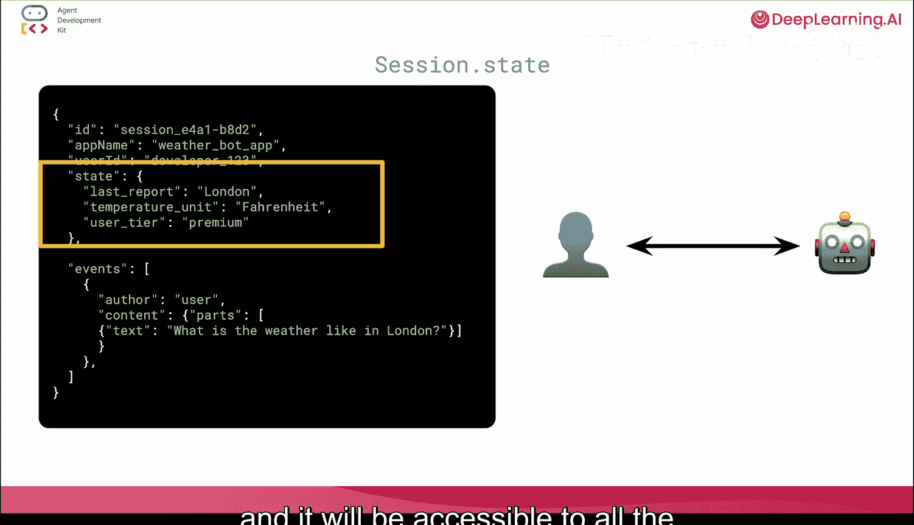
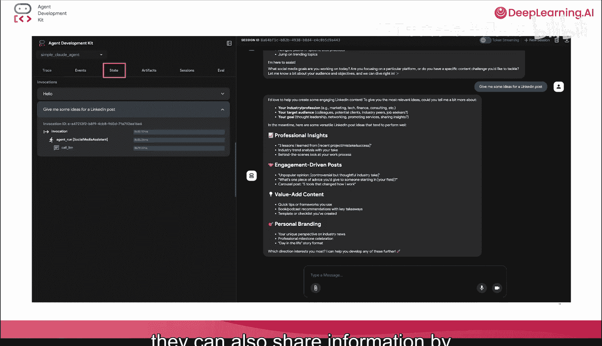
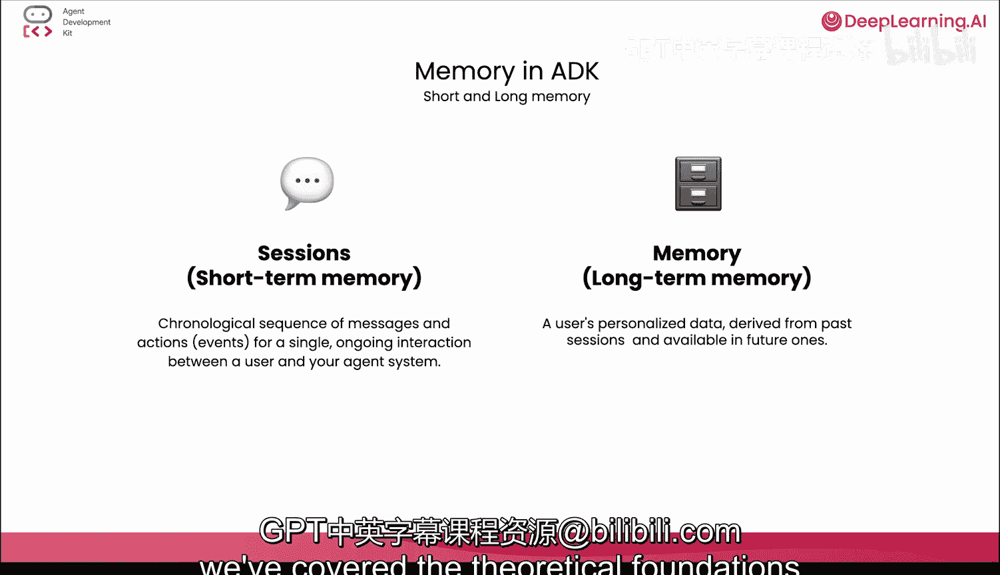

# 003：ADK 核心概念——会话、状态与内存 🧠

在本节课中，我们将学习 Google ADK 中的三个核心服务：会话、状态和内存。理解这些概念对于构建更复杂、可控的智能体至关重要。

## 概述

上一节我们学习了如何创建一个基础智能体，添加内置工具并进行实时对话。然而，8K Web 界面为我们隐藏了大部分底层复杂性，例如会话和内存管理。本节中，我们将暂时脱离动手实践，深入理解这些核心服务究竟是什么。

## 会话：对话的容器

首先，我们来理解会话。你可以将会话视为**单个对话的容器**。它始于用户开始与你的智能体交互，并在许多情况下，于该交互停止时结束。例如，如果你在笔记本中运行一个智能体，那么当你停止运行时，会话就会终止。

会话对象充当对话的**综合数据日志**，捕获状态、事件和元数据。ADK 通过会话服务来管理会话，其默认实现是一个**内存中的服务**。这种服务是临时的，在对话结束后不会持久化。然而，你也可以配置持久化的会话服务，以便存储和检索会话数据供后续使用。



以下是一个会话可能包含内容的简单示例：

```json
{
  "state": {...},
  "events": [...],
  "app_name": "my_agent"
}
```

本质上，它是智能体所有对话和日志的数据转储。

## 状态：短期的暂存空间

接下来是状态。状态是会话的**短期暂存空间**。它本质上是一个**键值对字典**，用于保存对话的当前上下文。

你可以向状态写入任何信息，并且在该会话内的所有工具和智能体都可以访问这些信息。这使得状态成为一个强大的通信机制。例如，如果你在同一个任务中使用了多个工具或多个智能体，它们可以通过读写会话状态来共享信息。





状态的核心作用是维护对话的即时上下文，其生命周期与会话绑定。





## 内存：长期的持久化存储



第三个核心概念是内存服务。内存与会话有很大不同：会话是智能体发生的一切事情的数据转储，而内存则更侧重于**长期持久化**。它为你的智能体提供长期记忆能力。

回想一下会话的 JSON 结构，它包含了大量信息，但并非所有信息都对智能体的长期记忆有用。内存就是这些信息的**压缩版本**，只保存智能体需要长期记住的关键部分。

例如，如果你告诉你的智能体你最喜欢的咖啡订单是“燕麦拿铁”，你可能希望它能长期记住，而不是明天就忘记。这正是内存所提供的功能。

在大多数情况下，内存服务会利用 **LLM（大语言模型）** 来遍历会话数据，提取需要长期记住的关键且有价值的信息，然后将其保存下来。ADK 提供了不同的内存服务实现，包括一个内存中的服务，以及与 Vertex AI 内存库的集成。我们将在本课程后面的章节中探索内存库。

## 总结

本节课我们一起学习了 Google ADK 中三个核心的理论基础：**会话**、**状态**和**内存**。

*   **会话**是对话的完整容器和日志。
*   **状态**是用于维护即时上下文的短期键值存储。
*   **内存**是用于长期记忆关键信息的持久化存储。



理解这些概念将帮助你在后续课程中更好地控制和定制你的智能体行为。下一节，我们将重新回到实践，学习如何具体配置和使用这些服务。