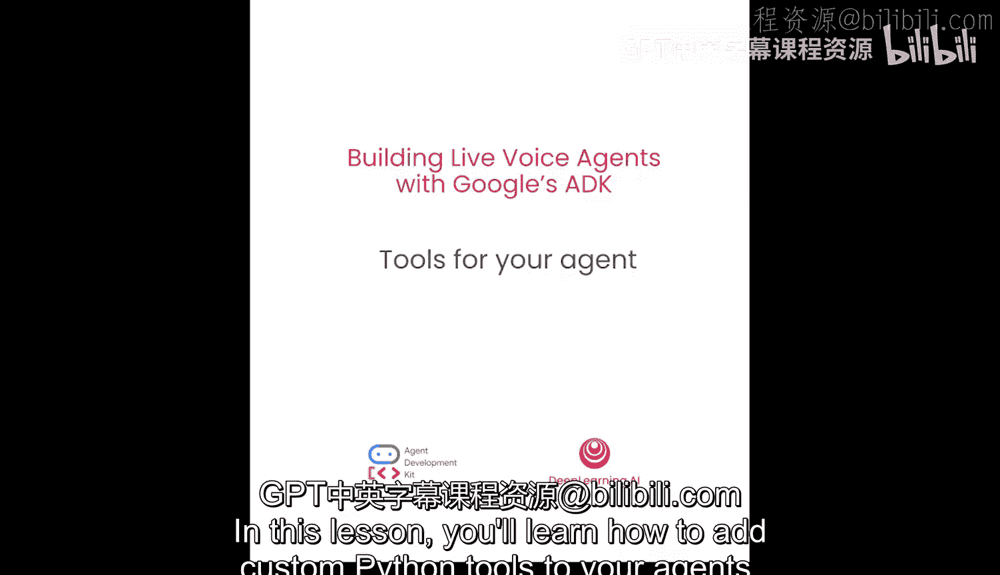
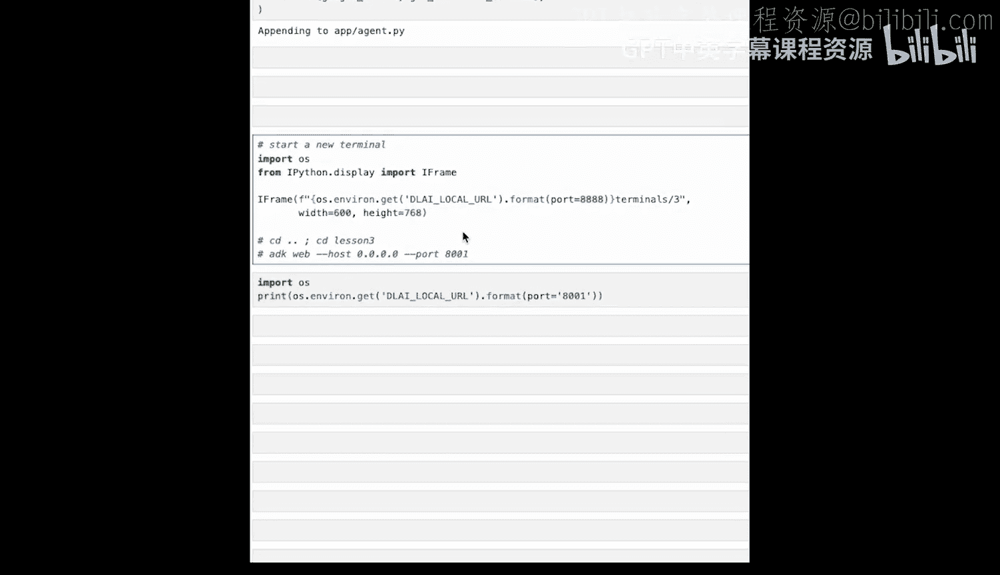
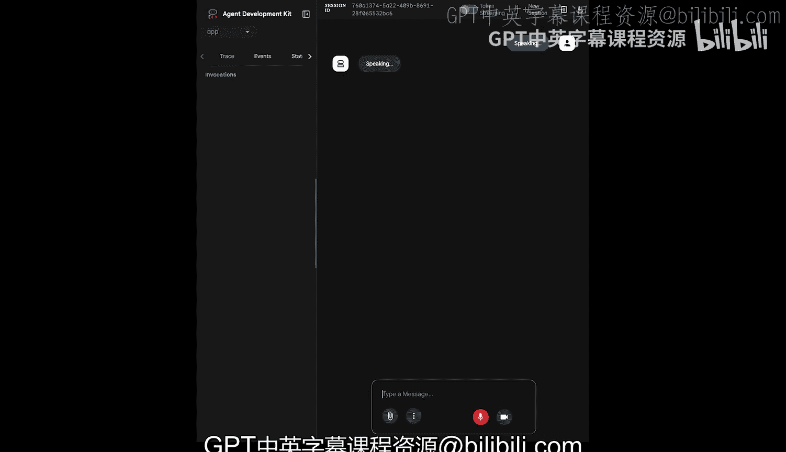

# 004：为你的代理添加工具 🛠️

在本节课中，我们将学习如何为你的 ADK 代理添加自定义的 Python 工具。我们将通过集成一个外部 API 来获取金融信息，并探讨定义工具的最佳实践，以及如何修改代理指令以有效使用这些工具。

## 环境准备与项目初始化

首先，请确保你的开发环境中已安装最新版本的 ADK 及其他依赖项。

**第一步**，与之前所有课程一样，始终创建一个 ADK 项目文件夹。在当前实验环境中，你无需添加 API 密钥。但如果你选择在自己的环境或计算机上运行此代码，请确保在 `adk create` 命令中传入 Gemini API 密钥。你可以从 Google AI Studio 或 Vertex AI Studio 获取该密钥。

## 课程目标：增强新闻搜索功能




上一节我们介绍了代理的基本工作流程。本节中，我们来看看如何通过添加新的信息来源来增强我们的“AI新闻分析师”功能。


目前，我们的代理可以从各大公司获取最新的 AI 新闻。如果我们能同时了解相关公司的金融市场表现，那将非常有价值。例如，如果谷歌发布了关于其新功能 Gemini 1.5 Pro 的新闻，观察其股价和百分比变化可以间接地为我们提供该新闻是正面还是负面的信号。

> **免责声明**：这并非股票购买建议，股价的涨跌与新闻也并非直接相关。我们只是尝试通过添加一个简单的 Python 函数，从实时数据中获取更多信息。

## 创建自定义工具：获取金融数据

为了实现这个目标，我们有一个 `get_financial_context` 函数。这是一个为 ADK 代理设计的函数工具。

ADK 框架非常智能，它能读取函数的描述、参数甚至类型，从而理解这个工具的作用。因此，像我们这里一样，拥有清晰的文档字符串对于代理知道何时以及如何有效使用此工具至关重要。

让我们看看代码：

```python
def get_financial_context(tickers: list[str]) -> dict:
    """
    获取给定股票代码列表的当前股价和日涨跌幅。
    参数:
        tickers: 股票代码列表，例如 ['GOOG', 'NVDA']
    返回:
        一个字典，键为股票代码，值为格式化的金融信息字符串。
    """
    import yfinance as yf
    financial_data = {}
    for ticker_symbol in tickers:
        try:
            stock = yf.Ticker(ticker_symbol)
            info = stock.info
            current_price = info.get('currentPrice')
            percent_change = info.get('regularMarketChangePercent')
            if current_price is not None and percent_change is not None:
                formatted_info = f"${current_price:.2f} ({percent_change:+.2f}%)"
                financial_data[ticker_symbol] = formatted_info
            else:
                financial_data[ticker_symbol] = "Financial data not available."
        except Exception as e:
            financial_data[ticker_symbol] = f"Error fetching data: {e}"
    return financial_data
```

**代码解析**：
*   **函数定义**：函数名为 `get_financial_context`，它接受一个参数 `tickers`，该参数必须是一个字符串列表。代理将在此传入股票代码，如 `GOOG` 或 `NVDA`。
*   **数据结构**：在函数内部，我们首先创建一个名为 `financial_data` 的空字典，用于存储每个股票代码的结果，最后一并返回。
*   **循环处理**：接下来，我们遍历代理提供的股票代码列表。循环内的核心逻辑使用了流行的 Python 库 `yfinance` 来获取数据。
*   **数据获取与安全访问**：`stock = yf.Ticker(ticker_symbol)` 这行代码创建了一个代表特定股票的对象。`info = stock.info` 则获取了关于该股票的完整信息字典。我们使用 `.get()` 方法安全地访问我们感兴趣的两个特定数据：当前价格和日涨跌幅。这是一个好习惯，因为如果数据因某些原因不可用，代码也不会崩溃。
*   **格式化输出**：成功获取价格和涨跌幅后，我们将它们格式化为清晰易读的字符串（例如 `$175.20 (+1.25%)`），并将此字符串添加到 `financial_data` 字典中，以股票代码作为键。
*   **错误处理**：由于股票代码可能无效或存在网络问题，我们将整个逻辑包裹在 `try-except` 块中。这是一个安全网。如果发生任何错误，我们只需记录该股票代码的错误信息，然后继续处理下一个。
*   **返回结果**：循环结束后，函数返回 `financial_data` 字典，其中包含了代理所查询的每个股票代码的金融背景信息。

现在，让我们运行这段代码，看看输出结果。你会看到我们已经用刚刚编写的工具装备了我们的代理。

## 定义核心代理逻辑

接下来，我们来看看路由代理本身。这是我们操作的大脑。代理通过名称、模型，以及最重要的——一套详细的指令和可使用的工具列表来定义。

我们使用的是 `gemini-2.0-flash-exp` 模型。其中的 `-exp` 是关键，它表明我们使用的是专为实时双向流式传输设计的模型。正是这一点实现了自然的语音对话，你甚至可以打断代理，而它也能实时响应。

然而，真正的力量在于指令提示。这是我们塑造代理个性和工作流程的地方。我们给了它一套非常具体的规则。

以下是代理指令的关键部分：

```
你是一个AI新闻分析师。当用户请求AI新闻时，请按以下步骤操作：
1. 首先询问用户想要获取多少条新闻。
2. 使用 `google_search_for_news` 工具获取指定数量的最新AI新闻头条。
3. 分析新闻内容，识别出提到的上市公司及其股票代码。
4. 使用 `get_financial_context` 工具获取这些股票代码的当前市场数据。
5. 在回复中，必须引用所使用的工具，例如：“使用 Google 搜索获取新闻...”和“通过 YFinance 获取市场数据...”。
6. 将新闻标题与对应的金融数据一起呈现给用户。
```

**指令解析**：
*   **明确工作流**：例如，如果你只是说“给我一些AI新闻”，代理会被指示回应：“当然可以。您想让我查找多少条新闻？”在获得具体数量之前，它不会继续执行。
*   **分步执行**：一旦你提供了数量，代理就会遵循其工作流程：第一步是使用其谷歌搜索工具查找新闻；第二步是分析这些新闻以识别公司股票代码；第三步是使用新的 `get_financial_context` 工具获取这些股票代码的股市数据。
*   **确保透明度**：注意我们如何明确告诉代理在响应中引用其工具，例如以“使用 Google 搜索新闻...”和“通过 YFinance 获取市场数据...”开头。这种透明度是我们代理设计的关键部分。

## ADK 会话与状态管理

整个交互是由 ADK 的会话和状态管理实现的。当你开始对话时，ADK 会创建一个会话，它就像代理的短期记忆。来回的每条消息都是对话中的一个回合。代理可以将信息存储在会话状态中。

例如，当你告诉它你想要 3 条新闻时，它会记住这个数字用于下一步。这就是它如何保持上下文连贯。因为这种状态在整个会话期间都被保留，所以你可以提出后续问题。例如，在它告诉你头条新闻后，你可以说“告诉我更多关于第二条新闻的信息”，代理可以参考它之前收集的信息来给你一个详细的总结。

因此，当你与代理对话时，实时模型会转录你的音频，代理逻辑处理你的请求。它按照我们定义的顺序使用其工具，并流式传输回音频响应，同时跟踪对话历史记录和其会话状态。这创造了一种无缝且智能的对话体验。

## 测试代理功能

现在，让我们运行 ADK Web UI 并测试我们的代理。

**用户**：嗨，你能帮我看看最新的 AI 新闻吗？

**代理**：当然可以。您想让我查找多少条新闻？

**用户**：找 3 条给我。

**代理**：使用 `google_search_for_news` 获取新闻，并使用 `get_financial_context` 通过 YFinance 获取市场数据。以下是头条新闻及涉及的主要上市AI公司的市场数据：
1.  顶级上市AI公司需知：NVDA $177.33 (+3.84%)
2.  CoreWeave 股价因 NVIDIA 支持的公司 VC 基金用于 AI 投资的消息而上涨：股票代码不可用
3.  AI 热潮推动 Oracle 股价创历史新高，接近万亿美元市值：ORCL $128.33 (+3.59%)
您对哪条感兴趣，或者需要我搜索更多吗？



**用户**：告诉我更多关于第一条的信息。

**代理**：这是关于第一条头条的更多信息：文章讨论了顶级上市AI公司。根据 `get_financial_context` 工具，NVDA 目前交易价格为 $177.33，涨幅为 +3.84%。您还想了解什么？

**用户**：巧克力蛋糕的最佳食谱是什么？

**代理**：我只能提供美国上市公司的最新 AI 新闻。

## 总结



本节课中，我们一起学习了如何为 Google ADK 代理创建和集成自定义 Python 工具。我们通过添加一个获取股票市场数据的函数，扩展了“AI新闻分析师”的功能。关键点包括：编写具有清晰文档字符串的工具函数、在代理指令中定义明确的工作流程和工具使用规则，以及利用 ADK 的会话状态来维持对话上下文。正如测试所示，代理现在能够按照指令，在获取新闻后自动查询相关公司的金融数据，并将结果清晰地呈现给用户，从而提供了更丰富的洞察力。