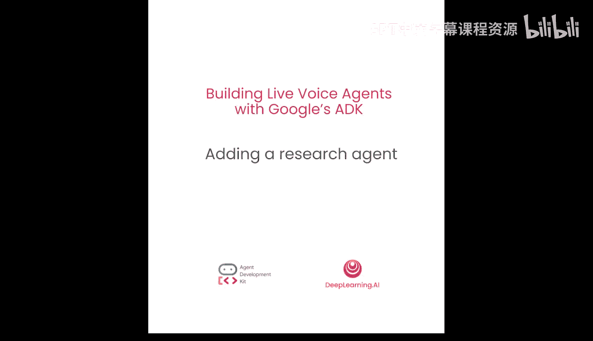
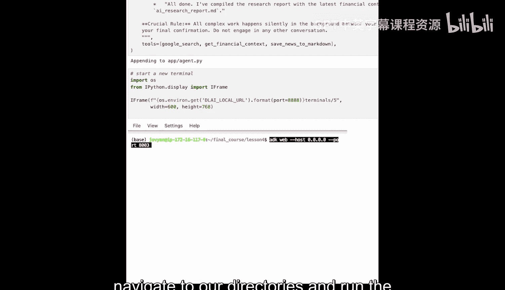
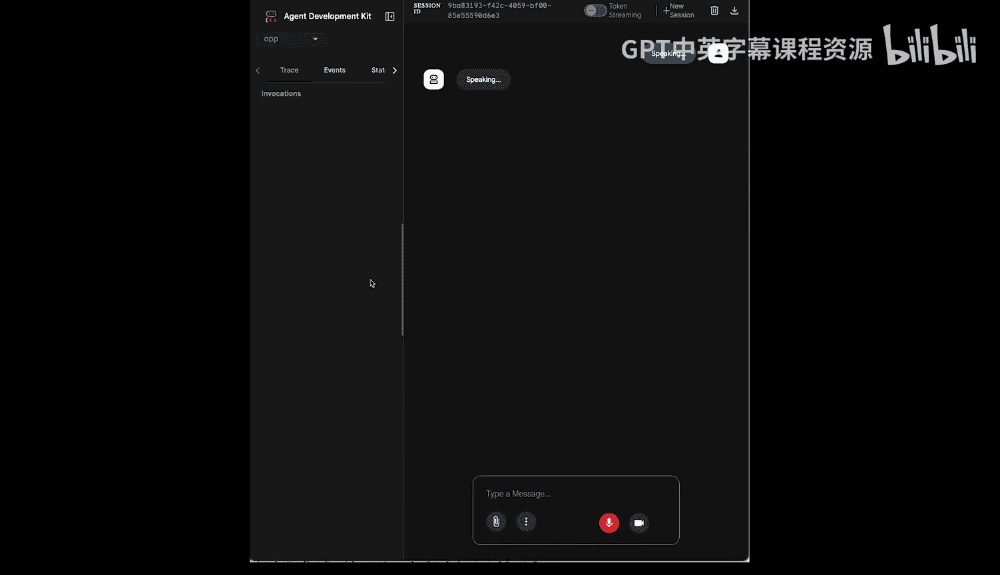
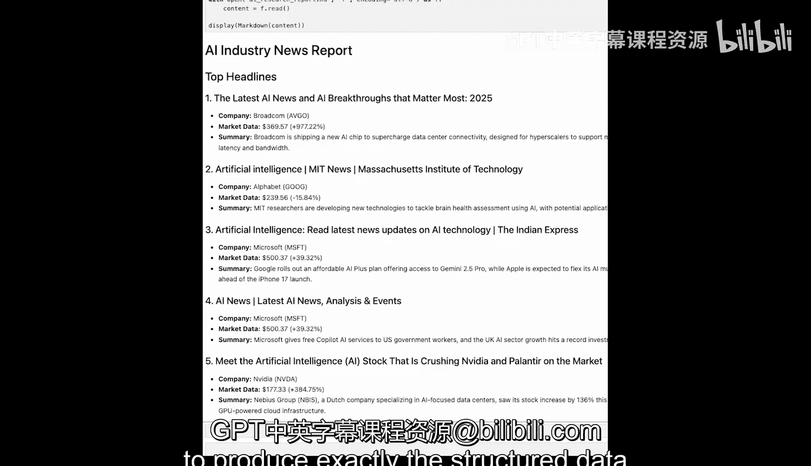

# 005：添加研究代理 📚



在本节课中，我们将学习如何通过定义模式（Schema）从代理处获取结构化的响应，并将研究结果保存为外部文件。我们还将看到如何将主代理的行为从新闻播报员转变为协调调度员。

在上一节课中，我们构建了一个出色的交互式新闻助手。它可以实时获取新闻和金融数据，并与我们讨论头条新闻。现在，我们将把这个概念演变成一个更强大的模式，即**协调调度员模型**。

设想一个现实世界的任务，例如为播客准备研究资料。你不会希望坐着听它读出找到的每一条新闻标题，这效率低下。相反，你希望扮演一个导演的角色：下达指令，你的研究助手就会在后台安静地工作，直到完成一份格式化的报告后才向你汇报。这正是我们本节课要构建的内容：将我们的代理从一个对话者转变为一个高效、安静的背景研究员。

为了实现这一目标，我们将进行三个关键改动：
1.  为工具包添加一个新工具。
2.  从根本上重写根代理的指令以改变其行为。
3.  与它的交互方式将变得更简单，专注于启动任务和接收最终成果。


与之前的课程一样，初始设置是相同的。我们首先确保安装了最新版本的 ADK 和所有其他依赖项。然后使用 `adk create` 命令为我们的代理创建文件夹和样板文件。由于我们已经做过几次，让我们直接进入代码改动部分。

## 工具配置 🔧

接下来，让我们从工具开始。与第3课一样，我们的代理仍然拥有 `get_financial_context` 函数。它的工作保持不变：接收一个股票代码列表，并返回其当前价格和日涨跌幅。我们无需在此处做任何更改。

现在，`agent.py` 文件中的新添加是一个名为 `save_news_to_markdown` 的函数。这是另一个自定义函数工具。它的工作非常简单：接收两个参数——文件名和要保存的内容。在函数内部，它只是将内容写入一个 Markdown 文件。这个工具是我们代理工作流程的最后一步，允许它将完整的研究保存到一个外部文件中，我们将其命名为 `ai_research_report.md`。

以下是该工具的代码示例：
```python
def save_news_to_markdown(file_name: str, content: str):
    """将内容保存到指定的 Markdown 文件。"""
    with open(file_name, 'w', encoding='utf-8') as f:
        f.write(content)
    return f"内容已成功保存到 {file_name}"
```

## 代理指令重写 ✍️

现在，进入最重要的部分：根代理的新指令。在这里，我们将其新角色定义为**后台 AI 研究协调员**。这些指令现在非常具体，以强制其执行新的行为。

首先，我们实现了一个严格的**双消息交互工作流程**。当你提出类似“为我查找最新的 AI 新闻”的请求时，代理的唯一即时响应将是一个确认，例如：“好的，我将开始研究最新的 AI 新闻。这可能需要一点时间。”

发送该消息后，代理将进入静默状态。这是**后台处理阶段**。它现在正在执行我们在其指令中定义的精确工具调用序列：
1.  首先使用谷歌搜索查找五篇文章。
2.  然后从这些文章中提取股票代码。
3.  接着将这些代码传递给我们的 `get_financial_context` 工具以获取财务数据。

为了确保每次输出都完美无缺，我们直接将一个**必需的报告模式**嵌入到代理的指令中。这是将 ADK 与大型语言模型（如 Gemini）结合使用的最强大功能之一。通过在提示词中提供一个清晰的 Markdown 模板，我们为模型提供了一个精确的蓝图。模型理解这个结构，并将一丝不苟地格式化研究结果以完全匹配它。

值得注意的是，对于更复杂的数据结构，ADK 允许你定义一个 Pydantic 模式并将其作为 `output_schema` 传递。当我们讲到多代理系统时，会探索这种更高级的模式。但对于当前的需求，直接在提示词中定义模式是一种**高度有效且简单**的保证输出一致性的方法。

最后，它调用我们的 `save_news_to_markdown` 工具，传入文件名 `ai_research_report.md` 和格式化后的内容。只有在文件成功保存后，代理才会进行第二次也是最后一次发言，传递其确认消息，例如：“全部完成。我已将研究报告编译并保存到 ai_research_report.md。”

整个复杂的研究过程都在这第一次确认和最终确认之间，在后台自主进行。

## 运行与结果 🚀

现在，让我们运行它。你已经知道流程：启动终端，导航到我们的目录，并运行 `adk web` 命令来启动服务器。

打开 Web UI 后，给它一个简单的命令：“获取我关于人工智能的最新新闻。”

你将看到类似以下的交互：
1.  **代理确认**：“好的，我将开始研究最新的 AI 新闻。我会用财务数据丰富发现内容，并为您编译一份报告。这可能需要一点时间。”
2.  （后台处理阶段，代理静默）
3.  **代理最终确认**：“全部完成。我已将包含最新财务数据的研究报告编译并保存到 ai_research_report.md。”



现在让我们看看输出。记住，这是一个后台代理，这意味着它接收了我们的指令或要求，然后在后端完成工作并保存了文件。让我们看看它保存的文件，了解它在后台进程中具体做了什么。

正如你在这里看到的，报告以一个清晰的标题“行业新闻报告”开始，后面跟着一个顶级标题。五个新闻条目中的每一个都被整齐地格式化，包含：
*   新闻标题本身。
*   一个详细说明公司及其股票代码的要点。
*   显示当前股价和涨跌幅的市场数据。
*   最后，它还显示了文章的简要摘要。

这种**一致、可预测的输出**是我们在代理指令中提供清晰模式的直接结果，展示了如何引导模型生成下游任务所需的确切结构化数据。

## 总结 📝





在本节课中，我们一起学习了如何将代理转变为后台研究协调员。我们通过添加一个保存文件的工具、重写指令以强制执行双消息工作流程，并在提示词中嵌入报告模式来实现这一点。这使得代理能够接收请求、在后台自主执行复杂的研究序列，并最终输出一个结构化的、可保存的报告。这种模式为构建能够处理多步骤、后台任务的智能代理奠定了坚实的基础。