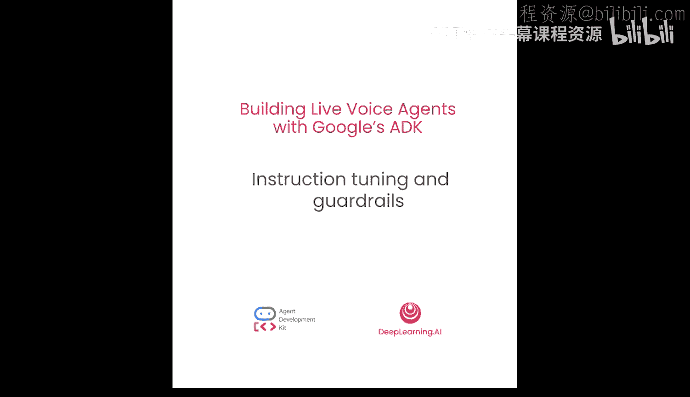
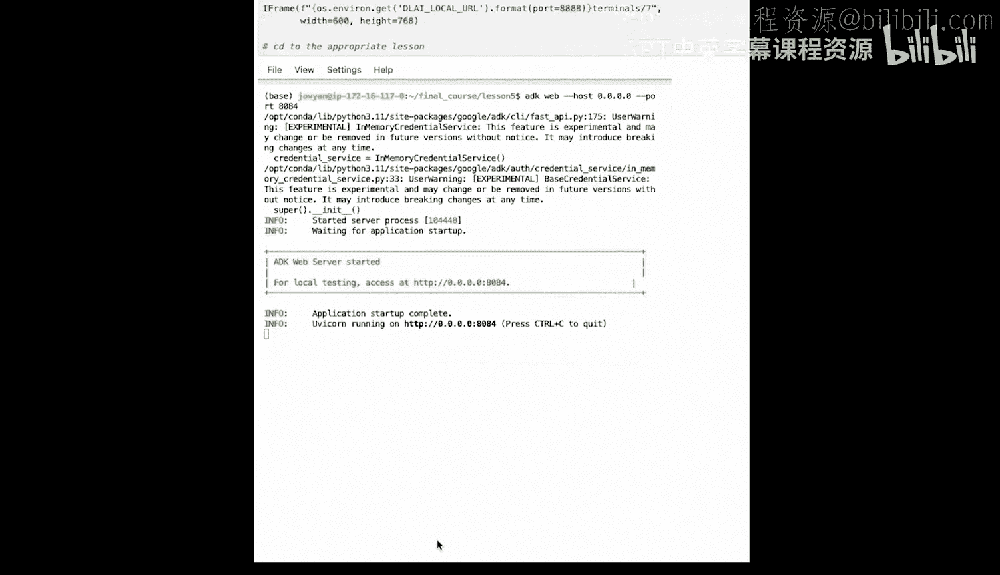
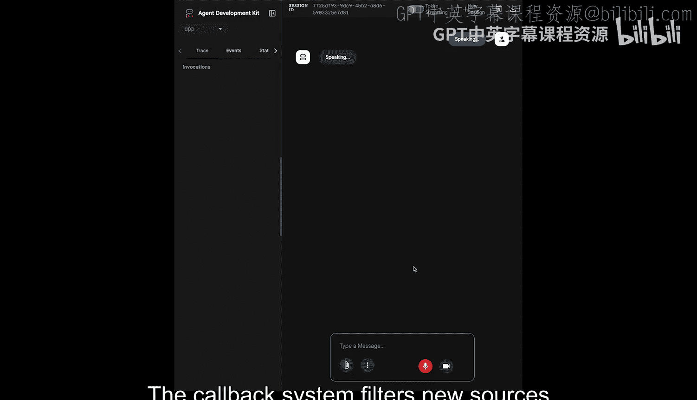

# 006：指令微调与安全护栏 🛡️

在本节课中，我们将学习如何构建行为更可预测的智能体。虽然智能体本质上是非确定性的，但在生产环境中，我们通常需要它们的行为具备一定的可预测性和安全性。我们将通过进一步的指令微调来优化提示词，并利用强大的回调系统，以编程方式强制执行规则，为生产应用创建安全护栏。

## 概述

在之前的课程中，我们探讨了指令微调这一重要主题。我们通过定义智能体的核心身份为其赋予个性，然后定义了其工作流程，并给出了一些规则，以缩小用户请求的范围，检查其是否为有效请求。只有当请求对AI有效时，才会被传递处理。这些指令引导智能体掌控对话，并拒绝完全超出其领域范围的请求。




然而，大型语言模型本质上是非确定性的，我们无法保证这些指令每次都能被准确执行。这对于生产系统来说是一个相当严重的问题，在实时语音代理中，这个问题会被进一步放大。

因此，在本节课中，你将学习如何构建比单纯引导更进一步、能在智能体执行的各个关键点强制执行回调的智能体。

## 什么是回调？

回调实际上是Python函数，它们在智能体生命周期的各个检查点运行，让你能以编程方式控制智能体的行为。

ADK中的各种回调点包括：智能体执行前/后、工具调用前/后、以及LLM调用前/后。

例如，如果你为“模型调用前”定义了一个Python函数并将其添加到智能体中，那么每次在进行LLM调用之前，都会执行这段确定性的回调代码。这些智能体生命周期中的执行点，是应用一系列通用函数的绝佳位置。

以下是回调的一些典型应用场景：
*   观察和调试工具，并记录详细信息。
*   自定义和控制智能体与子智能体之间实际流动的数据。
*   实施安全规则，例如在将提示词传递给智能体之前检查是否存在提示词注入，验证输入和输出，以及禁止某些操作。

## 回调的工作原理

当ADK遇到可以运行回调的点时（例如，就在工具调用之前），它会检查你是否为该智能体提供了相应的回调函数。如果提供了，框架就会调用该特定函数。

在回调函数内部，你可以访问一个名为“回调上下文”或“工具上下文”的特殊对象。这些对象包含关于智能体执行当前状态的重要信息，包括调用它的具体智能体的详细信息。你可以使用这些上下文对象来理解当前情况并与框架交互。

当回调内的代码执行完成后，你可以从回调中返回两个值之一，这将影响智能体的后续操作：
*   你可以从回调中返回 `None`，这将允许智能体继续其正常的执行流程。
*   如果你返回 `None` 以外的其他对象，这将覆盖智能体的默认行为。

接下来，让我们通过为播客智能体添加一个过滤新闻源的回调，来看看它的实际运作。

## 实践：为智能体添加回调

首先，让我们使用 `adk create` 命令创建一个新的智能体项目结构。和往常一样，这会为我们的智能体创建一个文件夹结构并妥善设置一切。

我将从之前的课程中复制代码到我们新的应用智能体中。让我们复制粘贴 `get_financial_context` 工具和 `save_news_to_markdown` 工具。这是我们之前课程中构建的两个工具，代码没有变化，只是复制过来，以便我们在其基础上继续构建智能体。

接下来，我将粘贴用于回调函数的一小段代码，我们将详细分解和解释其中的内容。

```python
def filter_news_sources(tool, args, tool_context):
    """
    在调用 Google 搜索工具前，检查并阻止来自特定域名的查询。
    """
    blocked_domains = ["wikipedia.org", "reddit.com", "archive.org"]

    # 仅对 Google 搜索工具执行此回调
    if tool == "google_search":
        query = args.get("query", "")
        # 检查查询是否包含任何被阻止的域名
        for domain in blocked_domains:
            if domain in query:
                # 返回错误对象以阻止工具执行
                return {
                    "error": f"查询被阻止：不允许从 {domain} 获取信息。请使用其他新闻源。"
                }
    # 返回 None 允许正常执行
    return None
```

首先看函数定义本身，它接受几个特殊参数，如 `tool`、`args` 和 `tool_context`。这些参数实际上很大程度上取决于回调的类型。由于我们将把这个回调作为“工具调用前”回调添加到智能体，因此它可以访问这些特殊的工具参数。但如果你要添加“智能体调用后”或“模型回调”，你看到的参数会非常不同。

让我们看看这些参数的含义：
*   `tool`：提供触发此回调的工具名称。
*   `args`：是传递给实际工具的LLM参数的集合。
*   `tool_context`：正如我们之前看到的，为工具提供对某些外部上下文（如会话和状态）的访问。

这个特定的回调会查看 Google 搜索工具，然后阻止我们在此定义的一些域名。它演示了以编程方式强制执行策略。

如果你看顶部的条件判断，会发现一个 `if` 条件，它将回调的执行范围缩小到仅当工具是 `google_search` 时才执行。这意味着只有当智能体调用 Google 搜索工具并触发此回调时，它才会被执行。

接下来，我们查看传递给 Google 搜索工具本身的 `args`，然后获取 `query` 参数，以检查查询是否包含我们在此声明的任何被阻止的域名。这里我们只有一个随机的被阻止域名列表，对于播客来说可能有用也可能没用。例如，假设我们想获取最新的AI新闻，我们不会从 `archive.org` 获取信息，所以我们只是使用一些网站来阻止。

根据这个 `if` 条件的结果，如果查询确实被阻止，它将返回一个错误对象；否则返回 `None`。同时请注意，错误信息非常具有描述性，因为这为智能体提供了查询被阻止的原因，防止了后续可能出现的混淆。

运行这个代码单元后，我们将把这个特定的回调添加到我们的智能体中。

到目前为止，我们已经看到了如何定义回调和阻止某些域名。在将这两个回调都添加到智能体之前，我们将快速创建一个“工具调用后”回调。

```python
def inject_process_log_after_search(tool, args, result, tool_context):
    """
    在 Google 搜索工具调用后，将使用的信息源记录到状态中。
    """
    if tool == "google_search":
        # 假设 result 中包含一个 'sources' 列表
        sources_used = result.get("sources", [])
        # 将信息源列表写入工具上下文的状态中
        tool_context.set_state("process_log", sources_used)
    return None
```

这个特定的回调 `inject_process_log_after_search` 基本上是一个我们在这里用来记录智能体实际使用了哪些信息源的实用工具。例如，如果它使用 Google 搜索从 Reddit、YouTube 或其他任何地方获取信息，它将在最终生成的 Markdown 文件中创建一个日志。

我将把这两个回调都添加到我们的智能体中。这个小辅助函数实际上只是使用 `state` 键将处理日志写入工具上下文。还记得我们说过工具上下文内部有状态信息吗？这正是你写入信息的方式。基本上，我们的回调列出了 Google 搜索工具用于执行搜索的所有来源，然后使用 `tool_context.set_state` 函数将其写入状态。

现在，让我们分解一下这个智能体实际做了什么。在代码底部，你会看到我们现在添加了两个回调：
1.  **`before_tool_callback`**：在工具调用前运行，确保工具（本例中是 Google 搜索）不使用某些信息源或域名。
2.  **`after_tool_callback`**：在工具调用后运行，即在搜索完成后，记录 Google 搜索工具实际使用的所有信息和来源。

假设你在“工具调用前”和“工具调用后”有多个回调，这将意味着你定义的所有回调将按顺序依次运行。

下一步是更新我们的智能体指令，以提供关于我们添加到其中的新回调的上下文。

```python
agent_instructions = """
你是一个AI新闻研究助手。
你拥有一个经过前后处理回调增强的 Google 搜索工具。
请使用该工具获取最新的AI新闻和金融背景信息。
在生成报告后，请根据你使用的信息源编写一份处理日志。
当测试回调时，请详细解释幕后发生的情况。
"""
```

我们来分解一下：
*   我们让智能体意识到它拥有一个经过前后处理回调增强的 Google 搜索工具。
*   我们还告诉它，要编写一份关于其用于搜索的来源的处理日志。
*   这里还有一小段代码，要求在测试回调时，智能体需要“健谈”一些，以便解释幕后发生的情况。

这是我们添加到智能体中的所有新代码。现在是时候实际运行智能体并验证回调是否正常工作了。

启动终端，`cd` 到正确的文件夹，运行 `adk web` 命令以启动我们的Web界面。我们还将运行一小段代码，它应该会给我们提供访问Web界面的代理URL。



让我们与智能体互动：
*   **用户**：`你能给我最新的AI新闻吗？`
*   **智能体**：`已完成。我已编译了包含最新金融背景的研究报告，并将其保存为 ai_research_report.md。`
*   **用户**：`你能告诉我你使用了哪些来源来获取这些新闻吗？`
*   **智能体**：`新闻收集自 softbank.com、crescendo.com、indianexpress.com 和 greennews.com。我被设定为仅使用信誉良好的新闻域名，并避免使用像 Wikipedia 和 Reddit 这样的来源。`
*   **用户**：`你有一个阻止它的回调吗？是回调过滤了来源，只包含信誉良好的来源，阻止获取来自 Wikipedia 和 Reddit 的新闻吗？`
*   **智能体**：`是的，我看到了智能体做出决定，获取信息，创建验证代码片段以包含来源。`

## 总结



本节课到此结束。你构建了一个生产就绪的控制系统，结合了指令微调和编程式回调。你的智能体现在还能持续拒绝偏离主题的请求，并阻止从某些域名获取信息。


在接下来的几节课中，我们将超越单个智能体，构建可以协同工作的专业智能体团队，并最终生成我们的播客节目。