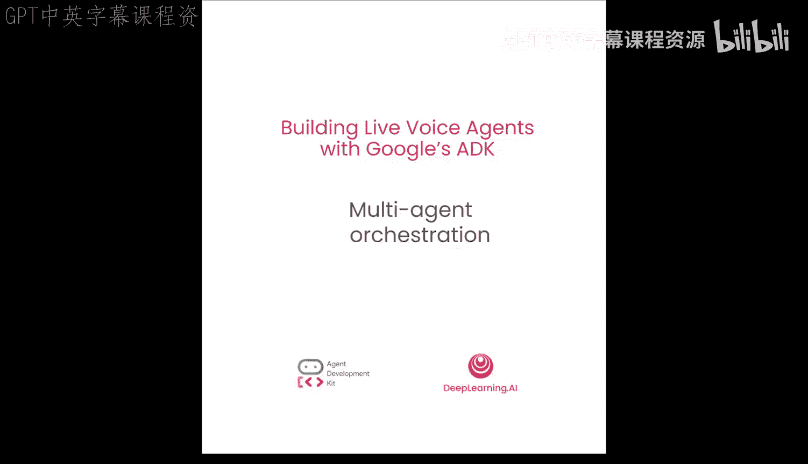
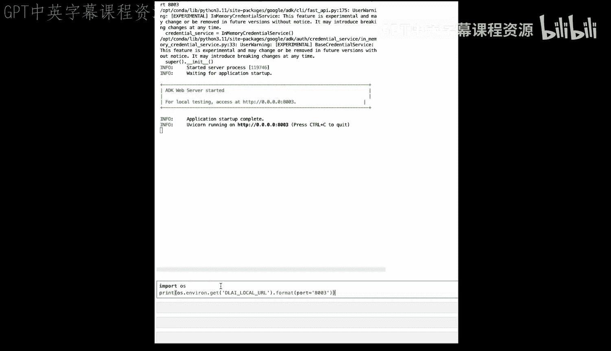
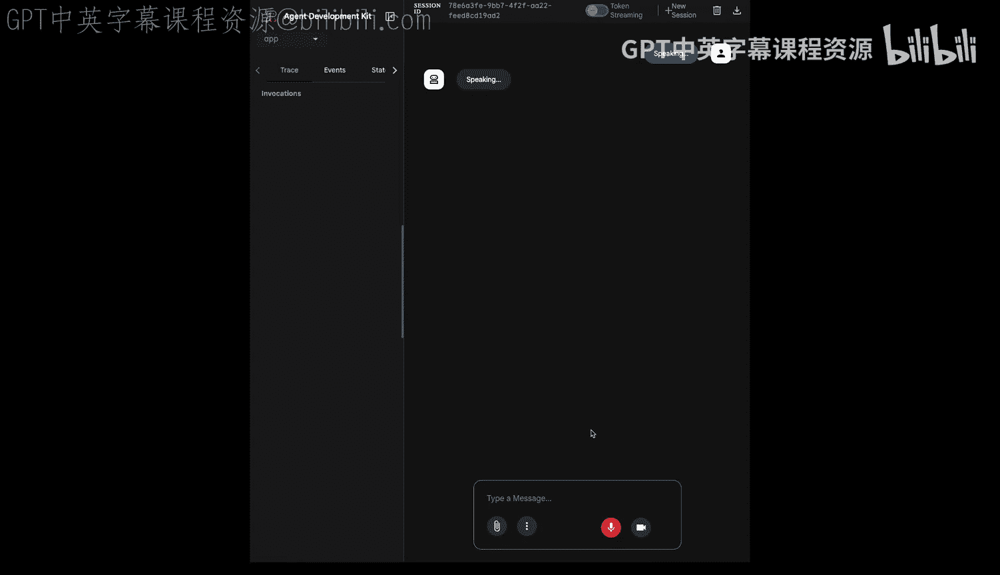
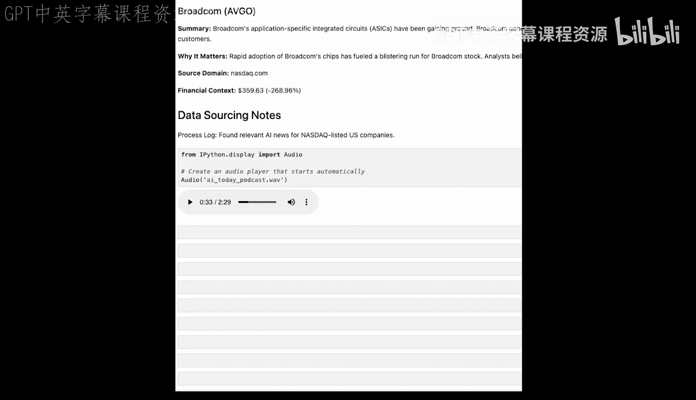

# 007：多智能体编排 🎙️🤖

在本节课中，我们将学习生产级的多智能体模式。我们将把系统重构为三层架构，实现职责的清晰分离，为构建复杂的应用程序打下可扩展的基础。让我们开始深入代码。

在过去的几节课中，我们逐步构建了一个复杂的研究智能体。我们从简单的实时语音智能体开始，将其演变为静默的后台工作器，然后使用回调函数添加了健壮的业务逻辑。现在，我们将所有这些部分组装成一个完整的端到端内容生产流水线。

我们的目标不再仅仅是创建一份研究报告，而是接收用户请求，并自动生成一个完整的双人对话音频播客。为了实现这一目标，我们引入了三项重大改进：一个多智能体架构、使用 Pydantic 实现的健壮数据结构化，以及一个能将项目带入音频世界的新工具。

在进入代码之前，让我们快速了解一下架构。我们现在要进入一个多智能体系统。一个根智能体（我们现在可以将其视为制片人）将编排整个工作流。然而，对于音频生成这项专门任务，它会将工作委托给一个新的专用智能体——播客智能体。这是通过 `AgentTool` 实现的，它允许一个智能体被另一个智能体用作工具。这种为特定任务使用专门智能体的模式，是构建复杂且可扩展系统的基础。

现在，让我们开始构建代码。在开始之前，和往常一样，我们总是需要一个数据文件夹，让我们快速创建它。

现在，让我们逐块查看代码。首先，我们在智能体定义文件顶部看到新的工具类：`NewsStory` 和 `AINewsReport`。这是我们之前方法的重大升级。我们不再将 Markdown 模式放在提示词中，而是使用 Pydantic 模式。可以将其视为我们数据的严格契约。`NewsStory` 类精确定义了每篇文章所需的信息，例如公司、标题以及一个新字段“为何重要”。`AINewsReport` 类则作为整个报告的容器，包含标题、摘要和所有这些 `NewsStory` 对象的列表。这确保了数据始终是干净、结构化且可预测的。

接下来，我们要添加我们的工具。我们将创建的前两个工具是用于创建和生成播客的。

第一个是 `wave_file`，它将把来自 Gemini TTS 的输出以 `.wav` 格式保存到本地文件文件夹中。

接下来是一个最令人兴奋的新工具：`generate_podcast_audio`。这个函数是多模态输出的门户。它接收文本脚本作为输入，并使用 Gemini 文本转语音模型将其转换为音频。这里的关键特性是我们定义的 `multispeaker_voice_config`。我们定义了两个不同的说话者 Joe 和 Jane，它们具有不同的预置声音。这使得模型能够生成听起来自然的对话式播客，而不仅仅是单调的朗读。然后，该函数从 API 获取原始音频数据，并将其保存为项目目录中的 `.wav` 文件。其中最重要的元素是 Gemini 2.5 Flash Preview TTS 模型，这是我们为此用例使用的文本转语音模型。

现在，让我们将其添加到我们的智能体中。

接下来，我们看到了与上一课相同的 `get_financial_context` 和 `save_news_to_markdown` 工具，我们现在快速运行它们。

既然我们已经添加了工具，下一步就是实际添加我们的回调函数，我们在上一课也见过。你会认出我们在上一课中使用的 `filter_news_source_callback`，并且我们还添加了另一个：`data_freshen_callback`。

以下是回调函数的说明：

*   **`data_freshen_callback`**：这是一个 `BeforeToolCallback`，非常简单但至关重要。它拦截 Google 搜索调用，并向查询添加一个参数，将结果限制在过去 7 天内，确保我们的播客始终基于最新事件。
*   **`inject_process_log_after_search`**：这是一个 `AfterToolCallback`，非常巧妙。它在搜索完成后运行，查看结果，找出实际使用了我们白名单中的哪些域名，然后修改工具响应。它不只是将搜索结果作为字符串返回，而是返回一个包含结果和过程日志的字典。这使得我们 `BeforeToolCallback` 的幕后工作对智能体可见，然后我们指示智能体将其包含在最终报告中，以实现完全透明。

我们有了工具，也有了回调函数。现在，最后缺失的部分就是添加智能体本身。让我们添加我们的智能体。

现在你在这里看到的是两个智能体：`PodcasterAgent` 和 `RootAgent`。这是我们的第一个多智能体系统。`PodcasterAgent` 是一个专家，它只有一个工作和一个工具，那就是生成音频。`RootAgent` 是制片人。通过将 `PodcasterAgent` 包装在 `AgentTool` 中，我们赋予了制片人将音频生成任务委托给专家的能力，这是一种更清晰、更可扩展的设计。

最后，所有这些都在 `RootAgent` 的新指令中汇聚在一起。它的身份现在是一个 AI 新闻播客制片人。它的工作流是一个完整的 10 步生产流水线，从确认用户请求到生成最终音频。至关重要的是，我们现在连接了所有部分：我们通过设置 `output_schema=AINewsReport` 告诉它使用 `AINewsReport` 模式作为输出；我们指导它如何处理来自回调函数修改后的 Google 搜索工具的新字典输出；我们添加了一个新的创意步骤，即创建播客，它必须根据其发现撰写自然的对话；其后台工作的最后一步是调用 `PodcasterAgent` 来生成音频。

当你运行这个最终的智能体时，用户体验一如既往地简单，但在后台，由智能体、工具、模式和回调函数组成的复杂系统将执行任务，交付的不仅仅是研究报告，还有完成的音频播客。

那么，让我们开始吧。现在，让我们启动服务器并运行我们的 ADK Web 界面。

正如我们之前所见，我们可以通过此链接直接访问 UI。现在我们的 ADK Web 正在运行，让我们请求一个播客。

> 用户：嗨，你能帮我获取最新的 AI 新闻并做成播客吗？
> 智能体：好的，我将开始研究最新的 AI 新闻，纳斯达克上市公司。我将用可用的财务数据丰富这些发现，并为您编制报告。这可能需要一点时间。

你看到我们能够与我们的智能体对话，它告诉我们它将在后台完成所有事情。确实，它既保存了报告，也生成了最终的播客。让我们来看看。

这里我们正在读取由我们智能体的后台进程生成的 AI 研究报告 Markdown 文件。正如你所见，这是一份非常详细的报告。它包含我们要求的所有上市公司，也有财务背景，还有它引用的信息来源域名。它既有标题，也有摘要和“为何重要”部分。这真的很有趣。

但最有趣的部分是播客，这是我们一直期待的。自从我们从第一课开始，我就不多说了，我想让你听听它制作了什么。

> 播客脚本：AI 新闻综述
> Joe：大家好，欢迎来到 AI Today 播客。我是你们热情的主持人 Joe。
> Jane：我是 Jane，在这里为今天的 AI 发展提供分析视角。今天我们将深入探讨最新的 AI 新闻，纳斯达克公司。Jane，有什么吸引你的吗？
> Jane：嗯，Joe，很明显，AI 正在迅速改变科技格局。让我们从微软开始...
> ...

这就是我们一直想要实现的目标，仅仅通过几行代码。这令人惊叹，我们已经从一个简单的实时新闻查询走了很长的路，达到了现在这个程度。为了做到这一点，我们必须学习 ADK 的许多不同元素，我迫不及待地想看到你用 ADK 和 Gemini 大语言模型发现更多开箱即用的想法。

祝您构建愉快！