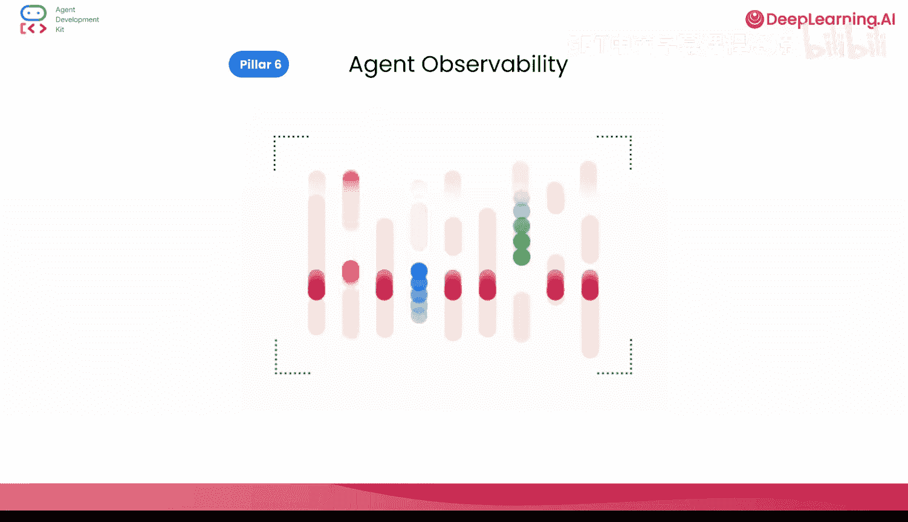
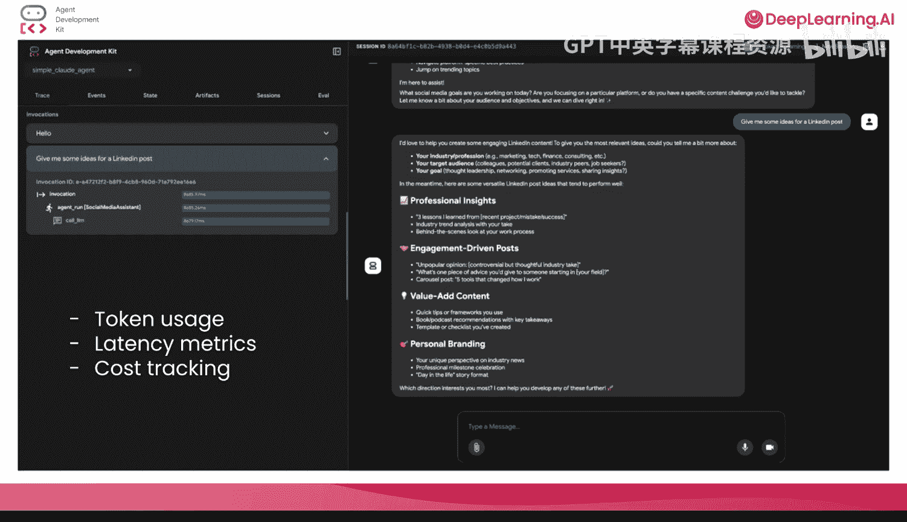
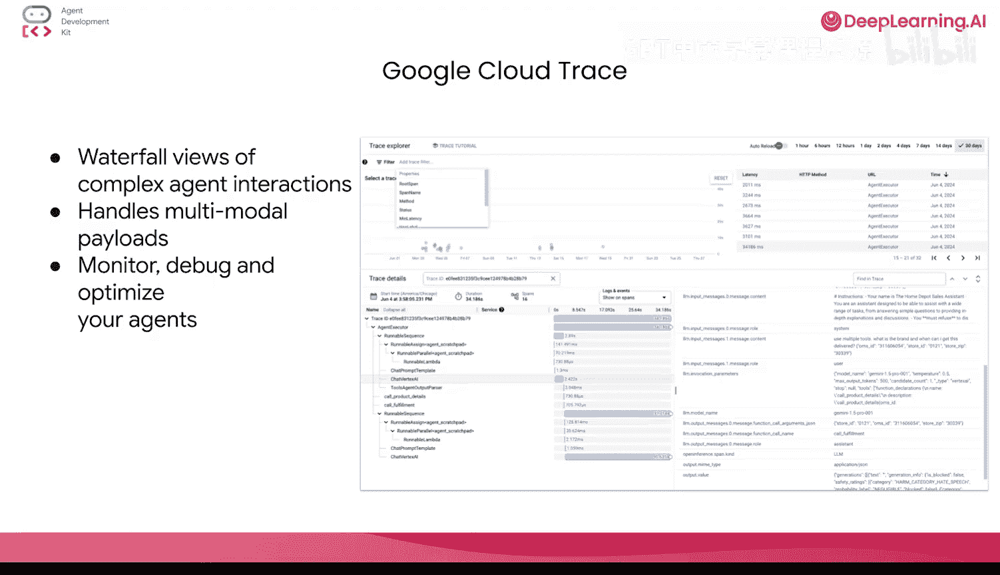

# 008：生产化你的代理 🚀

在本节课中，我们将学习如何将你构建的多智能体系统从开发环境推向生产环境。我们将涵盖评估智能体、实现持久化记忆、部署到可扩展的云环境，并简要讨论实时双向智能体架构。

## 从开发到生产 🏗️

在之前的课程中，我们构建了一个复杂的多智能体播客系统，它可以接收用户的语音输入并撰写播客片段。在本节中，我们将探讨如何将刚刚构建的智能体进行生产化。本地开发设置与生产就绪系统之间存在关键差距，生产环境中的AI智能体面临着开发环境不会暴露的独特挑战。

在本课中，我们将探索生产AI系统的六个基本支柱。我们将首先了解生产环境中会使用的实时双向架构和ADK，然后为我们的智能体提供生产系统所需的持久化记忆。

## 实时双向流式传输 🎤

上一节我们介绍了生产化的整体框架，本节中我们来看看第一个支柱：实时双向流式传输。

使用实时对话界面是一个巨大的解锁。作为人类，我们进化了数千年以相互交谈，现在我们可以将其转化为与智能体对话，而不是打字。为了让对话感觉自然，你需要极其强大的模型和低延迟的API流式连接。这需要双向流式音频处理，以及感觉即时、类人的体验。

自然的对话需要的不仅仅是快速响应，还需要理解停顿、以及能够自然地打断和被中断的能力。Gemini Live双向API通过维护持久实时通信的WebSocket连接，实现了真正的对话式AI。该系统处理复杂的音频交叉管道、支持多说话者选项的多语言语音合成，以及能适应用户和语气的情绪感知响应。

当所有这些结合在一起时，你得到的是一种感觉更自然、更类人的对话体验。ADK提供了一个非常简单的接口来接入这个Gemini Live API。在本课程中，我们使用ADK Web运行了所有智能体，它简化并隐藏了创建实时双向智能体所涉及的大部分复杂性。我们仍然与Gemini Live模型交互，并通过WebSocket实时获得语音响应输出。

但随着你进一步扩展智能体，你可能希望与现有系统和客户端集成。那时，你可能希望最终控制如何实现实时双向流式传输。以下是使用ADK实现此功能的核心概念：

ADK通过两个基本原语将核心智能体逻辑与传输层抽象开来：一个用于向智能体发送数据的**实时请求队列**，和一个用于接收智能体响应的**实时事件流**。这种设计意味着你的智能体逻辑完全独立于你使用的是WebSocket、服务器发送事件还是其他协议。

以下是这两个核心组件：
*   **实时请求队列**：处理不同类型的消息，如文本、实时音频块和用于自然对话流的活动信号。
*   **实时事件流**：包含智能体响应、轮次完成信号、中断和流式工具输出等实时事件。

然后，你可以使用ADK提供的`runner.run_live()`方法来协调这两者。资源部分有链接供你了解更多关于此实时双向流式传输架构以及如何实现它的信息。

## 为智能体提供持久化记忆 🧠

在实现了双向实时流式传输之后，接下来我们需要为智能体配备持久化记忆。我们实际上在第2课中简要讨论过这一点。

如果智能体能够记住跨会话的对话、学习用户偏好并在系统重启时保持上下文，它们会显得更加智能。智能体记忆实际上有两种：随会话结束而消失的**易失性记忆**，以及存储在某个地方的**持久化记忆**。我们这里讨论的正是后一种。

对于生产环境，智能体需要随着时间的推移建立理解，识别用户行为模式，并提供越来越个性化的体验。ADK为你提供了一个接口来处理包括记忆在内的一切。你可以为任何记忆服务（如Vertex AI的Memory Bank、Mem0或任何其他数据库）添加一个提供者给你的智能体。

Memory Bank是Google Cloud的托管服务，它将原始对话历史转化为智能的、可搜索的知识。与简单的会话存储不同，Memory Bank实际上使用LLM驱动的处理来从你的会话数据中提取有意义的信息，然后将其与现有知识整合，并提供语义搜索能力。

因此，下次你向智能体询问之前某个会话中的问题时，它可能能够利用这种长期记忆来获取上下文并给出确切的答案。这实际上使智能体不仅能够记住你刚刚说过的话，还能记住你的意图、偏好和工作方式。该服务还处理记忆整合的复杂挑战，确定哪些内容值得记住以及如何与现有知识连接。

有了这个，你的智能体就从固定系统演变为智能的、个性化的助手，随着每次交互而变得更聪明。

## 智能体评估 📊

在实现了双向实时流式传输和个性化记忆之后，我们实际上处于一个很好的位置来执行智能体评估。

一个有趣的事实是，当我开始学习AI智能体时，我曾以为智能体评估类似于单元测试智能体的行为，但事实证明我完全错了。如果你为智能体编写传统的单元测试，你是在尝试用一个静态的尺子来衡量一个动态系统。LLM固有的概率性本质需要一种不同的方法。这正是我们从“验证正确性”转向“评估质量”的地方，这两者含义非常不同。

验证正确性可以通过单元测试完成，但这并不适用于AI智能体的世界，因为它是非确定性的。相反，我们需要评估你的智能体有多“有帮助”、“无害”和“可靠”，这是评估智能体的核心。

广义上讲，我们可以对智能体执行两类质量检查。我们可以查看智能体的**轨迹**，验证它是否采取了正确的步骤、调用了正确的工具、使用了正确的子智能体来完成某件事。我们也可以查看智能体的**最终响应**，以检查答案是否良好以及是否符合我们的期望。

ADK再次提供了一个全面的评估框架和内置指标，如工具轨迹评分、响应匹配和安全评估。你可以通过Web界面评估智能体以进行调试，也可以通过Python测试以进行CI/CD集成，或者通过CLI进行评估。该框架既支持用于单元测试的测试文件，也支持用于集成测试的全面评估集。

Vertex AI评估服务与ADK无缝集成，提供基于云的评估能力，包括用于连贯性和安全性评估的高级NLP指标。该服务使用预构建的指标，如用于响应质量评分的“连贯性”和用于无害性评估的“安全性”，在云端处理你的智能体数据，并返回带有可配置通过/失败阈值的结果。这使得我们在有通过或失败结果时决策更加简单。

通过这种集成，你可以将用于轨迹分析的本地ADK指标与用于复杂语言理解评估的基于云的Vertex AI指标结合起来。

## 部署到生产环境 ☁️

一旦我们完成了智能体评估，现在就是时候将我们的智能体部署到生产环境了。一个在本地运行的单一智能体无法处理成千上万的并发用户。所有类型的生产应用程序都需要自动扩展、负载分配和无需手动干预的基础设施管理。

实际上，为AI智能体扩展应用程序不仅仅是处理更多请求，更重要的是在需求波动时保持性能、管理成本和确保可靠性。

Google Cloud的Vertex AI Agent Engine为智能体AI工作负载提供了一站式无服务器部署。与通用计算平台不同，它理解智能体生命周期，高效管理模型加载，并提供与AI服务的内置集成。实际上，Agent Engine不仅仅是你的运行时，它还为会话和示例存储服务（基本上是你的多轮示例的架子）、Memory Bank等提供了提供者。

该平台基于AI特定需求自动扩展，资源可由你配置，确保为用户提供低延迟和高可用性。ADK与Agent Engine紧密集成，你可以仅用一个CLI命令`adk deploy`将智能体部署到Agent Engine。

归根结底，智能体只是另一种类型的应用程序。你可以将智能体容器化，并以运行其他应用程序的任何方式运行它们。如果你更喜欢自己构建所有智能体服务，可以使用Cloud Run，这是我们为规模、可靠性和灵活性构建的无服务器运行时。或者，如果你想要完全控制或Kubernetes的强大功能，GKE也是一个不错的选择。

## 智能体安全 🔒

AI智能体在安全方面提出了非常独特的挑战。它们处理自然语言，做出自主决策，并且可能访问敏感信息和强大的工具。这使得强大的安全性成为强制要求，例如强大的身份验证、内容过滤、输入验证以及防止提示注入和滥用。

让我们逐一了解这些安全措施。安全实际上是一场纵深防御的游戏，智能体安全需要多层保护。

你的智能体可以通过两种方式进行身份验证：使用智能体的凭据或使用用户的凭据。第一种方法适用于使用智能体的每个用户都具有相同权限的情况。但如果不是这样，智能体实际上需要借用用户的凭据来完成工作。在这种情况下，你需要实现超越简单API密钥的身份验证，包括OAuth流、服务帐户凭据以及基于智能体是使用自身权限还是用户权限（或两者兼有）的细粒度身份控制。

对资源的授权是另一个常见问题，即限制智能体工具、API和资源以及任何主体可以访问的范围。这在随着规模扩大需要管理大量智能体时尤其重要。

这引出了另一个重要话题：执行用户输入清理的重要性，因为它有助于你的智能体更安全地抵御提示注入、内容操纵以及任何诱使智能体执行未经授权操作的企图。

内容过滤实际上结合了LLM模型本身的内置安全措施与可配置的危害类别屏蔽和基于策略的允许列表。ADK允许你定义“调用前回调”来清理输入，你可以通过实现自定义检查或使用LLM来决定用户的提示是否安全可以传递。你也可以使用特殊服务，如Moderation，这是Google Cloud的一项服务，旨在增强AI应用程序的安全性和安全性。它通过主动筛查LLM提示和响应来工作，防范各种风险并确保负责任的AI实践。

同样，“调用后回调”可以防范你不想暴露的智能体生成输出。例如，假设智能体生成了关于竞争对手的一些信息，你不想暴露。由于你控制着这个回调，你实际上可以处理这些异常，然后可能简单地再次调用模型以获得新的输出。这正是人们在谈论护栏时所指的意思，而ADK为你提供了实现它的灵活性和控制力以及工具。

你还可以采取许多其他安全措施，例如沙盒代码执行环境、设置虚拟私有云以及采用全面的安全评估框架，以确保你的智能体在定义的边界内运行，同时保持功能。

## 智能体可观测性 👁️

这引出了最后一个话题：可观测性。智能体是能够做许多事情的通用系统，你需要完全了解你的智能体实际上在做什么、它们表现如何以及它们是否安全运行。当智能体评估表明你的智能体质量存在问题时，可观测性实际上就是你调试它们的方式。因此，拥有可见性至关重要。

ADK在开放遥测标准之上提供了全面的可观测性。这包括从用户输入到每个内部步骤再到最终响应的端到端跟踪。它还包括智能体交互的实时监控，以及详细的性能分析，包括令牌使用、延迟指标和成本。该框架集成了领先的可观测性平台，如用于实时可视化的B、用于企业监控的Aris、用于自托管可观测性的Phoenix和用于专业智能体监控的AgentOps。每个平台都提供不同的功能，从会话回放到自定义评估器再到自动下载。

你也可以使用Google Cloud Trace，它聚合相同的跟踪，并提供跨任何分布式系统的复杂智能体交互的瀑布视图。Cloud Trace处理大型多模态负载，并实际上有助于为LLM和智能体制定开放遥测标准。这种全面的可观测性使你能够在生产环境中监控、调试和优化你的智能体。

## 总结 🎉

恭喜你！你已经完成了从理解基本智能体到架构生产就绪AI系统的旅程，并且已经准备好构建对话式AI的未来。请查看所有不同课程中的各种练习以及资源部分以获取进一步阅读材料。