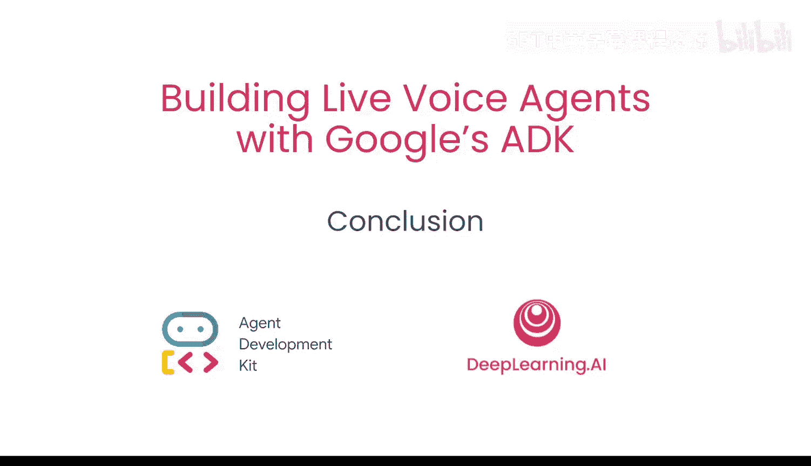

# 009：课程总结

在本节课中，我们将对之前学习的所有内容进行回顾与总结。我们一起从构建一个基础代理开始，逐步发展成一个功能丰富的多代理系统。

祝贺你，你已经完成了本课程。你从一个基础代理开始，最终构建了一个可以与之对话的多代理系统。这个系统能够访问诸如谷歌搜索这样的工具。

在构建过程中，我们创建了回调和微调指令，用于控制和修改代理的行为。

最后，我们看到了不同的代理如何协同工作，以生成文件、脚本和播客。

你可以查看资源部分，以了解更多关于 ADK 和实时代理的信息。

现在，你可以将所学知识应用到任何用例中。我们迫不及待想看到你用这些知识构建出什么。

---

本节课中我们一起学习了从基础代理到复杂多代理系统的完整构建流程，掌握了利用工具、回调机制和指令微调来控制代理行为的方法。希望你能运用这些技能，创造出令人惊叹的应用。