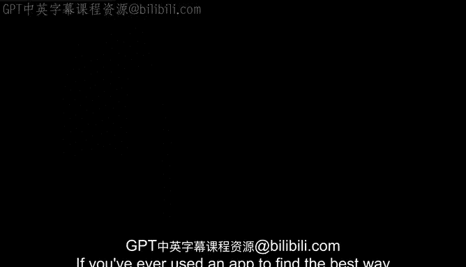
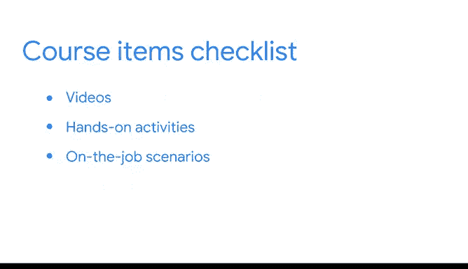

# 001：欢迎来到课程 🎉

在本节课中，我们将要学习数据科学领域的基本概念、数据专业人员的角色，以及本证书课程的结构与目标。课程将帮助你理解数据分析在日常生活中的应用，并为你进入这个高需求、高回报的领域打下坚实基础。

---

如果你曾使用应用程序寻找最佳交通路线，或在网上购物时收到产品推荐，那么你已从消费者端熟悉了数据分析。据估计，平均每人每秒至少产生 **1.7 MB** 的数据。这大致相当于全球每天产生超过 **2.5 × 10^18 MB** 的数据。因此，无论是现在还是可预见的未来，市场对能够组织数据并解读其中信息的人才需求巨大。

当你踏上这条职业道路时，你可能已具备解决问题、决策、资源分配、时间管理等实践经验，这些技能尤其适合数据专业人员的工作。许多公司正在寻找候选人，以填补这个快速成长且高薪领域的职位。

---

## 认识你的讲师 👩‍🏫

我叫 Cassie，在“数据科学”这个名称出现之前，我就已是一名数据科学家。我在 Google 负责决策智能，并将担任本证书项目第一门课程的讲师。在成为 Google Cloud 的首席决策科学家之前，我在 Google 研究部门担任数据科学家，参与了 Google 内超过 400 个项目。数据科学职业最吸引我的一点是其巨大的多样性，尤其适合像我这样天生好奇的人。项目与挑战的种类繁多，有人选择多年深耕一个项目，也有人每周参与数个新项目，可能性是无限的。

---

## 什么是数据专业人员？🔍

“数据专业人员”是一个统称，指任何处理数据和/或具备数据技能的个人。至少，一名数据专业人员能够**探索、清洗、选择、分析和可视化数据**。他们通常也能熟练编写代码，并对统计学家和机器学习工程师使用的技术有所了解，包括**构建模型**和**发展算法思维**。

---

## 机器学习与数据分析 🤖

机器学习是实现自动化的另一种方法，它通过使用数据而非明确的指令来表达完成任务的方式。机器学习是现代数据专业人员工具包中的重要组成部分。

要训练一个机器学习模型，专家会将大量潜在的数据输入通过算法，调整设置并不断迭代，直到产生有希望的结果。但训练模型只是专业机器学习旅程中的一小步。机器学习技术也可用于数据分析和探索，且步骤少得多，而这正是你将在本课程中学到的内容。

你将在课程资源中发现更多探索机器学习的机会，请务必查看。数据专业人员的工作跨越广泛的行业，影响着众多的产品和服务。正如我们稍后将讨论的，专注于数据专业工作的角色和头衔也有很多。可以将他们视为数据侦探，分析并解读他们的发现，以揭示其中的故事。

---

## 关于本证书课程 📚

Google 职业证书由 Google 内拥有数十年经验的行业专家设计。在本项目中，每门课程都将由一位不同的 Google 专家指导你。我们将通过视频分享知识，通过实践活动帮助你练习，并指导你应对工作中可能遇到的情景。

本证书旨在让你在 **3 到 6 个月** 内（如果兼职学习）为一份工作做好准备。因此，这个项目非常灵活，你可以按照自己的条件和节奏完成所有课程。

在整个项目中，我们将为你提供资源，帮助你在数据专业领域推进职业生涯。随着学习的深入，你还将建立一个作品集项目库和一个综合性的毕业设计项目，以展示你简历之外的能力。你还将拥有一个由同侪学习者组成的支持网络，他们与你一同学习此证书。

本课程旨在通过构建你目前已掌握的知识和技能来为你提供实践经验。无论你开始学习时对数据和分析的经验如何，你都将学到对开始或推进职业生涯相关且有益的不同经验。

---

## 技能发展与职业支持 🚀

除了构建你的技能组合，我们还将研究数据专业团队在工作场所如何协作和做出贡献。到本课程结束时，你将准备好追求数据职业领域的职位。

通过完成像这样的 Google 职业证书，你将培养在这个不断扩展的职业领域工作所需的技能和知识。毕业后，你可以与数百家有意招聘 Google 职业证书毕业生的雇主建立联系。无论你是想转行、提升技能还是创业，Google 职业证书都能帮助你迈出下一步。

在这第一门课程中，我将在这里帮助你获得在该领域取得成功所需的基础知识。再次表示，很高兴你来到这里。我对你迈出职业生涯的下一步感到兴奋。我们下个视频再见。

---

本节课中，我们一起学习了数据科学的重要性、数据专业人员的定义与技能要求，以及机器学习在数据分析中的应用。我们还了解了 Google 高级数据分析证书课程的结构、灵活性和职业支持。接下来，我们将深入探索数据科学的具体工具和方法。