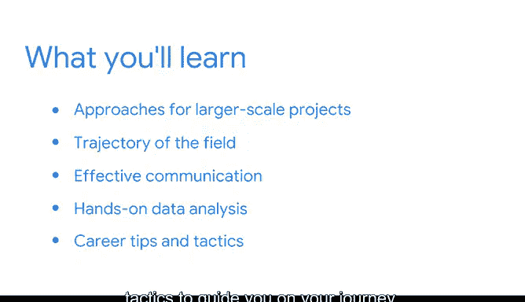

# 002：《数据科学基础》课程简介 📘

在本节课中，我们将概述《数据科学基础》这门课程的核心内容与学习目标。你将了解课程的整体结构、涵盖的关键主题，以及如何通过本课程为成为一名数据专业人士做好准备。

---

## 课程概览 🗺️

上一节我们介绍了整个项目的大致情况，本节中我们将更具体地探讨这门课程的内容安排。

我们将从基础开始，简要介绍数据领域提供的背景。即使你已经对数据领域的工作有所了解，我们也将深入探讨一些历史背景，展示这个领域的发展历程、现状以及未来方向。这些关键的发展和实际应用将充分展示本课程为你准备的众多机会。

---

## 核心技能与职业素养 🛠️

在本课程中，我们将讨论组织在未来员工身上寻找的具体技能和特质。你将培养作为数据专业人士所需的核心技能，并将这些技能与你已有的能力相结合。

我们将特别关注技术能力和职场期望。同时，在学习过程中将提供大量实践机会。

以下是本课程将重点培养的几个方面：
*   **技术技能**：掌握数据分析的基础工具和方法。
*   **职场软技能**：了解团队协作与职业沟通的期望。
*   **实践应用**：通过练习巩固所学知识。

---

## 职业机会与行业探索 💼

接下来，我们将探索你的就业市场机会。你将了解与你的技能相匹配的各种职位和角色。

你还将探究支撑数据职业领域所有角色的责任与道德规范。随着越来越多的行业转向数据专业，你一定能找到符合自己兴趣的职位。

我们也将探索其中一些行业，以便你了解数据专业人士的就业领域，从而做出更明智的决策。

---

## 团队协作与未来展望 🤝

然后，我们将研究大型组织如何组建数据专业团队来应对大规模项目。我们也将窥探数据职业的未来以及该领域的总体发展趋势，以便你在完成本课程后对未来有清晰的认知。

我们还将研究有效沟通的要素，并发现它如何能赋能你成为一名数据专业人士。在整个课程乃至整个项目中，你将看到有效沟通如何在数据分析过程中提升生产力并促进共识。

---

## 实践项目与职业指导 🚀

随着学习的深入，你将通过作品集项目获得实际的数据分析经验，本课程中的第一个项目即是起点。我们设计了几个不同的选项，让你能将数据技能应用到由行业合作伙伴提供数据的实际场景中。

你可以利用这些项目向未来的雇主展示你的技能。

最后，我们的讲师将提供一些职业建议和策略，指导你的职业发展之路。

以上是对本课程后续内容的简要预览。

---

## 总结 📝

本节课中，我们一起学习了《数据科学基础》课程的核心框架。我们概述了将从数据领域背景、核心技能、职业机会、行业现状、团队协作、未来趋势以及实践沟通等多个维度展开学习。本课程旨在为你打下坚实的数据科学基础，并通过实践项目帮助你为进入数据职业领域做好充分准备。

接下来，你将有机会查阅一些学习资源，这些资源将帮助你从本项目中获得最大收益。

我们下个视频再见。