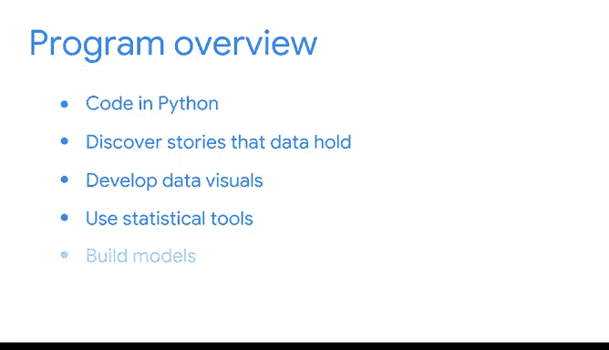

# 004：《数据科学基础》 🎯

在本课程中，我们将学习数据科学的核心基础，包括Python编程、数据探索、可视化、统计分析、模型构建以及机器学习入门。课程旨在帮助你构建一个充实的数据项目作品集，为你的职业发展铺平道路。

---

## 欢迎来到模块1 👋

上一节我们介绍了课程的整体框架，本节中我们将详细了解你在学习旅程中会遇到的具体内容。

在这个项目中，你将使用Python进行编程，探索数据背后的故事，开发数据可视化图表，运用统计工具，构建模型，并初步接触机器学习。

---

## 课程内容与项目产出 📈

以下是你在本课程中将参与的主要活动：

*   使用Python编写代码。
*   讨论数据蕴含的故事。
*   开发数据可视化图表。
*   运用统计工具。
*   构建数据模型。
*   初步涉足机器学习。

在此过程中，除了完成本项目的顶点课程外，你还将构建一个充满数据项目的作品集。无论你是希望转行、开启新职业生涯、提升技能，还是在公司现有岗位上寻求晋升，谷歌职业证书课程都能在你迈向新机遇的道路上提供指引。

---

## 认识你的讲师团队 🧑‍🏫

我们汇集了优秀的讲师团队来支持你的学习旅程，现在请他们做一下自我介绍。

> 大家好，我是Adrian，谷歌的客户工程师。我们将一起探索发展最快的编程语言之一——Python。你将学习基础知识，这将帮助你编写脚本，对数据集执行一系列关键的数学运算，所有这些都旨在帮助你解锁数据中的故事。

> 大家好，我是Rob，谷歌的消费产品负责人。我在这里从事市场营销项目。我很高兴能与大家探讨如何用数据讲故事。我们将讨论探索性数据分析的六个实践，以及如何识别其中的趋势和模式。我们还将学习使用Python和Tableau设计和呈现数据可视化的重要性，这能帮助你理解数据并将其传达给他人。

> 大家好，我是Evan，一名经济学家，为谷歌内部的各个团队提供咨询。统计学帮助你从数据本身产生更复杂的想法。在我们共处的时间里，你将发现如何生成见解、得出结论、进行推断、创建估计并做出预测。

> 大家好，我是Tiffany，谷歌的营销科学主管，在这里处理营销数据。我将指导你完成变量间关系的建模过程。我们将一起探索不同的回归模型和假设检验。我们还将讨论模型假设、构建、评估和解释，以此作为回答数据驱动问题的手段。

> 大家好，我是Saila，一名数据科学家，在谷歌为YouTube项目工作。我将指导你构建能够学习和适应、而无需特定指令的系统。在你构建自己的模型时，我们将讨论机器学习如何改变数据分析的过程。

> 大家好，我是Tiffany，我在谷歌领导一个专注于负责任地构建人工智能的团队。我将向你介绍职业资源和作品集项目，并指导你完成项目结束时的顶点课程。我将协助你了解不同的机会和工具，为你在就业市场上取得成功做好准备。

当然，你们已经知道，我将引导你们完成第一门课程。现在是作为数据专业人士成长和推进职业生涯的大好时机。通往充满新机遇的职业道路正在等待着你。

---

本节课中，我们一起了解了谷歌《数据科学基础》课程的核心内容、学习产出以及强大的讲师团队。从Python编程到机器学习，课程为你提供了全面的技能培养路径，并旨在通过实践项目帮助你构建职业作品集。准备好开始你的数据科学之旅了吗？