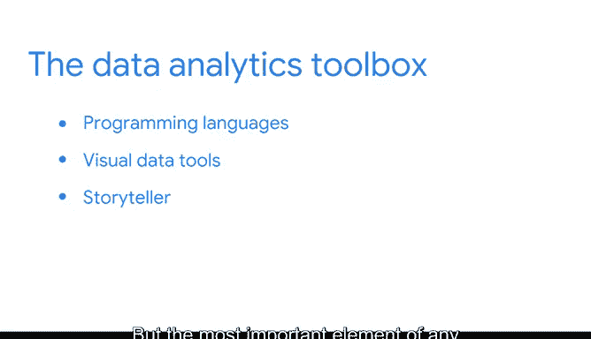

# 005：探索你的数据工具箱 🧰

在本节课中，我们将要学习数据科学工作中最常用的一些核心工具。这些工具各自有其独特用途，但当它们协同工作时，便能帮助我们构建并讲述数据背后的故事，从而影响和指导商业决策。

## 编程语言：与数据对话的基础 💻

上一节我们介绍了数据科学的重要性，本节中我们来看看数据专业人士如何与数据“对话”。编程语言是数据分析师高效处理和分析大型数据集的基础工具。随着时间发展，出现了多种语言，每位专业人士都有自己的偏好。本视频将重点介绍两种在数据分析领域非常流行的语言：R 和 Python。

### R 语言：统计学家的思维

R 是一种被研究人员和学者广泛使用的编程语言。它最初是作者在统计学研究生阶段使用的主要语言。有人认为 R 语言体现了统计学家的思维方式。这种观点有一定道理。如果你希望实现最新的统计突破，R 是一个绝佳的选择。但它的用途不仅限于统计，你会发现许多新技术和想法都用它来编程。

R 语言最出色的特性之一是，你只需几行代码就能创建复杂的统计模型。如果你对 R 语言感到好奇或需要复习，请务必查看我们同样在本平台提供的 Google 数据分析师认证课程。

### Python 语言：灵活性与可读性

本课程将教授 Python 编程语言。选择它有几个重要原因。首先，它强调代码的可读性，使其成为最容易学习和编写的编程语言之一。其次，与 R 不同，Python 并非诞生于数据社区。这听起来可能是个缺点，但在现代世界中，数据正以越来越有创意的方式被使用。因此，学习一种不仅能处理数据，还能用于构建和部署由数据驱动的应用程序的编程语言，具有巨大的优势。

尽管作者最初接触的是 R 语言，但如今更倾向于使用 Python，因为它具有灵活性。Python 可以执行各种与数据相关的任务，这使其在数据专业人士中非常受欢迎。如果你是完全的编程新手，Python 是一门非常容易上手的语言。它的格式在视觉上清晰简洁，是最适合初学者的语言之一，并且拥有庞大的在线社区和丰富的资源，可以在你遇到困难时提供帮助。

我们将在一个基于网页的计算平台（也称为 Jupyter Notebook）中使用 Python。该平台允许你实时运行代码，并有助于轻松识别错误。

## 可视化工具：让数据故事跃然纸上 📊

为了可视化数据中的故事，我们将教你如何通过图形界面分享复杂的数据。那些学习过我们数据分析课程的人会熟悉一个名为 Tableau 的平台。在本课程中，我们将更详细地了解这个强大的工具如何帮助他人理解你的分析结果。

以下是 Tableau 的核心优势：
*   **直观的图形界面**：通过拖拽操作即可创建图表。
*   **强大的交互功能**：允许用户探索数据的不同维度。
*   **丰富的图表类型**：满足各种数据展示需求。

## 沟通技巧：连接数据与决策的桥梁 🗣️

此外，我们还将探讨数据驱动职业中的有效沟通。乍看之下，沟通似乎不那么重要。但向非技术背景的利益相关者描述有时复杂的数据分析过程，可能是数据专业人士拥有的最重要技能之一。因为沟通是我们日常都在做的事情，我们很容易忘记数据专业人士如何分享和处理数据故事的重要性。我们的目标是强化你已经具备的沟通技能，让你在完成本课程后能够脱颖而出。

在本课程以及本项目的其他部分中，沟通将是一个关键组成部分，直接关系到你作为数据专业人士将要开展的工作。

## 总结与展望 ✨

本节课中我们一起学习了数据科学家的核心工具箱。编程语言（如 R 和 Python）让数据专业人士能够与数据交互并解读数据。像 Tableau 这样的可视化数据工具，通过吸引人们关注特定细节的视觉元素，丰富了数据中的故事。但任何故事中最重要的元素是讲故事的人，那就是你。

你之前的经验和知识构成了你的叙事能力，你独特的背景将使你在这些角色中脱颖而出。无论你最终选择哪条职业道路，保持决心并培养正确的技能，对于个人和职业转型都至关重要。我们在这个项目中为你提供的工具也将一路助你一臂之力。很高兴能继续陪伴你踏上这段旅程。最好的还在后面，我们下次见。