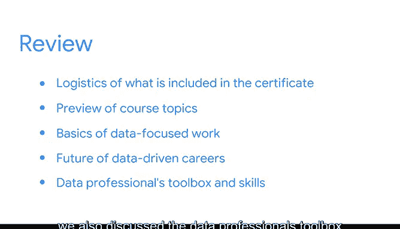

# 006：《数据科学基础》课程总结（第一部分）🎉

在本节课中，我们将对《数据科学基础》课程的第一部分内容进行回顾与总结。我们将梳理已学到的关键概念，并为你接下来的学习旅程做好准备。

---

首先，我们回顾了本证书课程的基本框架与构成。你认识了课程中的每一位讲师，并预览了后续课程中将涉及的不同主题。

接下来，我们探讨了以数据为核心工作的基础知识，以及正在融合数据洞察的各类行业。我们也讨论了数据驱动型职业的未来前景。

除了探索数据领域的工作实况，我们还讨论了数据专业人士的“工具箱”，以及本课程将帮助你培养的各项技能。

以下是我们在第一部分中涵盖的核心内容要点：

*   **课程概览与讲师介绍**：明确了课程结构并认识了教学团队。
*   **数据工作基础与行业应用**：了解了数据工作的基本形态及其在不同行业的价值。
*   **数据职业的未来**：展望了数据驱动型职业的发展趋势。
*   **数据专业工具箱与技能**：认识了数据分析所需的工具集和关键技能组合。

---

恭喜你完成了本课程第一部分的學習！这标志着你已正式开启了在数据领域探索新机遇的旅程。

我们期待在下一个视频中与你再次相见！🚀