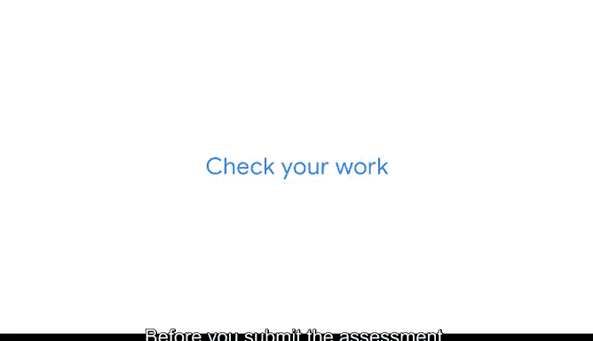

# 008：准备首次评估 📝

在本节课中，我们将学习如何为课程中的首次分级评估做好准备。评估是验证学习成果、建立信心并发现改进领域的重要环节。

---

## 评估的目的与重要性

正如你所知，本课程要求你在每个章节和课程结束时完成一次分级评估。现在是时候为你的第一次评估做准备了。

本次评估将有效验证你对关键数据分析概念的理解。它也将帮助你建立对数据分析理解的信心，同时识别出你可以继续改进的领域。

---

## 应对评估的策略

评估有时会让人感到压力，但采用策略应对可以使它们更易于管理。以下是帮助你成功的一系列建议。

在参加评估之前，请回顾你的笔记、视频、阅读材料以及最新的术语表，以在评估期间重温相关内容。

---

### 评估过程中的实用技巧

以下是评估过程中可以遵循的具体步骤：

1.  **从容应对**：在填写任何答案之前，先通览整个测试。
2.  **先易后难**：先回答简单的问题，标记那些你无法立即得出答案的问题。
3.  **排除错误选项**：对于选择题，首先专注于排除错误答案。
4.  **仔细审题**：建议将每个问题阅读两遍。第一次阅读时可能会遗漏一些线索。
5.  **管理焦虑**：如果你开始感到焦虑，可以通过一些思维练习来让自己平静下来。例如，在脑海中完成一道简单的数学题，或者倒着拼写你的名字。这也有助于你更容易地回忆信息。
6.  **检查与自信**：在提交评估之前，检查你的答案，但要保持自信。有时人们会因为感觉不对而更改答案，但最初的直觉往往是最好的。
7.  **相信自己**：请记住要相信自己。通常，人们所掌握的知识比他们自己认为的要多。

---

## 保持学习动力

每个人的学习速度和方式都不同。但保持学习动力非常重要。因此，请花上你需要的时间。当你感觉准备好了，就继续前进。

---

本节课中，我们一起学习了为首次评估做准备的策略和实用技巧，包括复习方法、答题策略以及心态调整。记住，评估是学习过程的一部分，旨在帮助你巩固知识并指明方向。你已经做好了准备，继续前进吧！