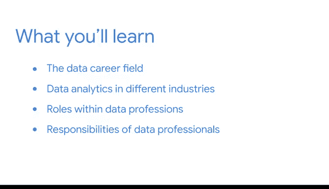

# 009：模块2导论 🚀

在本节课中，我们将开启《数据科学基础》课程的第二模块。我们将探索数据领域的职业路径，了解数据在不同行业中的应用，并初步认识数据专业中的不同角色及其职责。

---

很高兴你再次加入学习。我很荣幸能作为你的向导，陪伴你继续迈向数据专业人员的道路。

正如你已经发现的，数据可以以多种方式被使用，但无论其应用方式如何，需要牢记的核心要点是：**知识就是力量**。这种力量能够改善你的业务、工作、个人生活以及你周围的世界。我们被海量数据所包围，其中蕴含着等待被发掘的巨大潜力。

你选择深入学习并成为其中的一员，这非常棒。

说到你的学习旅程，在本课程的这个部分，我们将首先深入了解数据领域的职业。我们将探索不同的行业，并审视数据驱动工作的一些直接应用案例。

我们将探究数据专业中的一些具体角色，并更仔细地了解你会遇到的通用职业类别。我们还将审视不同数据专业人员的职责。

期待你开始这段探索。让我们出发吧。

---

## 本节总结

本节课中，我们一起开启了模块二的学习之旅。我们明确了本模块的核心目标是探索数据科学领域的职业全景，包括不同行业的数据应用、各类数据专业角色及其职责。这为我们后续深入具体职业路径奠定了坚实的基础。