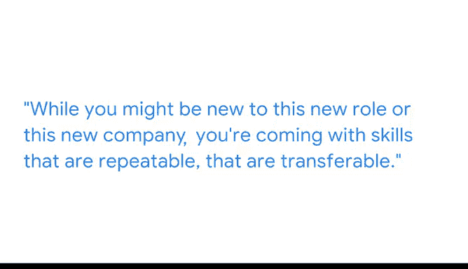

# 010：打造数据驱动的业务解决方案 🚀

在本节课中，我们将跟随谷歌客户工程师Adrian，学习如何将技术能力与商业需求结合，打造一个实际的数据驱动解决方案。我们将重点了解一个整合医疗数据的项目，并探讨其中可迁移的核心技能。

---

大家好，我是Adrian，是谷歌的一名客户工程师。

谷歌的客户工程师角色，是连接美国企业技术层面与商业层面的桥梁。我们的职责是帮助客户利用谷歌的技术来满足他们的商业需求。

我曾参与过最激动人心且有趣的项目之一，是创建一个统一的患者记录系统。这个项目是为一家实验室诊断公司开展的，该公司真正致力于构建患者的360度全景视图。

## 从分散到统一：项目核心目标

上一节我们了解了项目的背景，本节中我们来看看该项目的具体目标。我们的项目专注于整合不同系统中的信息。

你可以想象一下，将你最近常规血液检查的实验室诊断数据，或者更具体的检测（如糖尿病或狼疮测试）数据，连同你提供的所有生物信息数据，集中并标准化到一个环境中。

这样，无论是你的医生、放射科医师还是营养师查看数据，他们都能获得你所有数据的完整视图。他们不仅能访问数据，还能实时地进行可视化。

## 关键技术：虚拟现实可视化

在实现了数据整合之后，可视化成为关键。本项目的一个关键组成部分是使用虚拟现实头显作为主要的可视化组件。

这对我来说意味着，我有机会进行一些游戏设计，创建人体皮肤模型，并使用不同的颜色和编程功能来指示状态。例如，系统可以显示身体系统是否健康，或者是否需要关注或干预。

我们可以随时间观察诊断测试结果如何变化，以及这对患者产生的影响。

## 项目成果与价值

最终，我们完成了一个能统一患者所有数据的项目，并为关键的医疗专业人员提供了一种可视化数据的方式。

## 给初学者的核心建议：自信与技能迁移

在学习了具体的项目案例后，我们来看看能从中学到的通用经验。我给大家最好的建议是：保持自信。

你可能对这个新角色或新公司还不熟悉，但你带来的技能是可重复、可迁移的。

以下是你可以迁移的核心技能领域：

*   **问题解决方法**：你处理和解决问题的方式。
*   **关系构建能力**：你与利益相关者建立融洽关系的能力，以及确保能构建这些关系的软技能。
*   **沟通技巧**：甚至在沟通和撰写简洁明了的电子邮件方面。

总会有一些方法，让你能将过去的经验应用到新角色中。你可能需要跳出框框思考，但你一定能做到。

---

本节课中，我们一起学习了如何通过一个真实的医疗数据项目，理解数据驱动解决方案的构建过程。我们从项目目标、技术实现到最终价值进行了梳理，并重点强调了**自信**和**可迁移技能**（如问题解决、关系构建、沟通）对于数据科学从业者的重要性。记住，你过去的经验是你最宝贵的财富。