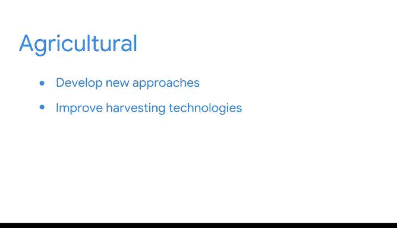

# 011：数据驱动型职业如何推动现代商业 📊

在本节课中，我们将探讨数据专业人员如何通过技术和战略工作推动现代商业，并了解数据科学在不同行业中的具体应用。

数据专业人员对其公司极具价值。他们确定哪些数据流对特定商业项目、挑战和计划最为重要。他们为未来设定关键目标，并通过重新构想流程和改进运营，赋予组织采取有意义行动的能力。

## 技术型数据工作 🔧

上一节我们提到了数据专业人员的价值，本节中我们来看看技术型数据工作的具体内容。这类工作对技术技能有很高要求。

以下是几个技术型数据角色的例子：

*   **机器学习工程师和统计学家**：他们凭借在数学、统计学和计算方面的专业知识，使用如 **`R`** 和 **`Python`** 等工具构建模型并进行预测，帮助团队从业务数据集中提取价值，从而产生直接、积极的解决方案。
*   **专家数据分析师**：他们的工作涉及探索庞大而复杂的数据集，以首先确定值得深入的方向。他们确保组织的数据科学工作尽可能高效地进行，在其他技术型数据专业人员和即将介绍的策略型工作之间架起桥梁。

## 策略型数据工作 🎯

了解了技术型工作后，我们再来看看策略型数据工作。这类人员更侧重于信息的解读和业务战略的对接。

以下是策略型数据角色的例子：

*   **商业智能专业人员和**技术项目经理**：他们运用技能解读影响组织运营、财务、研发等方面的信息。他们的工作与整体业务战略紧密结合，涉及通过数据分析寻求问题解决方案。简而言之，策略型数据专业人员通过最大化信息价值来指导企业运作。

有时，公司会设立一些角色，将专业的技术知识与策略型数据专长以不同寻常且极具创意的方式相结合。接下来，我们将了解这些机会以及更专业的技术和策略角色。

## 数据科学如何变革行业 🌍

前面我们区分了技术和策略工作，现在让我们通过具体例子，看看数据专业人员如何运用他们的专业知识变革金融、医疗保健、制造和农业等行业。

以下是数据科学在四个关键行业中的应用：

1.  **金融**：大数据金融界是数据科学力量的早期采用者。数据专业人员帮助金融机构评估投资风险、监控市场趋势、检测异常以减少欺诈，从而创建一个更稳定的金融体系。其核心公式可概括为：**`数据洞察 -> 风险控制 + 欺诈检测 -> 稳定金融系统`**。
2.  **医疗保健**：数据分析在医疗保健领域也至关重要，其益处甚至可以挽救生命。数据分析帮助医疗机构处理大量临床数据，支持健康状况的早期检测，从而实现更精确的诊断。流程可以表示为：**`临床数据 -> 分析处理 -> 早期检测 -> 精确诊断`**。
3.  **制造业**：数据专业人员预测何时进行预防性维护以避免生产线故障；利用数据最大化质量保证和缺陷跟踪；人工智能模型帮助应对物流问题，减少运输卡车的里程数，推进关键可持续发展目标。在供应链遍布全球的时代，数据实现了与供应商、零售商及其他网络伙伴清晰、近乎实时的沟通。
4.  **农业**：数据专业人员也利用数据洞察推进农业方法。农民们开发了作物生产、牲畜养殖、林业和水产养殖的新方法。自主机械、拖拉机和灌溉系统的引入也正在改进收割技术。

如果你想继续了解不同行业如何使用数据分析，请参考本课程关于此主题的资源。这里有一个小建议：不要错过向现实生活中的人学习的机会。我喜欢询问企业主、商店经理和客户支持专业人员他们每天如何使用数据。谁知道呢，这些对话中的某一次可能会为你打开一扇通往未来机遇的大门。

本节课中，我们一起学习了数据专业人员的两类核心工作——技术型与策略型，并探讨了数据科学在金融、医疗、制造和农业四大行业中的变革性应用。理解这些角色和应用场景，是规划数据驱动职业生涯的重要基础。