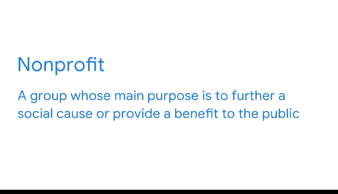
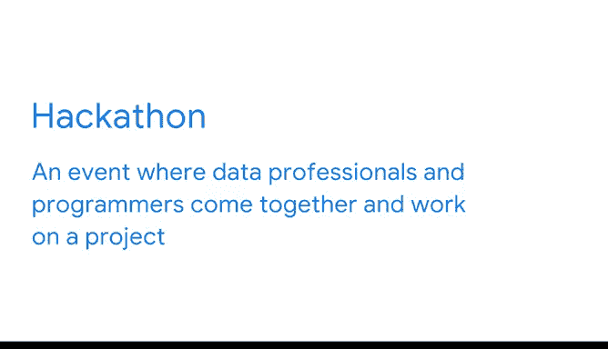

# 012：非营利组织中的数据分析应用 🎯

## 概述

在本节课中，我们将探讨数据分析如何应用于非营利组织，以帮助它们更有效地实现社会使命。我们将了解非营利组织如何利用数据指导决策、识别需求，并介绍数据专业人士通过志愿服务参与社会公益项目的途径。

---

## 非营利组织的目标与数据角色

此前，我们学习了企业如何利用数据指导决策、回答问题和解决问题。本节中，我们来看看非营利组织如何运用数据分析来追求其独特的目标。

非营利组织旨在推动社会事业或为公众谋福利。顾名思义，其主要目的并非盈利，而是促进集体、公共或社会利益。在非营利领域，数据专业人士可以获得非常有价值且鼓舞人心的工作机会。

具体而言，数据可以帮助这些组织更有效地预测和响应最迫切的需求领域。

---

## 数据分析实践案例

例如，假设美国一家为儿童提供自行车的慈善机构希望确定哪些社区最需要帮助。他们可以请其数据专业人士访问美国人口普查局的数据。

该专业人士将运用其技能，在人口普查数据库中导航，识别关键指标，并通过分析和数据可视化来总结发现。

这份报告将突出显示哪些地区有更多需要帮助的学龄儿童，能够从该项目的资源中受益。由此，数据洞察引导了关于该非营利组织可以在何处发挥最大作用的明智决策。

---

## 数据的收集与开放数据

现在，非营利组织不仅使用数据，许多组织也收集数据。正如你可能知道的，公共实体和政府机构可以成为有用数据的绝佳来源，其中大部分是可供普遍使用的开放数据。

开放数据是指可供公众使用的数据。它可以免费使用，并且会提供指南来帮助用户理解数据集并注明来源。

虽然获取开放数据是自行接触数据的好方法，但还有其他机会可以让你在帮助他人的同时精进技能。

---

## 参与公益数据项目

数据志愿者为许多帮助全球各地社区的非营利项目做出了贡献。想了解更多，以下是一些值得关注的机构：

首先，数据科学促进社会公益基金会于2013年在芝加哥大学成立。2020年，他们与联合国儿童基金会合作，分析了全球空气污染的各个方面，以帮助监测儿童健康。

DataKind于2011年在纽约市启动，并在英国、班加罗尔、旧金山、新加坡和华盛顿特区设有分部。该组织分析了不同服务不足社区的清理成本，以指导恢复工作。

你可以通过本视频文稿中的链接查看这两个基金会的最新工作。

---

## 黑客松：技能实践平台

另一个善用你数据技能的途径是黑客松。黑客松是一种活动，数据专业人士和程序员聚集在一起，就特定项目进行协作。

其目标是利用技术为现有问题创建解决方案。一些例子包括：

*   开发更好的工具来预测极端天气事件。
*   创造技术来帮助小学生学习重要的阅读技能。
*   找出社区发展组织可以利用其数据推进住房可及性和可负担性的方法。

将你的数据技能志愿贡献给公共项目，是一种为公益事业做贡献的绝佳方式，同时也能获得经验并与领域内的其他人建立联系。

---

## 总结

本节课中，我们一起学习了数据分析在非营利组织中的关键作用。我们看到了数据如何帮助识别需求、指导资源分配，并探索了数据专业人士通过志愿服务和参与黑客松等方式，将技能应用于社会公益项目的多种途径。接下来，我们将更深入地探讨公共部门中一些以数据为导向的项目，以及它们如何在全球范围内产生影响。