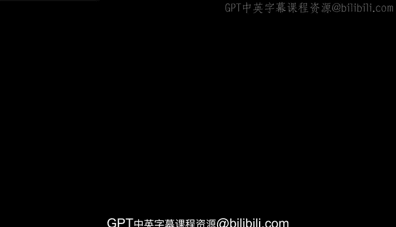

# 013：数据职业所需的核心技能 📊

在本节课中，我们将要学习数据专业人士所需的核心技能。这些技能是跨数据驱动职业的通用能力，结合了技术知识、业务理解与人际交往能力。

所有数据专业人士都共享对数据的热爱和解决问题的渴望。

当戴上分析师的“帽子”时，数据专业人士会勾勒出他们想要讲述的故事，然后从多个角度进行后续调查，以验证其可靠性，再呈现给决策者。在此过程中，他们依靠编程和调查技能来引导他人做出明智的决策。

数据专业人士还将如何完成实际任务的知识与对成功沟通和协作要素的认识相结合。稍后，我们将深入探讨沟通的要素，并讨论沟通如何增强和构建你作为数据专业人士的工作。现在，让我们来审视一些适用于数据驱动职业的技能和特质。

数据分析工作需要业务敏感性与数据收集、处理和分析知识的结合。我们的目标是帮助你培养成功所需的能力。

让我们从讨论一些人际交往技能开始。

以下是人际交往技能的关键点：

*   **定义**：人际交往技能通常被称为“软技能”或“人际技能”，侧重于沟通和建立关系。
*   **重要性**：在这个领域，利益相关者之间的互动程度很高。在团队成员经常在全球范围内协作的当下，这一点尤其重要。
*   **作用**：工作对话通常是项目的起点和驱动力。由于数据分析过程中的循环特性，沟通始终在进行。

另一个重要的技能是积极倾听。

以下是积极倾听的要点：

*   **含义**：这意味着在提供回应之前，允许团队成员、老板和其他协作利益相关者分享他们自己的观点，从而使每次交流都能增进相互理解。
*   **练习**：你可以练习积极倾听。下次与人交谈时，多花些精力去倾听话语之外的含义，专注于他们试图传达的信息。
*   **价值**：你的倾听和沟通技能将在帮助你获取有效见解和做出明智决策方面发挥巨大作用。

我们将在本课程稍后部分更仔细地探讨沟通。

作为数据专业人士，你还需要考虑其他方面。你将通过运用批判性思维技能，在大量数据中寻找隐藏的信息。在此过程中，你将调查各种不同数据源之间的联系，以寻找趋势和指标。把自己想象成一个数据侦探。

项目数据可能直接来自你的组织或其他来源。你可能会幸运地收到一个格式良好的电子表格或数据库，但很多时候，你需要先准备数据才能开始工作。这个过程被称为**数据清洗**。

数据清洗是指对数据进行重新组织和重新格式化，目标是去除任何可能在分析过程中导致错误的内容。

以下是数据清洗过程通常包括的步骤：

1.  **识别问题**：标记重复项、不相关条目、结构错误和空白处。
2.  **整合与修正**：合并重复数据，修正错误格式，填充或处理缺失值。
3.  **过滤**：一旦所有内容都处于正确的格式，就可以过滤掉不需要的材料。

现在，你的数据已准备好进行分析。是时候寻找趋势和倾向了。通常，将数据可视化呈现非常有帮助，可以通过图表、仪表板和报告来揭示额外的见解。

图形工具在识别模式以及与他人共享信息方面将非常有用。你将在后面更详细地探索这一点，并有机会练习编译可视化图表。

你还将学习更高级的技能，例如构建模型和机器学习算法。这些工具将帮助你和其他数据专业人士评估信息准确性、分析特定数据段并预测未来的业务成果。

你的辛勤工作将协助公司内的领导和其他决策者，为他们提供对不同信息集的丰富多样的视角。随着各类公司和企业对数据分析需求的增长，你很可能会在你个人感兴趣的行业中找到机会。

接下来，我们将看看在数据领域工作的具体情况。

---

本节课中，我们一起学习了数据专业人士的核心技能组合。我们了解到，成功的数据工作不仅需要**编程技能**和**数据分析能力**（如`data_cleaning()`和`model_building()`），还高度依赖**人际交往技能**和**积极倾听**。这些技能共同作用，使你能够从原始数据中提取见解，并通过有效的沟通推动基于数据的决策。