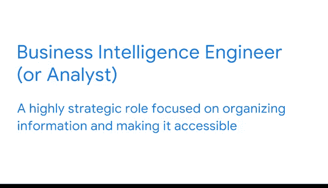

# 015：数据专业人员的职业领域 🧭

在本节课中，我们将通过分析招聘信息来了解数据领域的职业概况。我们将探讨不同职位头衔背后的职责，并介绍数据职业空间中的几个关键角色。

通过查看招聘信息，你可以深入了解一个职业。如果你曾搜索过数据领域的机会，你可能已经注意到，不同的数据相关职位头衔可能对应着相似的职责，或者相同头衔的职位在不同公司可能列出不同的职责。

以下是示例。在一家公司，数据分析师的职责侧重于使用统计和模型来构建见解，为商业决策提供信息。另一家公司的相同头衔职位，则可能侧重于优化自动化分析流程的工具和产品。

这些不一致的原因之一是，数据任务和职责取决于组织的数据团队结构，以及他们如何利用见解和分析。一些组织选择将职责划分得非常具体，而另一些组织则让工作任务的范畴相当宽泛。这就是为什么本课程将这一领域称为“职业空间”。在本视频中，我们将探索数据分析职业空间中的关键角色。

## 核心角色：数据分析师与数据科学家 😊

数据分析师和数据科学家是两个最常见的头衔。它们可以涵盖广泛的职责，其中许多你将在本课程中获得实践经验。

传统上，数据科学家被期望成为数据分析、统计学和机器学习的“三合一”专家。但并非所有雇主在撰写职位描述时都遵循这些惯例。通常，任何包含分析的职位都期望候选人能够作为技术娴熟的社会科学家，在大数据集中寻找模式和识别趋势。

此外，他们在挖掘数据内部故事的过程中，会提出新的探究和问题。他们的辛勤工作有助于引导公司未来的行动和决策制定。他们让组织能够随时掌握业务动态，将关键信息解释并转化为图表等可视化形式，使每个利益相关者都能理解他们的发现。有时，他们可能负责创建计算机代码和模型，以识别数据模式并进行预测。

当你在调查招聘信息时，会遇到其他具有相似职责的头衔。例如，初级数据科学家、入门级数据科学家、助理数据科学家或数据科学助理。所有这些角色都混合了技术和战略技能，以帮助他人做出明智的决策。

尽管如此，在比较具有相似头衔的职位时，我建议你根据其日常活动中使用的技能对它们进行分类。

## 其他相关数据角色 🛠️

在你的职业生涯中，你可能会遇到其他使用数据和分析技能的专业人士。这些角色包括数据工程师、数据科学经理或分析团队经理，以及商业智能工程师或分析师。

数据科学家依赖于公司内部收集、组织和转换原始数据的系统。设计和维护这些流程是数据工程师最重要的职责之一。他们的目标是使数据可访问，以便用于分析。他们还确保公司的数据生态系统健康并产生可靠的结果。这些职位技术性很强，通常处理数据的基础设施，通常涉及整个企业。在谈论数据分析之前，你首先需要有能力获取数据。在数据诞生之前的大部分技术工作，可以恰当地称为数据工程，而数据到达后所做的一切则是数据科学。

与数据工程师监督数据基础设施类似，有些数据角色负责管理公司数据分析项目的所有方面。数据科学经理或分析团队经理通常监督团队或整个组织的分析策略。作为数据分析师，你很可能会向担任此职责的人汇报。他们通常负责管理多组客户和利益相关者，并且通常是数据科学家和决策者之间的混合体。由于这种技能组合很罕见，这些职位通常更难填补。这个角色可能有其他头衔，如分析团队总监、数据主管或数据科学总监。

其他常见的招聘职位包括商业智能工程师或商业分析师。这个角色具有高度的战略性，侧重于组织信息并使其易于访问。商业智能分析师综合数据、构建仪表板并准备报告，以满足业务的特定需求或领导层的请求。

如果你有兴趣了解更多关于商业智能及其机会的信息，我鼓励你了解谷歌的商业智能认证课程。

## 总结 📝

本节课中，我们一起学习了如何通过招聘信息了解数据职业。我们探讨了数据分析师和数据科学家这两个核心角色的职责与技能要求，并介绍了数据工程师、数据科学经理和商业智能分析师等其他相关职位。现在你对数据分析职业空间中的角色有了一些概念，接下来我们将开始更深入地了解数据专业人员如何在更大的组织内发挥作用。