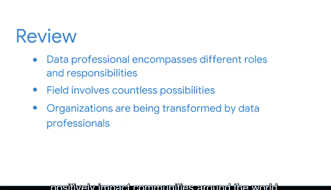

# 016：《数据科学基础》课程总结 🎯

在本节课中，我们将对数据科学职业的多个方面进行回顾与总结。我们将梳理数据专业人员的广泛定义、他们的核心工作内容，以及他们如何利用数据推动组织变革并产生积极的社会影响。

---

## 数据职业的多面性探索 🔍

上一节我们介绍了数据科学的具体应用，本节中我们来看看数据职业的广阔图景。课程探讨了数据职业的许多不同方面。

你了解到，“数据专业人员”是一个广义术语，它涵盖了数据领域内不同的角色和职责。

你发现，我们在这个领域的工作涉及无限的可能性。

以下是数据专业人员可能从事的部分工作内容：
*   确定重要的数据流。
*   识别并聚焦于未来的业务目标。
*   重新构想内部和外部流程。

---

## 数据驱动的变革力量 💡

接下来，我们思考数据专业人员如何推动变革。你还思考了组织如何被数据专业人员所改变，以及这些才华横溢的个人如何运用他们的技能对全球社区产生积极影响。

---

## 总结与展望 🚀

你已经取得了长足的进步，但仍有更多知识等待学习。

感谢你加入这次激动人心的探索之旅，我们很快会再次相见。

本节课中，我们一起学习了数据职业的广泛性、数据工作的核心可能性，以及数据专业人员在驱动组织与社会正向变革中所扮演的关键角色。数据科学的世界广阔而充满机遇，持续学习是探索这一领域的关键。