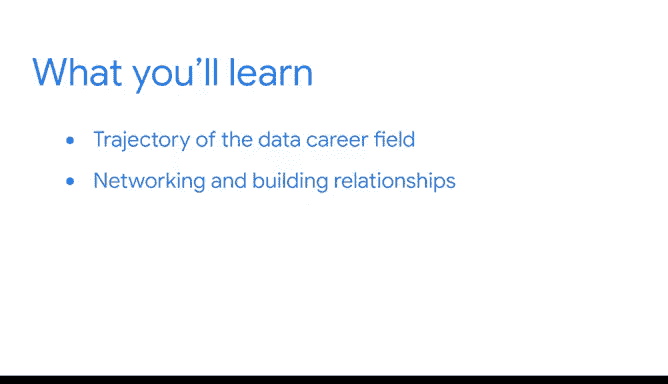

# 017：模块3介绍 🚀

在本节课中，我们将要学习数据科学职业的未来发展方向，以及如何在组织内建立有效的人际网络。

---

欢迎回来。我很高兴与大家分享这一部分内容。

我们将探讨数据职业的未来发展方向，包括一些新颖且令人兴奋的工具。这是一个极具影响力且回报丰厚的领域，并且它正在不断变得更好。

上一节我们介绍了数据科学的基础概念，本节中我们来看看职业发展的具体路径。

---

## 建立组织内的人际网络 🤝

接下来，我们将探讨在组织内部建立人际网络和关系的重要性。

以下是建立有效人际网络的几个关键步骤：

*   主动参与跨部门项目。
*   定期与同事分享你的发现和见解。
*   寻求并给予他人建设性的反馈。
*   参加公司内部的技术分享会或社交活动。

---

那么，让我们开始吧。我们下一个视频再见。

---

本节课中我们一起学习了数据科学领域的未来趋势，以及通过积极 networking 在组织内构建支持性关系的重要性。掌握这些软技能，将为你在这个快速发展的领域中获得长期成功奠定坚实基础。