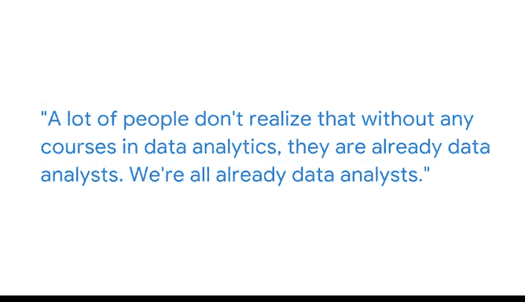

# 018：数据驱动决策的起点 🚀

在本节课中，我们将跟随谷歌云首席决策科学家凯西的分享，了解她如何从童年对数据的单纯热爱，逐步发展为将数据科学与决策科学相结合，以驱动现实世界行动的核心理念。我们将探讨数据的本质价值，并认识到数据分析是每个人与生俱来的能力。

***

凯西是谷歌云的首席决策科学家。

她第一次爱上数据是在八九岁时，当时她发现了微软Excel并为之着迷。这与大多数爬树玩耍的孩子不同，她热衷于在电子表格中处理数据。她有一个宝石收藏，而收藏的增长与其说是为了宝石，不如说是为了能将新数据录入表格。她会因为发现一颗尚未拥有的紫色紫水晶而感到兴奋，因为这意味着她可以在“颜色”列中填入“紫色”。她承认自己是个特别的孩子，但对她而言，数据是世界上最美丽的事物。

随着职业生涯的发展，凯西开始深入思考数据的“为什么”。她曾理所当然地认为数据本身就很美，但必须要有更重要的东西来驱动行动。这个重要的部分就是**决策**。她认为，如果一个数据点在森林中产生，却没有引发任何行动，那么它就毫无意义。只有当数据与**决策**或**现实世界的行动**相关联时，它才变得有价值。

因此，她对决策科学产生了浓厚兴趣，并将其与我们今天称为数据科学（当时主要是统计学，后来也包括大数据）的领域结合起来学习。她记得大学时，有职业顾问曾质疑她选择的专业方向，认为这甚至找不到工作。然而今天，结合决策科学（仔细思考“为什么”）与数据科学（信息部分），人们得以利用信息来驱动更好的行动，这正是她所热衷的事业。

***

许多人没有意识到，即使没有上过任何数据分析课程，他们其实已经是数据分析师了。我们所有人都是数据分析师。例如，你正在电脑或智能手机上观看这门课程。

此刻，摄像机正在将凯西讲话的信息记录并存储为一系列**矩阵**和数字。当你查看这些原始数据时，它们毫无意义。但当你用正确的软件（在这里是你的浏览器）打开它时，你正在从原始数据中**提取意义**，并学习新知识。所以，就在这一秒，你正在进行**数据分析**。

***

处理数据、使其发挥作用的方法多种多样。其中一些方法会比另一些更符合你的个性。只需引导自己走向最有趣的方向，因为在这些职业中有各种各样的人，这总体上是一项团队运动。团队中的其他人会弥补你不太倾向的部分，所以请尽情投入到你能获得最大乐趣的领域。

追求你个人的“数据性格”，关键是让它变得有用。一切美好的事物都会随之而来。

***

在本节课中，我们一起学习了凯西从数据爱好者成长为决策科学家的心路历程。核心在于理解数据的价值在于驱动**决策**与**行动**，并且数据分析是每个人在日常生活中都在实践的能力。找到与个人兴趣契合的数据工作方式，并专注于让数据产生实际效用，是迈向成功的关键。