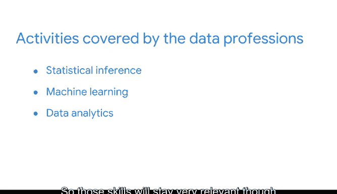

# 019：数据职业的未来展望 📈

在本节课中，我们将探讨数据相关职业的未来前景与增长潜力。我们将分析行业趋势、关键增长领域，并讨论从业者如何为未来做好准备。

---

当考虑一条新的职业道路时，最重要的考量因素之一是其前景和增长潜力。对数据分析相关职业的预测表明，市场对该领域的专业人才需求将持续旺盛。

过去十年，数据相关职业的需求激增。根据LinkedIn的估算，**数据科学领域在2012年至2017年间增长了超过650%**。

许多专家认为，我们尚未看到这些职业的全部潜力。事实上，美国劳工统计局指出，数据科学是美国增长最快的职业领域之一，预计未来十年将增长**30%**。

## 人工智能与机器学习的崛起 🤖

在数据科学众多职业中，增长最快的领域之一是人工智能和机器学习。近年来，我们在这些领域见证了显著进步。

人工智能（AI）的核心是开发能够执行通常需要人类智能才能完成任务的计算机系统。得益于数据科学的发展，AI正变得越来越普及。这些技术将持续进化，提供更准确的结果和更丰富的洞察。

随着AI日益成为数据工作中不可或缺的组成部分，我们必须意识到工作中可能存在的**人为偏见**。为了应对这一点，组织通过组建来自不同背景和生活经历的专业人士组成的多元化团队，能够最大程度地受益。融合广泛的视角和世界观，能促进更广泛的代表性，并产生更准确的结果。

## 专业化的趋势与持续学习 📚

在探讨数据职业的未来时，我想强调，数据专业人员尚未完全实现人工智能的全部潜力。随着这类技术创新不断演进，我们可以预见组织将相应地发展和调整其商业实践。

随着数据分析技术被更广泛地采用，最可能的增长领域在于**专业化**。我们预期在以数据为中心的团队内部，角色将进一步细分。

归根结底，我希望你记住这一点：世界每年都在产生越来越多的数据。因此，我们有理由预期，那些能从数据中提取商业价值的劳动将能持续创造价值。

**更多数据意味着对数据职业涵盖的三项主要活动有更多需求：统计推断、机器学习和数据分析。** 因此，这些技能将始终保持高度相关性，尽管它们的名称可能会随时间演变。

此外，该领域的持续创新为你提供了**终身学习、成长和发展**的机会。正如你可能已经知道的，成为一名数据专业人士意味着你在这个领域的成长和成功取决于持续学习的意愿。事实上，这可能正是你参加本课程的原因。为此，我为你感到骄傲。

在你的整个职业生涯中，请继续探索发展的机会，主动获取新技能，不断成长。这样，你将始终为未来做好准备。

---

**本节课总结**：我们一起探讨了数据职业光明的未来前景，特别是人工智能和机器学习领域的快速增长。我们认识到，应对技术发展的关键在于保持持续学习的心态、主动获取新技能，并关注专业化趋势。随着数据量的持续爆炸式增长，掌握核心数据分析技能的专业人士将拥有广阔的发展空间。