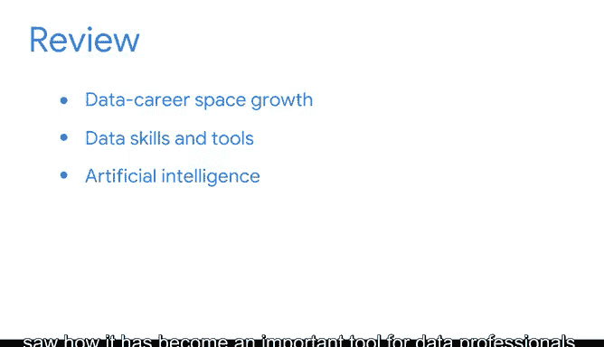

# 020：总结与展望 🎯

在本节课中，我们将回顾本部分内容的核心要点，并对后续学习方向进行展望。我们将总结数据科学领域的发展趋势、关键技能以及人工智能在其中的作用，为接下来的学习做好准备。

---

## 回顾关键概念 📚

上一节我们探讨了数据科学领域的多个方面，本节中我们来总结几个核心要点。

随着本部分内容接近尾声，我们花一些时间来回顾几个关键概念，然后再继续前进。

我们看到，数据职业领域在过去十年中经历了惊人的增长。

未来的预测表明，这种增长将持续下去。

你还发现，数据技能和工具正变得越来越普及。与此同时，专家们预见在不同领域内，角色将继续向专业化发展。

我们认识了人工智能，并看到了它如何成为数据专业人员的重要工具。

在我们反思目前所涵盖的信息时，请记住，你并非独自一人迈出个人和职业成长的这些步伐。😊

---

## 展望后续内容 🔮

以下是后续课程将要深入探讨的两个主要方向。

接下来，我们将更仔细地审视数据专业人员所需的技能。

并且，我们将研究大型组织如何整合数据分析。

我期待与你一同继续这段旅程。我们下一个视频再见。😊

---

## 总结 📝

本节课中我们一起学习了数据科学领域的增长趋势、技能的普及化与角色的专业化，以及人工智能作为关键工具的重要性。我们为进入下一阶段——深入探索数据专业人员的具体技能和组织层面的数据分析应用——做好了准备。