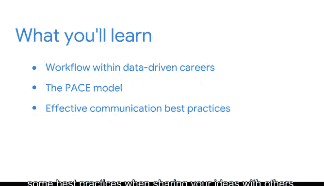

# 021：欢迎来到模块4 🚀

在本节课中，我们将学习数据驱动型职业中的工作流程，并介绍一个名为“Pa模型”的组织工具。我们还将探讨有效沟通的要素，以及与他人分享想法时的最佳实践。这些技能和工具将帮助你为即将到来的作品集项目做好准备。

---

我们通过介绍数据科学的基础知识、探索相关职业以及讨论成功所需的技能，开启了数据专业世界之旅。

上一节我们介绍了数据科学的基础，本节中我们来看看数据驱动型职业内部的工作流程。

你将认识一个名为 **Pa模型** 的有用组织工具。该工具能在处理项目时提供结构框架，同时保持高度的灵活性。

以下是Pa模型的核心优势：
*   提供清晰的项目结构。
*   允许根据项目需求灵活调整。
*   帮助团队保持目标一致。

---

接下来，我们将探讨有效沟通的要素以及分享想法时的最佳实践。

在数据领域，清晰传达你的发现与执行分析本身同样重要。有效的沟通能确保你的见解被理解并产生影响力。

以下是有效沟通的一些关键实践：
*   **了解你的受众**：根据听众的背景调整沟通内容和方式。
*   **结构清晰**：确保信息有逻辑地组织，例如使用“问题-分析-解决方案”的结构。
*   **可视化辅助**：善用图表（如使用 `matplotlib` 或 `seaborn` 库生成的图表）来直观展示数据。
*   **简洁明了**：避免不必要的技术行话，直击要点。

---

本节课中我们一起学习了数据驱动项目的工作流程，认识了**Pa模型**这一组织工具，并探讨了有效沟通的核心要素与实践方法。掌握这些技能将为你后续的作品集项目和职业发展奠定坚实基础。