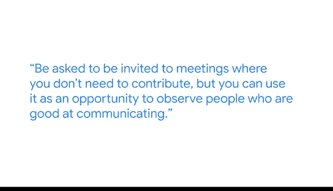

# 022：沟通在数据科学职业中的重要性 🗣️💡

在本节课中，我们将学习数据科学家Hautahi分享的观点，探讨为何沟通技巧与专业技术知识同等重要，并了解提升沟通能力的具体方法。

---

## 概述

成功的职业生涯不能仅依赖技术知识。如果只注重技术而忽视有效沟通，可能会导致同事和利益相关者之间的误解与挫败感。因此，培养沟通能力对于数据科学家至关重要。

## 跨团队协作中的沟通

上一节我们概述了沟通的重要性，本节中我们来看看它在实际工作场景中的应用。

我的团队主要在YouTube的不同产品线之间工作。这要求我们能够用团队B更熟悉的语言和思维方式，重新阐述与团队A合作的内容。关键在于理解他们思考产品方式的差异。

## 沟通在工作中的普遍性

无论在一个共享技术知识的小团队内部，还是向更广泛的利益相关者传达信息，你的大部分工作都依赖于良好的沟通。

## 如何在面试中展现沟通能力

以下是展示有效沟通技巧的方法。

在面试中展现沟通技巧的一个好方法是谈论具体的例子。这些例子可以来自以前的工作或个人生活经历。它们能有力地说明你仔细思考过问题。

*   这些例子不一定需要与数据分析相关。
*   它们可以是你生活中任何先前的经验。

事实上，我个人很看重数据科学同事们背景的多样性。

## 个人背景与沟通技能

从个人角度而言，我认为我的背景一点也不传统。我是美国移民，在新西兰乡村的部落土地上长大。我是毛利人，新西兰原住民，大约到七八岁之前只讲毛利语。

我认为我的毛利背景有助于我的沟通技巧，因为毛利文化非常重视口头交流。我也认为，那些与数据分析完全无关的先前工作经历同样有帮助。

*   例如，大学期间我在酒店工作，需要与来自各种背景的人交流，这本身就是学习沟通技巧的过程。

## 提升职场沟通技能的建议

对于在职场技能和沟通方面有些困难的人，我的建议如下。

*   **请求旁听会议**：主动请求参加那些你不需要发言的会议，将其作为观察善于沟通者的机会。
*   **寻找导师**：邀请你钦佩其沟通技巧的人担任你的导师，并向他们学习这些技能。
*   **广泛观察**：不仅要观察工作场所中善于沟通的人，也可以观察个人生活中的其他场合。

---

## 总结

本节课中我们一起学习了沟通在数据科学职业中的核心作用。我们了解到，有效的沟通是跨团队协作、工作推进和职业发展的关键。技术知识必须通过清晰的沟通才能转化为实际影响。通过观察学习、寻找导师和积累多样化经验，我们可以持续提升这项至关重要的软技能。