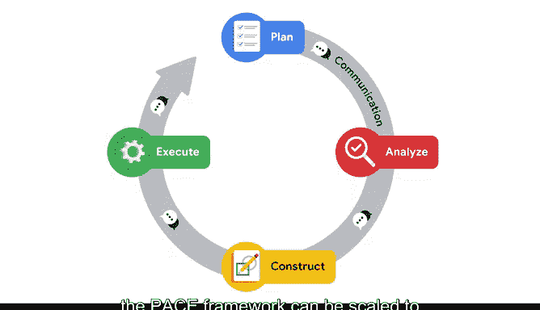

# 023：PACE框架简介 🧭


在本节课中，我们将学习一个名为PACE的项目管理框架。这个框架旨在帮助数据专业人员高效、有序地规划和执行数据分析项目，确保工作始终指向正确的方向。

---

任何项目中最重要的部分都是准备。这涉及到通盘考虑所有必要的步骤和预期的任务。

设想你正在计划一场晚宴。你会从规划主题、菜单、宾客名单以及其他细节开始。接着，你可能会核对预订清单、考虑饮食限制，或者去杂货店购买食材。之后，你会回家准备菜肴、打扫空间、布置餐桌并做好准备。

因为你事先做了如此充分的准备，这个夜晚将会非常美妙。虽然这个场景可能是虚构的，但它为数据专业人员提供了一些明智的建议：能够可视化数据、预测结果并迅速避开障碍，将使你成为一名问题解决者，并成为任何组织的宝贵资产。

本杰明·富兰克林曾说过：“未做准备，就是在准备失败。”近三个世纪后，这句话依然适用，无论是简单的晚宴还是复杂的深空任务。无论项目如何，拥有一个结构化的框架来完成工作都大有裨益。

在我从事数据科学咨询的岁月里，最常见的问题之一是团队来找我，以为他们需要关于使用哪种工具或方程的建议，而我们却在会议中发现他们正在解决一个完全错误的问题。如果你的方向错了，全宇宙的数学知识都帮不了你。但人们很容易对那些细枝末节感到兴奋，并一头扎进去浪费时间。

与我合作过的最优秀的团队都采用了一个框架，帮助他们以最高效的顺序专注于最具影响力的行动。他们有纪律地使用它来保持正轨，而不是迷失在细节中。

---

## PACE框架概述

对于完成过谷歌数据分析证书课程的学员，会记得一个分为六个阶段的数据工作流程结构：提问、准备、处理、分析、分享和行动。这个框架对许多项目非常有用，但对于更大的数据集，通常需要更多的自由度和灵活性。

为此项目设计的PACE框架提供了相同的工作流程和结构，但方式更简洁。PACE是一个在我们的数据专业团队提供意见和反馈后开发的框架。其目的是提供一个初始结构，指导你完成项目。目标是为你奠定一个基础，让你在此基础上发展自己的工作流程实践。PACE框架帮助你快速高效地解决问题并做出判断。

PACE是一个首字母缩写词，每个字母代表项目中的一个可执行阶段：
*   **P** - 计划
*   **A** - 分析
*   **C** - 构建
*   **E** - 执行

---

## PACE框架详解

上一节我们介绍了PACE框架的四个阶段，本节中我们来详细看看每个阶段的具体任务。

### 计划阶段

在计划阶段，你将定义项目的范围。首先，你需要识别组织的信息需求。在这里，你需要问自己以下问题：
*   项目的目标是什么？
*   需要哪些策略？
*   这个计划将带来哪些业务或运营影响？

清点项目及其所需任务，将帮助你更好地理解工作的背景，并为成功做好准备。

### 分析阶段

在分析阶段，你将与数据打交道。首先，你要为项目准备数据。在这里，你需要从主要和次要来源获取必要的数据，然后进行清洗、重组和转换以供分析。接着，你将进行数据的方法论检查。

你还会进行**探索性数据分析**。
```python
# 探索性数据分析通常涉及数据转换、质量评估和初步洞察发现
import pandas as pd
import seaborn as sns
data = pd.read_csv('your_data.csv')
print(data.describe())  # 评估数据质量
sns.pairplot(data)      # 寻找潜在关系和洞察
```
这包括将数据转换为可用格式、评估数据质量，然后深入数据以寻找尽可能多的潜在有用见解和方向。之后，你将与利益相关者合作，看看哪些领域值得更详细地跟进。

### 构建阶段

分析阶段为我们指明了方向，这引出了构建阶段。在此阶段，你将跟进在探索性数据分析中看起来有趣的所有潜在见解中的一个有限子集。

这时，你将与其他数据专业人员（可能是统计学家和机器学习工程师）合作，执行诸如构建机器学习模型、修订模型、揭示数据内部关系以及对那些关系进行统计推断等任务。

### 执行阶段

最后，在执行阶段，你将与分析结果以及你与利益相关者的协作成果进行分享，同时展示你从数据中解锁的价值。

在这里，你将向内部和外部的利益相关者展示发现，回答问题并考虑不同的观点。你还有机会根据在数据中的发现提出建议。在完善模型和整合反馈的过程中，你可能会发现需要重新审视计划和分阶段。

---

## PACE框架的可视化与迭代

理解PACE框架的一个好方法是将其视为一个完整的电路。四个阶段中的每一个都必须参与其中，电路才能正常运行。PACE电路中的电流或能量流，就是你、你的团队以及所有其他相关利益相关者和协作者之间的**沟通**。

当你以这种方式看待这些阶段时，可能会认为沟通只朝一个方向流动。你确实总是从计划开始，但不要害怕返回并迭代。新的信息和反馈可以融入流程的任何部分。

你可能需要返回分析阶段以澄清数据的某个方面，然后跳回执行阶段，将此方面呈现给你的利益相关者，而无需在此过程中构建新的模型或仪表板。你将看到PACE框架如何能够缩放以适应任何项目的范围。

该模型的适应性将使你为一个需要高度专业灵活性和沟通能力的动态职业做好准备。无论你的职业生涯走向何方，PACE框架都是一个提供清晰基础和结构的工具。



---

## 总结与应用

本节课中，我们一起学习了PACE项目管理框架，它包含计划、分析、构建和执行四个阶段。

通过持续应用PACE框架，你将为每门课程的组合项目做好准备。然后，你将有机会练习不断发展的技能。每个组合项目都将提供发展和加强你组织方法的机会。

随着你发展自己直观的工作流程，PACE框架可以成为一个极好的组织工具。接下来，我们将探讨沟通为何如此关键。