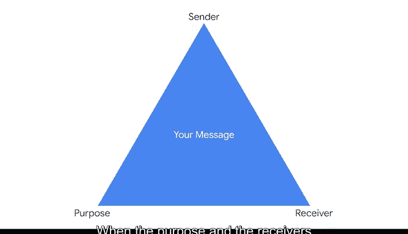

# 024：沟通的核心要素 📢

在本节课中，我们将要学习有效沟通的核心要素。作为数据专业人士，你是数据内部信息与其他项目相关方之间的直接桥梁。理解沟通的基本组成部分，将帮助你更清晰、更有效地传递信息。

---

## 沟通的三个核心要素

上一节我们介绍了沟通在数据工作中的重要性，本节中我们来看看构成任何沟通行为的三个核心要素：**目的**、**接收者**和**发送者**。所有沟通交流都需要牢记这三个要素。

### 1. 目的
**目的**指的是沟通发生的原因。在数据分析工作中，你可能遇到需要分析或报告技术性信息的情况。另一方面，也可能存在依赖于战略性见解的语境，这些见解将用于指导公司的财务或组织工作。

### 2. 接收者
**接收者**就是你的听众。在构思沟通内容时，你需要思考你在对谁说话。一个有用的方法是问自己：我的听众已经知道了什么？他们需要知道什么？请记住，每一次交流都可能引发一连串的事件。作为数据专业人士，你通常是跨组织分布式团队的一员，因此，分享给一个接收者的信息，可能会被用于向其他人进行报告。

### 3. 发送者
**发送者**是负责构思信息或沟通内容的人。是的，就是你。发送者是任何沟通交流中的关键部分。作为发送者，我鼓励你思考以下几点：你与接收者的关系如何？你在此次交流中的角色是什么？你是在汇报见解、推销想法，还是在识别潜在的数据输入？此外，哪些个人偏见可能会影响你试图分享的信息？

---

## 三要素如何塑造信息

在目的、接收者和发送者三者关系的核心，是你打算分享的**信息或沟通内容**，它同时受到这三个要素的影响。正因如此，当目的和接收者因场景不同而改变时，相同的信息可能会以截然不同的方式被分享。

以下是两个具体场景的对比，说明了信息如何因受众不同而被调整：

*   **场景一：面向非技术受众**
    *   沟通重点在于项目的**影响**和**成果**。
    *   会避免深入讨论用于编程模型的**代码细节**。

*   **场景二：面向技术同事**
    *   沟通会包含关于**代码**和**项目执行细节**的详尽信息。
    *   侧重于项目的**技术实现**与**后勤安排**。

在这两种情况下，交换的总体信息（即关于项目的信息）是相同的。不同的是信息的**构思方式**、**包含的细节**以及信息的**组织方式**。

---

## 总结与最佳实践起点

本节课中，我们一起学习了沟通的三个核心要素：**目的**、**接收者**和**发送者**。我们探讨了它们如何共同塑造最终传递的信息。既然我们已经剖析了沟通的关键要素，我们就可以真正开始思考一些最佳实践，这些实践将帮助你在未来的工作中进行成功沟通。