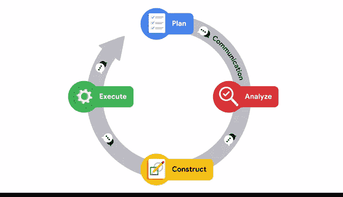

# 025：沟通驱动PACE框架 🧩

在本节课中，我们将要学习PACE框架如何作为一个整体在数据项目中运作，并理解沟通如何作为其核心驱动力，确保项目从规划到执行的各个阶段都能顺利推进。

---

上一节我们介绍了PACE框架及其四个阶段。现在，我们来看看如何将它们整合到实际的数据项目中。

乍看之下，PACE框架能清晰地展示整个项目的工作流程。从规划到执行的每个阶段，都逻辑清晰地对应着数据项目的开始、中期和结尾。

然而，正如你可能记得的，PACE框架极具灵活性，并不需要严格按照线性顺序执行。在项目中，迭代通常是合理的做法。让我们通过一个例子来详细说明这一点。

为了便于理解，我们可以将其与建造一栋大楼进行比较。

以下是建造流程与PACE阶段的对应关系：
*   **规划**：创建蓝图。
*   **分析**：分析地块空间，并考虑成本等其他变量。
*   **构建**：打下地基，搭建框架。
*   **执行**：安装屋顶，直至建筑完工可供入住。

建造者通过规划、分析、构建和执行客户的愿景，完成了整个工作流程。

在实践中，PACE工作流程旨在作为一种导航工具。我们创建它的目标是帮助你理解数据专业人士的工作流，并作为你未来角色中可以参考的助手。

---

现在，让我们回到建筑例子。屋顶完工后，就可以开始内部施工，例如安装石膏板、电气组件和管道系统。

这些工作中的每一项，也都有其自身的PACE工作流程，体现在总蓝图内的独立规划文件中。每一项工作都需要经历规划、分析、构建和执行，就像我们一直在讨论的建筑例子一样。

当数据项目在全局层面进入构建和执行阶段时，你可能需要回到早期阶段，以纳入额外的数据或其他利益相关者的反馈。即使整个项目正在过渡到PACE的新阶段，仍可能有即将开始其自身PACE循环的新任务。

无论你处于PACE工作流程的哪个位置，沟通都是驱动该框架实现项目的关键。在框架内的每个阶段，始终需要通过沟通来改进工作流程。

这包括：
*   询问关于数据的问题。
*   收集额外的数据源。
*   向利益相关者更新进度。
*   展示发现并接收反馈。

---

PACE框架开发背后最重要的考量之一，是提供一个灵活的结构，允许你在项目内进行调整。

让我们再次回到建筑例子。假设在安装电气系统期间，业主提出希望在计划中增加一个电动汽车的额外充电端口。

为了促成这一变更，你需要重新审视PACE框架，来规划、分析、构建和执行这个新请求。就像这个例子一样，来自其他利益相关者的请求可能随时出现。

无论额外请求或任务何时出现，数据专业人士都需要在整个项目周期内保持可用和可联系的状态。

有时你可能需要在会议上发言或参与进度更新。此外，你可以在跟踪系统中更新进度。电子邮件对话和聊天讨论将使其他人参与进来，并了解你工作流程的当前位置。

---

我很期待你能通过PACE的每个阶段，实践不同的沟通策略，获得一些实践经验。你将在课程后续部分有机会进行实践。

现在，我希望你记住，一名优秀的数据专业人士是一位积极主动的沟通者，能够及时回应问题。

通过清晰的解释让其他利益相关者随时了解最新情况，可以使你成为最高效的数据专业人士。

---

本节课中，我们一起学习了PACE框架在项目中的整合应用。我们通过建筑类比理解了其非线性和迭代的特性，并重点探讨了沟通如何作为核心驱动力，贯穿于规划、分析、构建和执行的每一个阶段，确保项目能够灵活应对变化并最终成功实现。