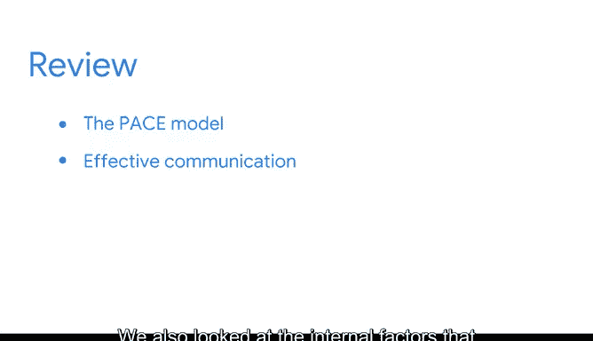

# 027：《数据科学基础》课程总结 🎯

在本节课中，我们将对数据工作流程的概述部分进行总结，回顾已学习的关键概念，并为接下来的挑战和项目做好准备。

---

你已经完成了数据工作流程概述部分的学习。你涵盖了许多材料和概念。

做得很好。你了解了 **PACE框架** 如何被用来帮助构建和指导项目流程。

**PACE框架** 代表：
*   **P** - 计划
*   **A** - 分析
*   **C** - 构建
*   **E** - 执行

接下来，我们学习了有效沟通，以及它如何在PACE框架内被运用。

我们探讨了可能影响数据分析的外部因素。

我们也审视了可能影响数据分析的内部因素，例如数据中的**偏见**。

---

在准备每周挑战时，请记住，你可以在下一部分复习我们涵盖的任何材料。

之后，你将开始着手你的第一个作品集项目。祝你一切顺利。

---

本节课中，我们一起回顾了数据工作流程的核心框架PACE、有效沟通的重要性，以及影响数据分析的内外部因素。这些知识将为你的数据分析实践打下坚实基础。